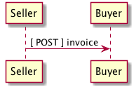

# Table of Contents

1.  [The Order Placement System](#orgd6b08bb)
2.  [Overview](#org968889d)
    1.  [Provide a non-technical overview of the business cases.](#org359176b)
    2.  [Actors](#orgc8a603c)
    3.  [Endpoints](#orgb107c5f)
    4.  [Connecting](#orgc2e83d4)
        1.  [HTTPS / TLS](#org40d98d9)
        2.  [Authentication](#org08cbc51)
    5.  [Resource Types](#org9ee6c28)
3.  [Testing Schema files](#org67f5276)
    1.  [JSON](#orgc30170b)
    2.  [XML](#orgbfabeb5)
4.  [Probes](#org3403809)
    1.  [`./probes/top`](#orgd584479)
        1.  [Version 1.0 *unsupported*](#org44019f8)
        2.  [Version 1.5 *required*](#org1d32a35)
        3.  [Version 2.0](#org46de772)
    2.  [`./probes/bottom`](#orga465fcf)
        1.  [Version 1.0 *unsupported*](#org86f1109)
        2.  [Version 1.5 *required*](#orgd84af03)
        3.  [Version 2.0](#org8896480)
    3.  [`./probes`](#org6dc8c52)
        1.  [Version 1.0 *unsupported*](#orgfef2534)
        2.  [Version 1.5 *optional*](#org37aa651)
        3.  [Version 2.0](#orgd021337)
    4.  [Resource Schema](#org7c83c24)
        1.  [Version 1.0](#org1b1c468)
        2.  [Version 1.5](#orge618e97)
        3.  [Version 2.0](#org54a72b5)
    5.  [Test Results](#orgc437792)
5.  [Stock](#org7919e2f)
    1.  [Provide a non-technical overview of the business cases.](#org6bd2e24)
    2.  [Sequence of Events](#org3a3bf80)
    3.  [Versions](#orgf923fb5)
        1.  [Version 1.0](#orga99670b)
        2.  [Version 1.5](#org92b1cfa)
        3.  [Version 2.0](#org2c85cb3)
    4.  [Use Cases](#org995030f)
        1.  [As an unidentified buyer I would like to see the cost for one or more products](#org6ee250b)
        2.  [As an unidentified buyer I would like to know if the seller has enough stock to satisfy my order](#org120a4f6)
        3.  [As an unidentified buyer I would like to be able to specify a date when the order must be received.](#org4ef5ca2)
        4.  [As a seller I would like to be able to provide a replacement item when the seller specifies an outdated item number](#org3fe5ff6)
        5.  [As a seller I would like to be able to provide a substitue when the item specified by the buyer is not in stock](#orge689c8d)
    5.  [Resource Schemas](#orgcf39714)
        1.  [Version 1.0](#org9b26f5b)
        2.  [Version 1.5](#org0bd3bbc)
        3.  [Version 2.0](#org7d65527)
    6.  [Testing](#org3650fa9)
6.  [Invoice](#org40b0a09)
    1.  [Provide a non-technical overview of the business cases](#org1f38914)
    2.  [Sequence of Events](#org20c7721)
    3.  [Versions](#orga3f3048)
        1.  [Version 1.0](#orge8ef3f7)
        2.  [Version 2.0](#org037b1b3)
    4.  [Use Cases](#orgcd30d59)
        1.  
    5.  [Resource Schemas](#orgb3feced)
        1.  [Version 1.0](#org5d32756)
        2.  [Version 2.0](#org9599f1b)
    6.  [Testing](#org581e92c)
7.  [Order](#org17d6ad4)
    1.  [Provide a non-technical overview of the business cases](#org670db44)
    2.  [Sequence of Events](#orgf4b6717)
    3.  [Versions](#orge1a2975)
        1.  [Version 1.0](#org4c9fb91)
        2.  [Version 1.5](#orgb1292f1)
        3.  [Version 2.0](#orgf83acfc)
    4.  [Use Cases](#orgc946ef9)
        1.  [Request](#org49840bc)
        2.  [Response](#org14c7a00)
    5.  [Resource Schemas](#orgae8ef7e)
        1.  [Version 1.0](#org435137c)
        2.  [Version 1.5](#org7c5b84c)
        3.  [Version 2.0](#orgb432cf5)
    6.  [Testing](#orgca18f17)
8.  [Ship Method](#org5780c98)
    1.  [Provide a non-technical overview of the business cases](#org63cd25b)
    2.  [Sequence of Events](#org03f3c1d)
    3.  [Versions](#org834f21c)
        1.  [Version 1.0](#orga9250ce)
        2.  [Version 2.0](#orge17aaf3)
    4.  [Use Cases](#orgf9fe2f8)
        1.  
    5.  [Resource Schemas](#orgffe1718)
        1.  [Version 1.0](#org484d614)
        2.  [Version 2.0](#org8c10cc1)
    6.  [Testing](#org8d707fd)
9.  [About this document](#orga9f9f0f)
    1.  [Tangle](#org45af46a)
    2.  [Export](#orgb0926fd)
10. [Resource Schemas](#org270cbe9)
    1.  
11. [Test Results](#orgd868990)

# The Order Placement System

Lorem ipsum dolor sit amet, consectetur adipisicing elit, sed do eiusmod tempor incididunt ut labore
et dolore magna aliqua. Ut enim ad minim veniam, quis nostrud exercitation ullamco laboris nisi ut
aliquip ex ea commodo consequat. Duis aute irure dolor in reprehenderit in voluptate velit esse
cillum dolore eu fugiat nulla pariatur. Excepteur sint occaecat cupidatat non proident, sunt in culpa
qui officia deserunt mollit anim id est laborum.

# Overview

## TODO Provide a non-technical overview of the business cases.

Lorem ipsum dolor sit amet, consectetur adipisicing elit, sed do eiusmod tempor incididunt ut labore
et dolore magna aliqua. Ut enim ad minim veniam, quis nostrud exercitation ullamco laboris nisi ut
aliquip ex ea commodo consequat. Duis aute irure dolor in reprehenderit in voluptate velit esse cillum
dolore eu fugiat nulla pariatur. Excepteur sint occaecat cupidatat non proident, sunt in culpa qui
officia deserunt mollit anim id est laborum.

## Actors

Within the ECi Order Placement system a dealer typically takes on the role of
*Buyer*. A vendor or supplier (typical readers of this document) take the role of
*Seller*. A *Consumer* is the dealer's customer, though there are nuances we will
not attempt to explain right now.

## Endpoints

There are six endpoints, three provided by the Seller's system

And three provided by the Buyer's system:

## Connecting

### HTTPS / TLS

The ECi Order Placement services will always connect using a minimum of TLS 1.2.

### Authentication

1.  Buyer -> Seller

    The Seller is responsible for providing participating dealers (Buyers) a user name
    and password which the ECi system will use to connect to the Seller's system. This
    information will be passed to the seller via HTTP Basic Authentication [RFC 7617](http://www.rfc-editor.org/info/rfc7617).
    Stock and Order resources allow for additional non-schema defined information
    (opaque) to be supplied by the Buyer and delivered to the Seller.

2.  Seller -> Buyer

    ECi is responsible for assigning and maintaining an ID and an API key to each of
    the Seller systems. This information will be passed to the buyer system via HTTP
    Basic Authentication. Stock and Order resources allow for additional non-schema
    defined information (opaque) to be supplied by the Seller and delivered to the Buyer.

## Resource Types

There are six resource types exchanged between the Buyer's system and the Seller's system:

Not all Seller systems support resources or endpoints for Shipment Methods, Order&Delta;
(accept/reject), or Shipment information. We have chosen to represent resources using
JSON Schema and prefer Seller implementations also choose a JSON representation. The
Buyer's system can be programmed to send and receive resources in other representations,
though this is not part of the standard agreement and will need to be addressed separately.

# Testing Schema files

## JSON

    #!/bin/bash
    #
    # brew install jsonlint
    # npm install jsonlint -g
    #

    #
    # make sure all of the files are well-formed JSON
    find ./rsrc-schema/tst ./rsrc-schema/src -type f -name '*.json' -exec jsonlint --quiet --compact {} \;

## XML

    #!/bin/bash
    #
    # brew install xmllint

    # make sure all of the files are well-formed xml
    find ./rsrc-schema/src -type f -name '*.xsd' -exec xmllint --noout {} \;
    find ./rsrc-schema/tst -type f -name '*.xml' -exec xmllint --noout {} \;

# Probes

Each API or Application MUST support two HTTP GET operations that will allow QA/IT/Support and
internal ( private network ) applications the ability to pro-actively monitor the health
of APIs and applications. It is expected that IT will be routinely calling the required probes with
network and application health monitoring system many times throughout the day. These probes should
also be made available to Customer Care ( Support ) where then can be executed on demand. The custom
probes will be executed on demand by IT, QA, and Support staff. They are not expected to be used by
frequent running software as they may cause strain on the system and have a negative impact on
system users and systems.

It is important that information returned from these probes is not cached. We recommend setting the
following HTTP headers:

    Cache-Control: no-cache, no-store, must-revalidate
    Pragma: no-cache
    Expires: 0

## `./probes/top`

### Version 1.0 *unsupported*

### Version 1.5 *required*

This probe MUST be a light weight indicator of API or application availability. QA/IT/Support and
internal ( private network ) applications MUST be able to GET this low impact fast running probe.
It is expected that this probe will be called one or more times per minute. Calling applications are
required to check the HTTP status code as a pass ( *200* ) or fail ( *500* ) indicator. A body
MUST not be returned to the caller.

    curl -sw "%{http_code}\\n" http://localhost:3000/apis/v0/order/probes/top

### Version 2.0

No changes to date

## `./probes/bottom`

### Version 1.0 *unsupported*

### Version 1.5 *required*

This probe should test all of the layers of the API or application and all vital connections to
required systems, APIs, databases, etc. QA/IT/Support staff and internal facing applications MUST be
able to GET this modest impact probe. It is expected that this probe will be called several times
per hour. Calling applications are required to check the HTTP status code as a pass ( *200* ) or
fail ( *500* ) indicator. A body is optional. If a body is provided by the endpoint it must contain
an array of one or more probe resources, each of which will contain its own HTTP Status Code.

1.  JSON

        [
          {
            "self": "https://some.server/some.service/probes/bottom#auth",
            "code" :"auth",
            "httpStatusCode": 200,
            "when": "2018-04-23T18:25:43.511Z"
          },
          {
            "self": "https://some.server/some.service/probes/bottom",
            "description": "database connection test",
            "httpStatusCode": 400,
            "value":"The database cannot be contacted. Ensure the database is running and network reachable.",
            "when": "2018-04-23T18:25:44.511Z"
          }
        ]

2.  XML

        <probes>
          <probe>
            <self>https://some.server/some.service/probes/bottom#auth</self>
            <code>auth</code>
            <httpStatusCode>200</httpStatusCode>
            <when>2018-04-23T18:25:43.511Z</when>
          </probe>
          <probe>
            <self>https://some.server/some.service/probes/bottom</self>
            <description>database connection test</description>
            <httpStatusCode>400</httpStatusCode>
            <value>The database cannot be contacted. Ensure the database is running and network reachable.</value>
            <when>2018-04-23T18:25:44.511Z</when>
          </probe>
        </probes>

### Version 2.0

No changes to date

## `./probes`

### Version 1.0 *unsupported*

### Version 1.5 *optional*

APIs or Applications MAY choose to support individual probes outside of the top / bottom convention.
QA/IT/Support staff and internal facing applications may attempt a GET on this URL and will expect
the endpoint to return an ordered list of probes the application can call ( HTTP GET ) to determine
the pass ( *200* ) or fail ( *500* ) state of the probe. The body must contain an array of one or more
probe resources. These custom probes are expected to be run on demand, not routinely executed by IT
network and application health monitoring systems as the duration and impact of the probe's execution
is not defined.

1.  JSON

        [
          {
            "self": "https://some.server/some.service/probes/auth",
            "code" :"auth"
          },
          {
            "self": "https://some.server/some.service/probes/con-db",
            "description": "database connection test"
          }
        ]

2.  XML

        <probes>
          <probe>
            <self>https://some.server/some.service/probes/auth</self>
            <code>auth</code>
          </probe>
          <probe>
            <self>https://some.server/some.service/probes/con-db</self>
            <description>database connection test</description>
          </probe>
        </probes>

### Version 2.0

No changes to date

## Resource Schema

`self` Required. URL identifying the probe

`code` Machine facing value that uniquely identifies the probe
If `code` is not populated `description` MUST be populated

`description` Human facing value that uniquely identifies the probe.
If `description` is not populated `code` MUST be populated

`httpStatusCode` HTTP Status Code
This property is normally populated when used as the body of an HTTP GET on
*./probes/bottom* and may be populated when executing custom API or application
probes. Since the bottom probe may aggregate many probes we need a way to
communicate pass (*200* ) or fail ( *500* ) status of each individual probe function
aggregated by the bottom probe. If `httpStatusCode` is populated `when` MUST also
be populated

`when` The date and time of probe execution.
If `when` is populated `httpStatusCode` MUST also be populated

`value` Human facing text
Generally populated when there is a failure or warning of some type but the
implementor can use this field in any way they see fit. If populated the value
should give the human user some idea of where the failure or warning is happening
and why it might be happening.

### Version 1.0

Not supported

### Version 1.5

1.  JSON

        {
          "id": "./vnd.eci.stg.probe.1.5.0.json",
          "$schema": "http://json-schema.org/draft-08/schema#",
          "title": "Probe",
          "description": "Defines the location and description of a probe. Upon execution ( HTTP GET ) defines the state of the probe.",
          "type": "array",
          "items": {
            "additionalProperties": false,
            "required": ["self"],
            "anyOf": [{"required": ["code"]},
                      {"required": ["description"]}],
            "dependencies": {
              "httpStatusCode": { "required": [ "when" ]},
              "when": { "required": [ "httpStatusCode" ]}
            },

            "properties" : {

              "self": {
                "description": "system function identifying a unique system owned resource as a URL",
                "type": "string",
                "minLength": 1,
                "maxLength": 1024
              },

              "code": {
                "description": "machine facing value that uniquely identifies the probe",
                "type": "string",
                "minLength": 1,
                "maxLength": 32
              },

              "description": {
                "description": "human readable string describing the probe's purpose",
                "type": "string",
                "minLength": 1,
                "maxLength": 128
              },

              "httpStatusCode": {
                "description": "usually used bottom probe but may also be returned by api or application specific probes",
                "type": "integer",
                "default": 200,
                "minimum": 100,
                "maximum": 599
              },

              "value": {
                "description": "details from the probe that may help users understand the health of an endpoint",
                "type": "string",
                "minLength": 1,
                "maxLength" : 1024
              },

              "when": {
                "description": "date and time of probe execution",
                "type" : "string",
                "format": "date-time"
              }
            }
          }
        }

2.  XML

        <?xml version='1.0' encoding='utf-8'?>

        <xs:schema xmlns:xs='http://www.w3.org/2001/XMLSchema'
                   elementFormDefault='qualified'
                   xml:lang='en'>

          <xs:element name='probes'>
            <xs:complexType>
              <xs:sequence minOccurs='1' maxOccurs='50'>
                <xs:element name='probe' type='ProbeType'/>
              </xs:sequence>
            </xs:complexType>
          </xs:element>

          <xs:complexType name='ProbeType'>
            <xs:sequence>
              <xs:annotation>
                <xs:documentation>
                  TODO
                </xs:documentation>
              </xs:annotation>
              <xs:element name='self' type='xs:string' minOccurs='0' maxOccurs='1'/>
              <xs:element name='code' type='xs:string' minOccurs='0' maxOccurs='1'/>
              <xs:element name='description' type='xs:string' minOccurs='0' maxOccurs='1'/>
              <xs:element name='httpStatusCode' type='xs:integer' minOccurs='0' maxOccurs='1'/>
              <xs:element name='when' type='xs:dateTime' minOccurs='0' maxOccurs='1'/>
              <xs:element name='value' type='xs:string' minOccurs='0' maxOccurs='1'/>
            </xs:sequence>
          </xs:complexType>
        </xs:schema>

### TODO Version 2.0

## Test Results

    ./test-json.sh 2>&1
    ./test-xml.sh 2>&1
    xmllint --noout --schema ./rsrc-schema/src/vnd.eci.stg.probe.1.5.0.xsd ./rsrc-schema/tst/vnd.eci.stg.probe.1.5.0*.xml
    xmllint --noout --schema ./rsrc-schema/src/vnd.eci.stg.probe.2.0.0.xsd ./rsrc-schema/tst/vnd.eci.stg.probe.2.0.0*.xml

# Stock

## TODO Provide a non-technical overview of the business cases.

Lorem ipsum dolor sit amet, consectetur adipisicing elit, sed do eiusmod tempor incididunt ut labore
et dolore magna aliqua. Ut enim ad minim veniam, quis nostrud exercitation ullamco laboris nisi ut
aliquip ex ea commodo consequat. Duis aute irure dolor in reprehenderit in voluptate velit esse cillum
dolore eu fugiat nulla pariatur. Excepteur sint occaecat cupidatat non proident, sunt in culpa qui
officia deserunt mollit anim id est laborum.

## Sequence of Events

In the following section, Use Cases, examples of data ( `--data` ) to be sent and
received will be shown. It is assumed that the caller will make the actual *POST*
call with the required headers e.g.

    curl --request POST \
         --header "Content-Type: application/vnd.eci.stg.stock.1.5.0.xml" \
         --user user123:password123 \
         --url http://vendor-host/vendor-stock-endpoint
         --data ''

## Versions

### Version 1.0

No longer published

### Version 1.5

Lorem ipsum dolor sit amet, consectetur adipisicing elit, sed do eiusmod tempor incididunt ut labore
et dolore magna aliqua. Ut enim ad minim veniam, quis nostrud exercitation ullamco laboris nisi ut
aliquip ex ea commodo consequat. Duis aute irure dolor in reprehenderit in voluptate velit esse cillum
dolore eu fugiat nulla pariatur. Excepteur sint occaecat cupidatat non proident, sunt in culpa qui
officia deserunt mollit anim id est laborum.

### TODO Version 2.0

Lorem ipsum dolor sit amet, consectetur adipisicing elit, sed do eiusmod tempor incididunt ut labore
et dolore magna aliqua. Ut enim ad minim veniam, quis nostrud exercitation ullamco laboris nisi ut
aliquip ex ea commodo consequat. Duis aute irure dolor in reprehenderit in voluptate velit esse cillum
dolore eu fugiat nulla pariatur. Excepteur sint occaecat cupidatat non proident, sunt in culpa qui
officia deserunt mollit anim id est laborum.

## Use Cases

### As an unidentified buyer I would like to see the cost for one or more products

Version 1.5

1.  Request

    In this example a buyer is asking for her cost, the seller's asking price, for a product known to the
    seller as *abc-123*.

    1.  JSON

            { "items": [{ "sellerRef": "abc-123" }]}

    2.  XML

            <items>
              <item>
                <sellerRef>abc-123</sellerRef>
              </item>
            </items>

2.  Response

    The seller's response is intended to inform the buyer that the the item will cost her *99.99$USD*.

    1.  JSON

            { "items": [{ "sellerRef": "abc-123", "unitCost": 99.99}]}

    2.  XML

            <items>
              <item>
                <sellerRef>abc-123</sellerRef>
                <unitCost>99.99</unitCost>
              </item>
            </items>

### As an unidentified buyer I would like to know if the seller has enough stock to satisfy my order

Version 1.5

In this case the buyer's intent is to understand if the seller an supply the requested number of
items ( *24* ) for a product known to the seller as *abc-123*.

1.  Request

    1.  JSON

            { "items": [{ "sellerRef": "abc-123", "quantity": 24}]}

    2.  XML

            <items>
              <item>
                <sellerRef>abc-123</sellerRef>
                <quantity>24</quantity>
              </item>
            </items>

2.  Response

    1.  If the seller can deliver the buyer's requested quantity ( *24* ) the seller may reply with

        1.  the requested quantity ( *24* )

            1.  JSON

                    { "items": [{ "sellerRef": "abc-123", "quantity": 24}]}

            2.  XML

                    <items>
                      <item>
                        <sellerRef>abc-123</sellerRef>
                        <quantity>24</quantity>
                      </item>
                    </items>

        2.  the quantity on hand ( *103* )

            1.  JSON

                    { "items": [{ "sellerRef": "abc-123", "quantity": 103}]}

            2.  XML

                    <items>
                      <item>
                        <sellerRef>abc-123</sellerRef>
                        <quantity>103</quantity>
                      </item>
                    </items>

        3.  a fixed value e.g. *1,000*.

            1.  JSON

                    { "items": [{ "sellerRef": "abc-123", "quantity": 1000}]}

            2.  XML

                    <items>
                      <item>
                        <sellerRef>abc-123</sellerRef>
                        <quantity>1000</quantity>
                      </item>
                    </items>

    2.  If the seller cannot deliver the buyer's requested quantity ( *24* ) the seller may reply with

        1.  the quantity on hand ( *12* ).

            1.  JSON

                    { "items": [{ "sellerRef": "abc-123", "quantity": 12}]}

            2.  XML

                    <items>
                      <item>
                        <sellerRef>abc-123</sellerRef>
                        <quantity>12</quantity>
                      </item>
                    </items>

        2.  a fixed value e.g. *0*.

            1.  JSON

                    { "items": [{ "sellerRef": "abc-123", "quantity": 0}]}

            2.  XML

                    <items>
                      <item>
                        <sellerRef>abc-123</sellerRef>
                        <quantity>0</quantity>
                      </item>
                    </items>

### As an unidentified buyer I would like to be able to specify a date when the order must be received.

Version 2.0

In this example the buyer is providing the current date ( 24 April 2008 ) and the date
when they would expect the order to be delivered ( 24 April 2008 ).

    { "count": 1,
      "date" : "2018-04-24T17:00:00.000Z",
      "dateExpected" : "2018-04-26T17:00:00.000Z",
      "items": [
        { "line": 1,
          "item": { "sellerRef": "abc-123" }}]}

In this example the buyer is providing the current date ( 24 April 2008 ) and the date
when they would expect one of the line items in the order to be delivered ( 24 April 2008 ).

    { "count": 1,
      "items": [
        { "line": 1,
          "item": { "sellerRef": "abc-123",
                    "date" : "2018-04-24T17:00:00.000Z",
                    "dateExpected" : "2018-04-26T17:00:00.000Z"}}]}

1.  If the seller does not support this feature the reply can omit dateExpected

        { "count": 1,
          "date" : "2018-04-24T17:00:00.000Z",
          "items": [
            { "line": 1,
              "item": { "sellerRef": "abc-123" }}]}

2.  If the seller supports this feature the reply should contain a date the buyer can expect the item to be delivered

    In this example the seller is telling the buyer they can expect deliver on 30 April 2008

        { "count": 1,
          "date" : "2018-04-24T17:00:00.000Z",
          "dateExpected" : "2018-04-30T17:00:00.000Z",
          "items": [
            { "line": 1,
              "item": { "sellerRef": "abc-123" }}]}

### As a seller I would like to be able to provide a replacement item when the seller specifies an outdated item number

Version 2.0

1.  TODO

### As a seller I would like to be able to provide a substitue when the item specified by the buyer is not in stock

Version 2.0

1.  TODO

## Resource Schemas

### Version 1.0

No longer published

### Version 1.5

1.  Stock

    1.  JSON

            {
              "id": "./vnd.eci.stg.stock.1.5.0.json",
              "title": "Stock, Cost, Date Collection",
              "description": "a collection items a buyer may purchase from a seller",
              "type": "object",
              "properties" : {

                "items": {
                  "description": "the unique items that have or will have stock and cost information",
                  "type": "array",
                  "minItems": 1,
                  "maxItems": 1000,
                  "uniqueItems": true,
                  "items" : {
                    "$ref" : "#/definitions/item"
                  }
                }
              },

              "additionalProperties": false,

              "definitions" : {
                "item": {
                  "title": "Stock, Cost, Date Item",
                  "description": "describes the items a buyer would like to purchase from a seller.",
                  "type": "object",
                  "properties" : {

                    "sellerRef": {
                      "description": "seller function identifying a unique seller owned resource",
                      "type": "string",
                      "minLength": 1,
                      "maxLength": 32
                    },

                    "quantity": {
                      "description": "the number of individual units in the measure e.g. Box of 20",
                      "type": "number",
                      "minimum" : 1,
                      "maximum" : 999999999.999999
                    },

                    "unitCost": {
                      "description": "",
                      "type": "number",
                      "minimum" : 0,
                      "maximum" : 999999999999.999999
                    }
                  },

                  "additionalProperties": false
                }
              }
            }

    2.  XML

            <?xml version='1.0' encoding='utf-8'?>

            <xs:schema xmlns:xs='http://www.w3.org/2001/XMLSchema'
                       elementFormDefault='qualified'
                       xml:lang='en'>

              <xs:element name='items'>
                <xs:complexType>
                  <xs:sequence minOccurs='1' maxOccurs='1000'>
                    <xs:element name='item' type='StockItemType'/>
                  </xs:sequence>
                </xs:complexType>
              </xs:element>

              <xs:complexType name='StockItemType'>
                <xs:sequence>
                  <xs:annotation>
                    <xs:documentation>
                      The set of returned products must not contain duplicate products (that
                      is the nature of sets), and products, by defition, must have a unique
                      ID. Currently we do not place a restriction on the number of products
                      that can be requested at one time, but we should probably do that soon
                      to protect both ECi and the Vendor.
                    </xs:documentation>
                  </xs:annotation>
                  <xs:element name='sellerRef' type='IDType' minOccurs='0' maxOccurs='1'/>
                  <xs:element name='quantity' type='QuantityType' minOccurs='0' maxOccurs='1'/>
                  <xs:element name='unitCost' type='CostType' minOccurs='0' maxOccurs='1'/>
                </xs:sequence>
              </xs:complexType>

              <xs:simpleType name='CostType'>
                <xs:annotation>
                  <xs:documentation>
                    Every Product must have a unit cost that is equal to or greater than
                    0 and must cost just under one trillion monetary units. Version 1.5.0
                    assumes the monetary unit is US Dollars.
                  </xs:documentation>
                </xs:annotation>
                <xs:restriction base='xs:decimal'>
                  <xs:minInclusive value='0'/>
                  <xs:maxInclusive value='999999999999.999999'/>
                  <xs:fractionDigits value='6'/>
                  <xs:totalDigits value='18'/>
                </xs:restriction>
              </xs:simpleType>

              <xs:simpleType name='IDType'>
                <xs:annotation>
                  <xs:documentation>
                    Every Product must have at least one ID and that ID must uniquely locate
                    only one product; a Product may have more than one ID but a ID must relate
                    to only a single product.
                  </xs:documentation>
                </xs:annotation>
                <xs:restriction base='xs:token'>
                  <xs:minLength value='1'/>
                  <xs:maxLength value='32'/>
                </xs:restriction>
              </xs:simpleType>

              <xs:simpleType name='QuantityType'>
                <xs:restriction base='xs:unsignedInt'/>
              </xs:simpleType>

            </xs:schema>

### Version 2.0

1.  Stock

    1.  TODO

2.  Stock Item

    1.  TODO

## Testing

    ./test-json.sh 2>&1
    ./test-xml.sh 2>&1
    xmllint --noout --schema ./rsrc-schema/src/vnd.eci.stg.stock.1.5.0.xsd ./rsrc-schema/tst/vnd.eci.stg.stock.1.5.0*.xml
    xmllint --noout --schema ./rsrc-schema/src/vnd.eci.stg.stock.2.0.0.xsd ./rsrc-schema/tst/vnd.eci.stg.stock.2.0.0*.xml

# Invoice

## TODO Provide a non-technical overview of the business cases

Lorem ipsum dolor sit amet, consectetur adipisicing elit, sed do eiusmod tempor incididunt ut labore
et dolore magna aliqua. Ut enim ad minim veniam, quis nostrud exercitation ullamco laboris nisi ut
aliquip ex ea commodo consequat. Duis aute irure dolor in reprehenderit in voluptate velit esse cillum
dolore eu fugiat nulla pariatur. Excepteur sint occaecat cupidatat non proident, sunt in culpa qui
officia deserunt mollit anim id est laborum.

## Sequence of Events

In the following section, Use Cases, examples of data ( `--data` ) to be sent and
received will be shown. It is assumed that the caller will make the actual *POST*
call with the required headers e.g.

    curl --request POST \
         --header "Content-Type: application/vnd.eci.stg.invoice.1.0.0.xml" \
         --user user123:password123 \
         --url http://vendor-host/vendor-invoice-endpoint
         --data ''

## Versions

### Version 1.0

Lorem ipsum dolor sit amet, consectetur adipisicing elit, sed do eiusmod tempor incididunt ut labore et dolore magna aliqua. Ut enim ad minim veniam, quis nostrud exercitation ullamco laboris nisi ut aliquip ex ea commodo consequat. Duis aute irure dolor in reprehenderit in voluptate velit esse cillum dolore eu fugiat nulla pariatur. Excepteur sint occaecat cupidatat non proident, sunt in culpa qui officia deserunt mollit anim id est laborum.

### Version 2.0

Lorem ipsum dolor sit amet, consectetur adipisicing elit, sed do eiusmod tempor incididunt ut labore et dolore magna aliqua. Ut enim ad minim veniam, quis nostrud exercitation ullamco laboris nisi ut aliquip ex ea commodo consequat. Duis aute irure dolor in reprehenderit in voluptate velit esse cillum dolore eu fugiat nulla pariatur. Excepteur sint occaecat cupidatat non proident, sunt in culpa qui officia deserunt mollit anim id est laborum.

## Use Cases

### TODO

Version 1.0

1.  Request

    In this example a seller is

    1.  JSON

    2.  XML

2.  Response

    The buyer's response is intended to

    1.  JSON

    2.  XML

## Resource Schemas

### Version 1.0

1.  JSON

2.  XML

### Version 2.0

1.  JSON

2.  XML

## Testing

    ./test-json.sh 2>&1
    ./test-xml.sh 2>&1
    xmllint --noout --schema ./rsrc-schema/src/vnd.eci.stg.invoice.1.0.0.xsd ./rsrc-schema/tst/vnd.eci.stg.invoice.1.0.0*.xml

# Order

## TODO Provide a non-technical overview of the business cases

Lorem ipsum dolor sit amet, consectetur adipisicing elit, sed do eiusmod tempor incididunt ut labore
et dolore magna aliqua. Ut enim ad minim veniam, quis nostrud exercitation ullamco laboris nisi ut
aliquip ex ea commodo consequat. Duis aute irure dolor in reprehenderit in voluptate velit esse cillum
dolore eu fugiat nulla pariatur. Excepteur sint occaecat cupidatat non proident, sunt in culpa qui
officia deserunt mollit anim id est laborum.

## Sequence of Events

In the following section, Use Cases, examples of data ( `--data` ) to be sent and
received will be shown. It is assumed that the caller will make the actual *POST*
call with the required headers e.g.

    curl --request POST \
         --header "Content-Type: application/vnd.eci.stg.order.1.5.0.xml" \
         --user user123:password123 \
         --url http://vendor-host/vendor-order-endpoint
         --data ''

## Versions

### Version 1.0

No longer published

### TODO Version 1.5

Lorem ipsum dolor sit amet, consectetur adipisicing elit, sed do eiusmod tempor incididunt ut labore
et dolore magna aliqua. Ut enim ad minim veniam, quis nostrud exercitation ullamco laboris nisi ut
aliquip ex ea commodo consequat. Duis aute irure dolor in reprehenderit in voluptate velit esse cillum
dolore eu fugiat nulla pariatur. Excepteur sint occaecat cupidatat non proident, sunt in culpa qui
officia deserunt mollit anim id est laborum.

### TODO Version 2.0

Lorem ipsum dolor sit amet, consectetur adipisicing elit, sed do eiusmod tempor incididunt ut labore
et dolore magna aliqua. Ut enim ad minim veniam, quis nostrud exercitation ullamco laboris nisi ut
aliquip ex ea commodo consequat. Duis aute irure dolor in reprehenderit in voluptate velit esse cillum
dolore eu fugiat nulla pariatur. Excepteur sint occaecat cupidatat non proident, sunt in culpa qui
officia deserunt mollit anim id est laborum.

## TODO Use Cases

### Request

In this example a buyer is

1.  JSON

2.  XML

### Response

The seller's response is intended to

1.  JSON

2.  XML

## Resource Schemas

### Version 1.0

No longer published

### TODO Version 1.5

1.  JSON

2.  XML

        <xs:schema attributeFormDefault='unqualified'
                   elementFormDefault='qualified'
                   xmlns:xs='http://www.w3.org/2001/XMLSchema'>

          <xs:element name='Order' type='Order'/>

          <xs:complexType name='AddressType'>
            <xs:sequence>
              <xs:element name='AlternateLocation' type='xs:string' />
              <xs:element name='Attention'         type='xs:string' />
              <xs:element name='City'              type='xs:string' />
              <xs:element name='Country'           type='xs:string' />
              <xs:element name='MailStopCode'      type='xs:string' />
              <xs:element name='Recipient'         type='xs:string' />
              <xs:element name='Remarks'           type='xs:string' />
              <xs:element name='State'             type='xs:string' />
              <xs:element name='Street'            type='xs:string' />
              <xs:element name='Tag'               type='xs:string' />
              <xs:element name='Zip'               type='xs:string' />
            </xs:sequence>
          </xs:complexType>

          <xs:complexType name='BillToType'>
            <xs:sequence>
              <xs:element name='Address'   type='AddressType'   />
              <xs:element name='Email'     type='xs:string'     />
              <xs:element name='Name'      type='xs:string'     />
              <xs:element name='Phone'     type='xs:string'     />
              <xs:element name='Reference' type='ReferenceType' />
              <xs:element name='Remarks'   type='xs:string'     />
            </xs:sequence>
          </xs:complexType>

          <xs:complexType name='BuyerType'>
            <xs:sequence>
              <xs:element name='Address'   type='AddressType'   />
              <xs:element name='Email'     type='xs:string'     />
              <xs:element name='Name'      type='xs:string'     />
              <xs:element name='Phone'     type='xs:string'     />
              <xs:element name='Reference' type='ReferenceType' />
              <xs:element name='Remarks'   type='xs:string'     />
              <xs:element name='TaxNumber' type='xs:string'     />
            </xs:sequence>
          </xs:complexType>

          <xs:complexType name='CarrierType'>
            <xs:sequence>
              <xs:element name='Name'    type='xs:string' />
              <xs:element name='Remarks' type='xs:string' />
            </xs:sequence>
          </xs:complexType>

          <xs:complexType name='ConsumerType'>
            <xs:sequence>
              <xs:element name='Address'    type='AddressType'   />
              <xs:element name='ContractId' type='xs:string'     />
              <xs:element name='Email'      type='xs:string'     />
              <xs:element name='Name'       type='xs:string'     />
              <xs:element name='Phone'      type='xs:string'     />
              <xs:element name='Reference'  type='ReferenceType' />
              <xs:element name='Remarks'    type='xs:string'     />
              <xs:element name='TaxNumber'  type='xs:string'     />
            </xs:sequence>
          </xs:complexType>

          <xs:complexType name='CurrencyType'>
            <xs:sequence>
              <xs:element name='Code'      type='xs:string'  />
              <xs:element name='Number'    type='xs:integer' />
              <xs:element name='Precision' type='xs:integer' />
              <xs:element name='Scale'     type='xs:integer' />
            </xs:sequence>
          </xs:complexType>

          <xs:complexType name='ItemType'>
            <xs:sequence>
              <xs:element name='Amount'               type='MoneyType'       />
              <xs:element name='AmountSubjectToTerms' type='MoneyType'       />
              <xs:element name='Description'          type='xs:string'       />
              <xs:element name='Discount'             type='MoneyType'       />
              <xs:element name='ExpectedDate'         type='xs:dateTime'     />
              <xs:element name='Freight'              type='MoneyType'       />
              <xs:element name='Id'                   type='xs:string'       />
              <xs:element name='LineNumber'           type='xs:integer'      />
              <xs:element name='Make'                 type='xs:string'       />
              <xs:element name='Model'                type='xs:string'       />
              <xs:element name='Quantity'             type='xs:float'        />
              <xs:element name='QuantityAcknowledged' type='xs:decimal'      />
              <xs:element name='Reference'            type='ReferenceType'   />
              <xs:element name='Remarks'              type='xs:string'       />
              <xs:element name='SerialNumber'         type='xs:string'       />
              <xs:element name='Tax'                  type='MoneyType'       />
              <xs:element name='Unit'                 type='UnitMeasureType' />
              <xs:element name='UnitCost'             type='MoneyType'       />
            </xs:sequence>
          </xs:complexType>

          <xs:complexType name='ItemsCollection'>
            <xs:sequence minOccurs='1' maxOccurs='5000'>
              <xs:element name='item' type='ItemType'/>
            </xs:sequence>
          </xs:complexType>

          <xs:complexType name='MoneyType'>
            <xs:sequence>
              <xs:element name='Amount' type='xs:decimal'   />
              <xs:element name='Type'   type='CurrencyType' />
            </xs:sequence>
          </xs:complexType>

          <xs:complexType name='Order'>
            <xs:sequence>
              <xs:element name='BillTo'                      type='BillToType'    />
              <xs:element name='Buyer'                       type='BuyerType'     />
              <xs:element name='BuyerReference'              type='xs:string'     />
              <xs:element name='Carrier'                     type='CarrierType'   />
              <xs:element name='Consumer'                    type='ConsumerType'  />
              <xs:element name='CountEmbedded'               type='xs:integer'    />
              <xs:element name='Currency'                    type='CurrencyType'  />
              <xs:element name='Date'                        type='xs:dateTime'   />
              <xs:element name='ExpectedDate'                type='xs:dateTime'   />
              <xs:element name='Items'                       type='ItemType'      />
              <xs:element name='OptionAllowBackorder'        type='xs:boolean'    />
              <xs:element name='OptionAllowCostChanges'      type='xs:boolean'    />
              <xs:element name='OptionAllowPartialShipments' type='xs:boolean'    />
              <xs:element name='OptionAllowSubstitutions'    type='xs:boolean'    />
              <xs:element name='OptionDropShip'              type='xs:boolean'    />
              <xs:element name='Reference'                   type='ReferenceType' />
              <xs:element name='Remarks'                     type='xs:string'     />
              <xs:element name='SellerReference'             type='xs:string'     />
              <xs:element name='ShipTo'                      type='ShipToType'    />
            </xs:sequence>
          </xs:complexType>

          <xs:complexType name='ReferenceType'>
            <xs:sequence>
              <xs:element name='BuyerReference'        type='xs:string' />
              <xs:element name='ConsumerReference'     type='xs:string' />
              <xs:element name='Description'           type='xs:string' />
              <xs:element name='DocumentReference'     type='xs:string' />
              <xs:element name='LineNumberReference'   type='xs:string' />
              <xs:element name='ManufacturerReference' type='xs:string' />
              <xs:element name='SellerReference'       type='xs:string' />
            </xs:sequence>
          </xs:complexType>

          <xs:complexType name='ShipToType'>
            <xs:sequence>
              <xs:element name='Address'   type='AddressType'   />
              <xs:element name='Email'     type='xs:string'     />
              <xs:element name='Name'      type='xs:string'     />
              <xs:element name='Phone'     type='xs:string'     />
              <xs:element name='Reference' type='ReferenceType' />
              <xs:element name='Remarks'   type='xs:string'     />
            </xs:sequence>
          </xs:complexType>

          <xs:complexType name='UnitMeasureType'>
            <xs:sequence>
              <xs:element name='Description'     type='xs:string'  />
              <xs:element name='MachineFacingID' type='xs:string'  />
              <xs:element name='Quantity'        type='xs:decimal' />
            </xs:sequence>
          </xs:complexType>

        </xs:schema>

### TODO Version 2.0

1.  JSON

2.  XML

## Testing

    ./test-json.sh 2>&1
    ./test-xml.sh 2>&1
    xmllint --noout --schema ./rsrc-schema/src/vnd.eci.stg.order.1.5.0.xsd ./rsrc-schema/tst/vnd.eci.stg.order.1.5.0*.xml
    xmllint --noout --schema ./rsrc-schema/src/vnd.eci.stg.order.2.0.0.xsd ./rsrc-schema/tst/vnd.eci.stg.order.2.0.0*.xml

# Ship Method

## TODO Provide a non-technical overview of the business cases

Lorem ipsum dolor sit amet, consectetur adipisicing elit, sed do eiusmod tempor incididunt ut labore
et dolore magna aliqua. Ut enim ad minim veniam, quis nostrud exercitation ullamco laboris nisi ut
aliquip ex ea commodo consequat. Duis aute irure dolor in reprehenderit in voluptate velit esse cillum
dolore eu fugiat nulla pariatur. Excepteur sint occaecat cupidatat non proident, sunt in culpa qui
officia deserunt mollit anim id est laborum.

## Sequence of Events

In the following section, Use Cases, examples of data ( `--data` ) to be sent and
received will be shown. It is assumed that the caller will make the actual *POST*
call with the required headers e.g.

    curl --request GET \
         --header "Accepts: application/vnd.eci.stg.shipmethod.1.0.0.xml" \
         --user user123:password123 \
         --url http://vendor-host/vendor-shipmethod-endpoint

## Versions

### Version 1.0

Lorem ipsum dolor sit amet, consectetur adipisicing elit, sed do eiusmod tempor incididunt ut labore et dolore magna aliqua. Ut enim ad minim veniam, quis nostrud exercitation ullamco laboris nisi ut aliquip ex ea commodo consequat. Duis aute irure dolor in reprehenderit in voluptate velit esse cillum dolore eu fugiat nulla pariatur. Excepteur sint occaecat cupidatat non proident, sunt in culpa qui officia deserunt mollit anim id est laborum.

### Version 2.0

Lorem ipsum dolor sit amet, consectetur adipisicing elit, sed do eiusmod tempor incididunt ut labore et dolore magna aliqua. Ut enim ad minim veniam, quis nostrud exercitation ullamco laboris nisi ut aliquip ex ea commodo consequat. Duis aute irure dolor in reprehenderit in voluptate velit esse cillum dolore eu fugiat nulla pariatur. Excepteur sint occaecat cupidatat non proident, sunt in culpa qui officia deserunt mollit anim id est laborum.

## Use Cases

### TODO

Version 1.0

1.  Request

    In this example a buyer is

    1.  JSON

    2.  XML

2.  Response

    The seller's response is intended to

    1.  JSON

    2.  XML

## Resource Schemas

### Version 1.0

1.  JSON

2.  XML

### Version 2.0

1.  JSON

2.  XML

## Testing

    ./test-json.sh 2>&1
    ./test-xml.sh 2>&1
    xmllint --noout --schema ./rsrc-schema/src/vnd.eci.stg.shipmethod.1.0.0.xsd ./rsrc-schema/tst/vnd.eci.stg.shipmethod.1.0.0*.xml

# About this document

These documents wer created using [emacs's](https://www.gnu.org/software/emacs/) org mode in a Literate Programming style with additional
support from packages such as babel, htmlize, graphviz, plantuml, etc. Emacs was hosted on macOS
High Sierra (10.13.3). Supporting libraries and applications were installed and updated using Homebrew.

    emacs version: GNU Emacs 26.1 (build 1, x86_64-apple-darwin14.5.0, NS appkit-1348.17 Version 10.10.5 (Build 14F2511))
     of 2018-05-30
    org version: 9.1.13

Embedded within this document are code fragments that are executed and do actual
work. As an example the next bit of code creates directories to hold images
generated by graphviz, plantuml, etc. as well as folders for schema documents and
source code required to test and demonstrate key concepts. Not all executing code
will be weaved or tangled but may execute "silently".

    (progn (make-directory "./images" t)
           (make-directory "./rsrc-schema/src" t)
           (make-directory "./rsrc-schema/tst" t))

## Tangle

To tangle documents use the key binding **C-c C-v t**

## Export

To export documents use the key binding **C-c C-e** and choose your preferred export format. For this
project I am using Markdown e.g. **C-c C-e m m**

# Resource Schemas

## TODO

# Test Results

    ./test-json.sh 2>&1

    ./rsrc-schema/tst/vnd.eci.stg.order.1.5.0-request.json: line 1, col 0, found: 'EOF' - expected: 'STRING', 'NUMBER', 'NULL', 'TRUE', 'FALSE', '{', '['.
    ./rsrc-schema/tst/vnd.eci.stg.order.1.5.0-response.json: line 1, col 0, found: 'EOF' - expected: 'STRING', 'NUMBER', 'NULL', 'TRUE', 'FALSE', '{', '['.
    ./rsrc-schema/tst/vnd.eci.stg.shipmethod.1.0.0-response.json: line 1, col 0, found: 'EOF' - expected: 'STRING', 'NUMBER', 'NULL', 'TRUE', 'FALSE', '{', '['.
    ./rsrc-schema/tst/vnd.eci.stg.invoice.1.0.0-response.json: line 1, col 0, found: 'EOF' - expected: 'STRING', 'NUMBER', 'NULL', 'TRUE', 'FALSE', '{', '['.
    ./rsrc-schema/tst/vnd.eci.stg.shipmethod.1.0.0-request.json: line 1, col 0, found: 'EOF' - expected: 'STRING', 'NUMBER', 'NULL', 'TRUE', 'FALSE', '{', '['.
    ./rsrc-schema/tst/vnd.eci.stg.invoice.1.0.0-request.json: line 1, col 0, found: 'EOF' - expected: 'STRING', 'NUMBER', 'NULL', 'TRUE', 'FALSE', '{', '['.
    ./rsrc-schema/src/vnd.eci.stg.invoice.1.0.0.json: line 1, col 0, found: 'EOF' - expected: 'STRING', 'NUMBER', 'NULL', 'TRUE', 'FALSE', '{', '['.
    ./rsrc-schema/src/vnd.eci.stg.order.2.0.0.json: line 1, col 0, found: 'EOF' - expected: 'STRING', 'NUMBER', 'NULL', 'TRUE', 'FALSE', '{', '['.
    ./rsrc-schema/src/vnd.eci.stg.shipmethod.1.0.0.json: line 1, col 0, found: 'EOF' - expected: 'STRING', 'NUMBER', 'NULL', 'TRUE', 'FALSE', '{', '['.
    ./rsrc-schema/src/vnd.eci.stg.order.1.5.0.json: line 1, col 0, found: 'EOF' - expected: 'STRING', 'NUMBER', 'NULL', 'TRUE', 'FALSE', '{', '['.
