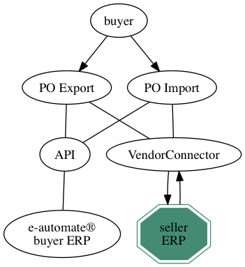
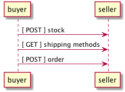
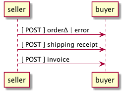
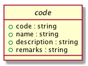
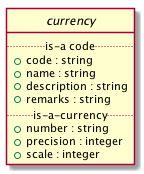
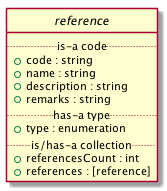

# VendorConnector, ECi order placement services

ECi’s order processing service, VendorConnector, allow partners to provide their
Dealers end-to-end order placement services from within their ECi e-automate®
business management software. These services benefit both Partners (seller/vendor)
and Dealers (buyer/purchaser) by automating the exchange of information between
seller and buyer to increase the accuracy of, and to reduce the time and cost
associated with, placing, fulfilling, tracking, and receiving orders.

## Deliverables

The documention, source code, schemas, and examples in this repository are here to
help sellers integrate their new or existing systems with ECi's order placement
services.

Sellers can choose to provide one or more of the following deliverables:

<table border="2" cellspacing="0" cellpadding="6" rules="groups" frame="hsides">

<colgroup>
<col  class="org-left" />

<col  class="org-left" />
</colgroup>
<thead>
<tr>
<th scope="col" class="org-left">Description of Deliverable</th>
<th scope="col" class="org-left">Yes / No</th>
</tr>
</thead>

<tbody>
<tr>
<td class="org-left">provides health monitoring endpoint(s) (probes)</td>
<td class="org-left">&#xa0;</td>
</tr>
</tbody>

<tbody>
<tr>
<td class="org-left">provides buyers with a list of shipping options</td>
<td class="org-left">&#xa0;</td>
</tr>
</tbody>

<tbody>
<tr>
<td class="org-left">provides buyers with current cost data</td>
<td class="org-left">&#xa0;</td>
</tr>
</tbody>

<tbody>
<tr>
<td class="org-left">provides buyers with current stock level</td>
<td class="org-left">&#xa0;</td>
</tr>
</tbody>

<tbody>
<tr>
<td class="org-left">allows buyers to place orders</td>
<td class="org-left">&#xa0;</td>
</tr>
</tbody>

<tbody>
<tr>
<td class="org-left">provides shipping information for orders</td>
<td class="org-left">&#xa0;</td>
</tr>
</tbody>

<tbody>
<tr>
<td class="org-left">provides invoices for orders</td>
<td class="org-left">&#xa0;</td>
</tr>
</tbody>
</table>

## Actors

Within the ECi Order Placement system a dealer typically takes on the role of **buyer**. A vendor or
supplier (typical readers of this document) assume the role of **seller**. The **buyer** purchases
from the **seller** on behalf of the **consumer**.

-   **buyer:** The entity doing the purchasing. In e-automate™ terms, the buyer is the **dealer**.
-   **consumer:** When the buyer is purchasing for a specific customer, the customer is said to be a consumer.
-   **seller:** You. The entity doing the selling.

## Endpoints

There are six endpoints, three provided by the seller's system and three provided by the buyer's
system. Not all seller systems support resources or endpoints for Shipping Methods, Order&Delta;
(accept/reject), or Shipping Receipts.

### Seller provided endpoints

Buyer to seller interactions often start off by asking the seller if the items they are interested in
purchasing are available in sufficient quantity and at an acceptable cost. The buyer's final act will
to post an order to the seller's system.

### Buyer provided endpoints

Seller to buyer interactions may start with some type of document accepting the order as is, making
changes to the order, or rejecting the order. For orders that are accepted the seller will let the
buyer know when the order has been shipped along with delivery tracking information and an invoice.

## Resource Types

We have chosen to represent resources using JSON Schema and prefer seller implementations also choose
a JSON representation. The buyer's system will be programmed to send and receive resources in other
representations, though this is not part of the standard agreement and will need to be addressed
separately.

These resource types are intended to represent data in flight and are not meant to represent data at rest.

There are seven resource types exchanged between the buyer's system and the seller's system:

-   **stock:** buyer requests cost and/or availability of one or more items
-   **(stock&Delta;):** seller modifies the received stock resource
-   **shipping-method:** seller may provide the buyer with a selection of shipping options to choose from
-   **order:** buyer provides a list of one or more items, the quantity of each item, to be purchased
-   **order&Delta;:** seller may modify the order to indicate back orders, cost, etc.
-   **shipping receipt:** seller provides the buyer with delivery and tracking information for each shipment
-   **invoice:** seller provides the buyer a list of items purchased, the quantity purchased, and cost information
-   **error:** buyer and seller systems may respond with error information

## Connecting

### HTTPS / TLS

The ECi Order Placement services will always connect using a minimum of TLS 1.2.

### Authentication

1.  Buyer -> Seller

    The seller is responsible for providing participating dealers (buyers) a user name
    and password which the ECi system will use to connect to the seller's system. This
    information will be passed to the seller via HTTP Basic Authentication [RFC 7617](http://www.rfc-editor.org/info/rfc7617).
    Stock and Order resources allow for additional non-schema defined information
    (opaque) to be supplied by the buyer and delivered to the seller.

2.  Seller -> Buyer

    ECi is responsible for assigning and maintaining an ID and an API key to each of
    the seller systems. This information will be passed to the buyer system via HTTP
    Basic Authentication. Stock and Order resources allow for additional non-schema
    defined information (opaque) to be supplied by the seller and delivered to the buyer.

## Resource Type Documentation

### Health monitoring probes

Probe [documentation](./probe/README.md)

The purpose of a Probe is to allow buyer and seller health monitoring applications and staff to detect
problems before customers do and provide actionable information, allowing problems to be identified
and corrected as quickly as possible. It is expected that QA, IT, and Support health monitoring
systems and staff will have access to these probes and will access them multiple times throughout
the day.

### Shipping Method

Shipping Method [documentation](./shipping-method/README.md)

A shipping method is the process by which the items on a purchase order are to be transported
(e.g., FedEx, UPS, USPS, Vendor’s Delivery Truck) from the seller to the buyer or consumer. Using
PO Processor, a shipping method may be selected for each order. In some cases, the seller may allow
the buyer to specify alternate ship methods for delivering parts and/or items on back order.

Related Help Topic: [Submitting Purchase Orders](http://webhelp.e-automate.com/172/welcome.htm#PO_Processor/Submitting_Purchase_Orders.htm)

### Stock

1.  TODO write non-technical description

    Stock [documentation](./stock/README.md)

### Order

1.  TODO write non-technical description

    Order [documentation](./order/README.md)

### Invoice

1.  TODO write non-technical description

    Invoice [documentation](./invoice/README.md)

### Shipping Receipts

1.  TODO write non-technical description

    Shipping Receipts [documentation](./receipt/README.md)

## Embedded Resource Types

### Code

1.  Test Results

        echo $(date -u +"%Y-%m-%dT%H:%M:%SZ") started
        xmllint --noout --schema ./other-schema/src/vnd.eci.stg.code.1.0.0.xsd ./other-schema/tst/vnd.eci.stg.code.1.0.0*.xml 2>&1
        ajv -s ./other-schema/src/vnd.eci.stg.code.1.0.0.json -d "./other-schema/tst/vnd.eci.stg.code.1.0.0*.json" 2>&1
        echo $(date -u +"%Y-%m-%dT%H:%M:%SZ") stopped

    <table border="2" cellspacing="0" cellpadding="6" rules="groups" frame="hsides">

    <colgroup>
    <col  class="org-left" />

    <col  class="org-left" />
    </colgroup>
    <tbody>
    <tr>
    <td class="org-left">2019-07-26T00:14:34Z</td>
    <td class="org-left">started</td>
    </tr>

    <tr>
    <td class="org-left">./other-schema/tst/vnd.eci.stg.code.1.0.0.xml</td>
    <td class="org-left">validates</td>
    </tr>

    <tr>
    <td class="org-left">./other-schema/tst/vnd.eci.stg.code.1.0.0.json</td>
    <td class="org-left">valid</td>
    </tr>

    <tr>
    <td class="org-left">2019-07-26T00:14:34Z</td>
    <td class="org-left">stopped</td>
    </tr>
    </tbody>
    </table>

2.  Overview

    At the heart of the order placement 1.0 resource schema is the notion or concept of a code. A code
    is intended to describe a thing of interest to both humans and software.

3.  Definition of Terms

    -   **code:** software facing identity function; used to identify the object to a software system
    -   **name:** human facing identity function; use to identify the object to human readers
    -   **description:** human facing description providing more information than the name allows
    -   **remarks:** non-schema, human facing information sent back and forth between system actors {buyer, seller, consumer}

4.  Example

    1.  JSON

            { "code": "wbkbd2345",
              "name": "wireless keyboard",
              "description": "four channel bluetooth Apple layout full size aluminum keyboard with backlit keys",
              "remarks": "requires two AA batteries" }

    2.  XML

            <?xml version='1.0' encoding='utf-8'?>

            <code>
              <code>wbkbd2345</code>
              <name>wireless keyboard</name>
              <description>four channel bluetooth Apple layout full size aluminum keyboard with backlit keys</description>
              <remarks>requires two AA batteries</remarks>
            </code>

5.  Resource Schema

    1.  Version 1.0

        1.  JSON

                {
                  "id": "./vnd.eci.stg.code.1.0.0.json",
                  "$schema": "http://json-schema.org/draft-07/schema#",
                  "title": "code",
                  "description": "",

                  "type": "object",
                  "additionalProperties": false,

                  "properties": {

                    "code": {
                      "description": "",
                      "type": "string",
                      "minLength": 1,
                      "maxLength": 32
                    },

                    "name": {
                      "description": "",
                      "type": "string",
                      "minLength": 1,
                      "maxLength": 32
                    },

                    "description": {
                      "description": "",
                      "type": "string",
                      "minLength": 1,
                      "maxLength": 128
                    },

                    "remarks": {
                      "description": "details of the error that may help users solve the problem",
                      "type": "string",
                      "minLength": 1,
                      "maxLength": 256
                    }
                  }
                }

        2.  XML

                <?xml version='1.0' encoding='utf-8'?>

                <xs:schema xmlns:xs='http://www.w3.org/2001/XMLSchema'
                           elementFormDefault='qualified'
                           xml:lang='en'>

                  <xs:element name='code' type='CodeType'/>

                  <xs:complexType name='CodeType'>
                    <xs:sequence>
                      <xs:annotation>
                        <xs:documentation>
                          TODO
                        </xs:documentation>
                      </xs:annotation>
                      <xs:element name='code'        type='xs:string'   minOccurs='0' maxOccurs='1' />
                      <xs:element name='name'        type='xs:string'   minOccurs='0' maxOccurs='1' />
                      <xs:element name='description' type='xs:string'   minOccurs='0' maxOccurs='1' />
                      <xs:element name='remarks'     type='xs:string'   minOccurs='0' maxOccurs='1' />
                    </xs:sequence>
                  </xs:complexType>
                </xs:schema>

### Currency

1.  Test Results

        echo $(date -u +"%Y-%m-%dT%H:%M:%SZ") started
        xmllint --noout --schema ./other-schema/src/vnd.eci.stg.currency.1.5.0.xsd ./other-schema/tst/vnd.eci.stg.currency.1.5.0*.xml 2>&1
        ajv -s ./other-schema/src/vnd.eci.stg.currency.1.5.0.json -d "./other-schema/tst/vnd.eci.stg.currency*.json" 2>&1
        echo $(date -u +"%Y-%m-%dT%H:%M:%SZ") stopped

    <table border="2" cellspacing="0" cellpadding="6" rules="groups" frame="hsides">

    <colgroup>
    <col  class="org-left" />

    <col  class="org-left" />
    </colgroup>
    <tbody>
    <tr>
    <td class="org-left">2019-07-26T00:14:38Z</td>
    <td class="org-left">started</td>
    </tr>

    <tr>
    <td class="org-left">./other-schema/tst/vnd.eci.stg.currency.1.5.0.xml</td>
    <td class="org-left">validates</td>
    </tr>

    <tr>
    <td class="org-left">./other-schema/tst/vnd.eci.stg.currency.1.5.0.json</td>
    <td class="org-left">valid</td>
    </tr>

    <tr>
    <td class="org-left">2019-07-26T00:14:39Z</td>
    <td class="org-left">stopped</td>
    </tr>
    </tbody>
    </table>

2.  Overview

    1.  TODO

3.  Definition of Terms

    -   **code:** every currency has a registered ISO alphabetic code
    -   **description:** not used
    -   **name:** human facing value that uniquely identifies the currency.
    -   **remarks:** not used
    -   **number:** every currency has a registered ISO numeric code
    -   **precision:** total number of digits in a number
    -   **scale:** number of digits to the right of the decimal point in a number

4.  Example

    1.  JSON

            { "code": "CLF",
              "name": "Unidad de Fomento",
              "number": 900,
              "precision": 18,
              "scale": 4 }

    2.  XML

            <?xml version='1.0' encoding='utf-8'?>

            <currency>
              <code>CLF</code>
              <name>Unidad de Fomento</name>
              <number>900</number>
              <precision>18</precision>
              <scale>4</scale>
            </currency>

5.  Resource Schema

    1.  Version 1.0

        > Not supported.

    2.  Version 1.5

        1.  JSON

                {
                  "id": "./vnd.eci.stg.code.1.5.0.json",
                  "$schema": "http://json-schema.org/draft-07/schema#",
                  "title": "code",
                  "description": "",

                  "type": "object",
                  "additionalProperties": false,

                  "properties": {

                    "code": {
                      "description": "",
                      "type": "string",
                      "minLength": 1,
                      "maxLength": 32
                    },

                    "name": {
                      "description": "",
                      "type": "string",
                      "minLength": 1,
                      "maxLength": 32
                    },

                    "description": {
                      "description": "",
                      "type": "string",
                      "minLength": 1,
                      "maxLength": 128
                    },

                    "remarks": {
                      "description": "",
                      "type": "string",
                      "minLength": 1,
                      "maxLength": 256
                    },

                    "number": {
                      "description": "",
                      "type": "number",
                      "minimum": 1,
                      "maximum": 999
                    },

                    "precision": {
                      "description": "",
                      "type": "number",
                      "minimum": 0,
                      "maximum": 18
                    },

                    "scale": {
                      "description": "",
                      "type": "number",
                      "minimum": 1,
                      "maximum": 6
                    }
                  }
                }

        2.  XML

                <?xml version='1.0' encoding='utf-8'?>

                <xs:schema xmlns:xs='http://www.w3.org/2001/XMLSchema'
                           elementFormDefault='qualified'
                           xml:lang='en'>

                  <xs:element name='currency' type='CurrencyType'/>

                  <xs:complexType name='CurrencyType'>
                      <xs:sequence>
                        <xs:element name='code'        type='xs:string'  minOccurs='0' maxOccurs='1' />
                        <xs:element name='name'        type='xs:string'  minOccurs='0' maxOccurs='1' />
                        <xs:element name='description' type='xs:string'  minOccurs='0' maxOccurs='1' />
                        <xs:element name='remarks'     type='xs:string'  minOccurs='0' maxOccurs='1' />
                        <xs:element name='number'      type='xs:integer' minOccurs='0' maxOccurs='1' />
                        <xs:element name='precision'   type='xs:integer' minOccurs='0' maxOccurs='1' />
                        <xs:element name='scale'       type='xs:integer' minOccurs='0' maxOccurs='1' />
                      </xs:sequence>
                    </xs:complexType>
                </xs:schema>

6.  © 2018-2019 ECi Software Solutions, Inc. All rights reserved.

### Error

1.  Test Results

        echo $(date -u +"%Y-%m-%dT%H:%M:%SZ") started
        xmllint --noout --schema ./other-schema/src/vnd.eci.stg.error.1.5.0.xsd ./other-schema/tst/vnd.eci.stg.error.1.5.0*.xml 2>&1
        ajv -s ./other-schema/src/vnd.eci.stg.error.1.5.0.json -d "./other-schema/tst/vnd.eci.stg.error.1.5.0*.json" 2>&1
        echo $(date -u +"%Y-%m-%dT%H:%M:%SZ") stopped

    <table border="2" cellspacing="0" cellpadding="6" rules="groups" frame="hsides">

    <colgroup>
    <col  class="org-left" />

    <col  class="org-left" />
    </colgroup>
    <tbody>
    <tr>
    <td class="org-left">2019-07-26T00:14:43Z</td>
    <td class="org-left">started</td>
    </tr>

    <tr>
    <td class="org-left">./other-schema/tst/vnd.eci.stg.error.1.5.0-multiple.xml</td>
    <td class="org-left">validates</td>
    </tr>

    <tr>
    <td class="org-left">./other-schema/tst/vnd.eci.stg.error.1.5.0-nested.xml</td>
    <td class="org-left">validates</td>
    </tr>

    <tr>
    <td class="org-left">./other-schema/tst/vnd.eci.stg.error.1.5.0-single.xml</td>
    <td class="org-left">validates</td>
    </tr>

    <tr>
    <td class="org-left">./other-schema/tst/vnd.eci.stg.error.1.5.0-multiple.json</td>
    <td class="org-left">valid</td>
    </tr>

    <tr>
    <td class="org-left">./other-schema/tst/vnd.eci.stg.error.1.5.0-nested.json</td>
    <td class="org-left">valid</td>
    </tr>

    <tr>
    <td class="org-left">./other-schema/tst/vnd.eci.stg.error.1.5.0-single.json</td>
    <td class="org-left">valid</td>
    </tr>

    <tr>
    <td class="org-left">2019-07-26T00:14:43Z</td>
    <td class="org-left">stopped</td>
    </tr>
    </tbody>
    </table>

2.  Overview

    1.  TODO

3.  Definition of Terms

    -   **code:** Software facing value that uniquely identifies the error. If `Code` is not populated `Name` MUST be populated
    -   **name:** Human facing value that uniquely identifies the probe. If `Name` is not populated `Code` MUST be populated
    -   **description:** Human facing text. Generally populated when there is a failure or warning of some type. If populated the value should give the human user some idea of where the failure or warning is happening and why it might be happening.
    -   **remarks:** Human facing text. Generally populated with one or more actions the user can take to solve the problem
    -   **when:** The date and time of probe execution. If `When` is populated `HttpStatusCode` MUST also be populated

4.  Example

    1.  a singe error

        1.  JSON

                { "code": "500",
                  "name": "null pointer exception",
                  "description": "programmer error. you did nothing wrong.",
                  "remarks": "please take careful note of what you were doing just before the error and report it to customer care.",
                  "when": "2018-04-24T17:00:00.000Z" }

        2.  XML

                <error>
                  <code>500</code>
                  <name>null pointer exception</name>
                  <description>programmer error. you did nothing wrong.</description>
                  <remarks>please take careful note of what you were doing just before the error and report it to customer care.</remarks>
                  <when>2018-04-24T17:00:00.000Z</when>
                </error>

    2.  multiple errors

        1.  JSON

                { "code": "500",
                  "itemsCount": 2,
                  "items": [{ "code": "500",
                              "name": "null pointer exception",
                              "description": "programmer error. you did nothing wrong.",
                              "remarks": "please take careful note of what you were doing just before the error and report it to customer care.",
                              "when": "2018-04-24T17:00:00.000Z"},
                            { "code": "400",
                              "name": "argument exception",
                              "description": "user input error, a required field is missing.",
                              "remarks": "the field user name is required.",
                              "when": "2018-04-24T17:00:00.000Z"}]}

        2.  XML

                <error>
                  <code>500</code>
                  <itemsCount>2</itemsCount>
                  <items>
                    <item>
                      <code>500</code>
                      <name>null pointer exception</name>
                      <description>programmer error. you did nothing wrong</description>
                      <remarks>please take careful note of what you were doing just before the error and report it to customer care.</remarks>
                      <when>2018-04-24T17:00:00.000Z</when>
                    </item>
                    <item>
                      <code>400</code>
                      <name>argument exception</name>
                      <description>user input error, a required field is missing.</description>
                      <remarks>the field user name is required.</remarks>
                      <when>2018-04-24T17:00:00.000Z</when>
                    </item>
                  </items>
                </error>

    3.  nested errors

        1.  JSON

                { "code": "400",
                  "name": "argument exception",
                  "description": "user input error, one or more required fields are missing or contain data that is not expected.",
                  "remarks": "review the following errors and try again.",
                  "itemsCount": 2,
                  "items": [{ "code": "400",
                              "name": "argument exception",
                              "description": "first name is required.",
                              "remarks": "please provide your first name.",
                              "when": "2018-04-24T17:00:00.000Z"},
                            { "code": "400",
                              "name": "argument exception",
                              "description": "birth date contains unexpected data.",
                              "remarks": "please provide your birthday in the following format MM/DD/YYYY.",
                              "when": "2018-04-24T17:00:00.000Z"}]}

        2.  XML

                <error>
                  <code>400</code>
                  <name>argument exception</name>
                  <description>user input error, one or more required fields are missing or contain data that is not expected.</description>
                  <remarks>review the following errors and try again.</remarks>
                  <itemsCount>2</itemsCount>
                  <items>
                    <item>
                      <code>400</code>
                      <name>argument exception</name>
                      <description>first name is required.</description>
                      <remarks>please provide your first name.</remarks>
                      <when>2018-04-24T17:00:00.000Z</when>
                    </item>
                    <item>
                      <code>400</code>
                      <name>argument exception</name>
                      <description>birth date contains unexpected data.</description>
                      <remarks>please provide your birthday in the following format MM/DD/YYYY.</remarks>
                      <when>2018-04-24T17:00:00.000Z</when>
                    </item>
                  </items>
                </error>

5.  Resource Schema

    1.  Version 1.0

        > Not supported.

    2.  Version 1.5

        1.  JSON

                {
                  "id": "./vnd.eci.stg.error.1.5.0.json",
                  "$schema": "http://json-schema.org/draft-07/schema#",
                  "title": "Error",
                  "description": "defines when an error occurred, what the error was, and perhaps how to resolve it.",
                  "type": "object",
                  "additionalProperties": false,
                  "anyOf": [{"required": ["code"]},
                            {"required": ["name"]},
                            {"required": ["when"]}],

                  "properties": {

                    "code": {
                      "description": "software facing value used to identify and respond to errors",
                      "type": "string",
                      "minLength": 1,
                      "maxLength": 32
                    },

                    "name": {
                      "description": "human facing value used to identify and respond to errors",
                      "type": "string",
                      "minLength": 1,
                      "maxLength": 32
                    },

                    "description": {
                      "description": "human readable string describing the error",
                      "type": "string",
                      "minLength": 1,
                      "maxLength": 128
                    },

                    "remarks": {
                      "description": "details of the error that may help users solve the problem",
                      "type": "string",
                      "minLength": 1,
                      "maxLength": 256
                    },

                    "when": {
                      "description": "origination date and time of the error",
                      "type": "string",
                      "format": "date-time"
                    },

                    "itemsCount": {
                      "description": "number of things in the items collection",
                      "type": "number",
                      "minimum": 1,
                      "maximum": 1000
                    },

                    "items": {
                      "description": "",
                      "type": "array",
                      "minItems": 1,
                      "maxItems": 1000,
                      "uniqueItems": true,
                      "items": {
                        "$ref": "#"
                      }
                    }
                  }
                }

        2.  XML

                <?xml version='1.0' encoding='utf-8'?>

                <xs:schema xmlns:xs='http://www.w3.org/2001/XMLSchema'
                           elementFormDefault='qualified'
                           xml:lang='en'>

                  <xs:element name='error' type='ErrorType'/>

                  <xs:complexType name='ErrorType'>
                    <xs:sequence>
                      <xs:annotation>
                        <xs:documentation>
                          TODO
                        </xs:documentation>
                      </xs:annotation>
                      <xs:element name='code'        type='xs:string'   minOccurs='0' maxOccurs='1' />
                      <xs:element name='name'        type='xs:string'   minOccurs='0' maxOccurs='1' />
                      <xs:element name='description' type='xs:string'   minOccurs='0' maxOccurs='1' />
                      <xs:element name='remarks'     type='xs:string'   minOccurs='0' maxOccurs='1' />
                      <xs:element name='when'        type='xs:dateTime' minOccurs='0' maxOccurs='1' />
                      <xs:element name='itemsCount'  type='xs:integer'  minOccurs='0' maxOccurs='1' />
                      <xs:element name='items'       type='ErrorsType'  minOccurs='0' maxOccurs='1' />
                    </xs:sequence>
                  </xs:complexType>

                  <xs:complexType name='ErrorsType'>
                    <xs:sequence minOccurs='0' maxOccurs='1000'>
                      <xs:element name='item' type='ErrorType'/>
                    </xs:sequence>
                  </xs:complexType>

                </xs:schema>

### Reference

1.  Test Results

        echo $(date -u +"%Y-%m-%dT%H:%M:%SZ") started
        xmllint --noout --schema ./other-schema/src/vnd.eci.stg.reference.1.5.0.xsd ./other-schema/tst/vnd.eci.stg.reference.1.5.0*.xml 2>&1
        ajv -s ./other-schema/src/vnd.eci.stg.reference.1.5.0.json -d "./other-schema/tst/vnd.eci.stg.reference*.json" 2>&1
        echo $(date -u +"%Y-%m-%dT%H:%M:%SZ") stopped

    <table border="2" cellspacing="0" cellpadding="6" rules="groups" frame="hsides">

    <colgroup>
    <col  class="org-left" />

    <col  class="org-left" />
    </colgroup>
    <tbody>
    <tr>
    <td class="org-left">2019-07-26T00:14:47Z</td>
    <td class="org-left">started</td>
    </tr>

    <tr>
    <td class="org-left">./other-schema/tst/vnd.eci.stg.reference.1.5.0-as-code.xml</td>
    <td class="org-left">validates</td>
    </tr>

    <tr>
    <td class="org-left">./other-schema/tst/vnd.eci.stg.reference.1.5.0.xml</td>
    <td class="org-left">validates</td>
    </tr>

    <tr>
    <td class="org-left">./other-schema/tst/vnd.eci.stg.reference.1.5.0-as-code.json</td>
    <td class="org-left">valid</td>
    </tr>

    <tr>
    <td class="org-left">./other-schema/tst/vnd.eci.stg.reference.1.5.0.-as-code.json</td>
    <td class="org-left">valid</td>
    </tr>

    <tr>
    <td class="org-left">./other-schema/tst/vnd.eci.stg.reference.1.5.0.json</td>
    <td class="org-left">valid</td>
    </tr>

    <tr>
    <td class="org-left">2019-07-26T00:14:48Z</td>
    <td class="org-left">stopped</td>
    </tr>
    </tbody>
    </table>

2.  Overview

    1.  TODO

3.  Discussion

    In version 1.5 and beyond the code type will be replaced with a reference type. The human facing
    elements are left in place and has an additional `remarks` field. The software facing `code` has
    been extended to allow us to identify a thing in many different systems.

    A contrived example, under my fingers is a keyboard. Using the reference type we can describe the
    keyboard from the viewpoint of different actor's actor systems. This keyboard is known as
    `wbkbd2345` in the buyer's system and as `kbdbt4cha` in the seller's system.

4.  Definition of Terms

    -   **code:** software facing identity function; used to identify the object to a software system
    -   **name:** human facing identity function; use to identify the object to human readers
    -   **description:** human facing description providing more information than the name allows
    -   **remarks:** non-schema human facing information sent back and forth between buyer and seller
    -   **type:** enumeration, telling us the domain of the code
    -   **referencesCount:** the number of references in the references collection
    -   **references:** holds one or more references

5.  Example

    1.  references are codes

        1.  JSON

                { "code": "wbkbd2345",
                  "name": "wireless keyboard",
                  "description": "four channel bluetooth Apple layout full size aluminum keyboard with backlit keys"
                }

        2.  XML

                <?xml version='1.0' encoding='utf-8'?>

                <reference>
                  <code>wbkbd2345</code>
                  <name>wireless keyboard</name>
                  <description>four channel bluetooth Apple layout full size aluminum keyboard with backlit keys</description>
                </reference>

    2.  references can represent a code from many different perspectives; in the case buyer and seller.

        1.  JSON

                { "name": "wireless keyboard",
                  "description": "four channel bluetooth Apple layout full size aluminum keyboard with backlit keys",
                  "remarks": "requires two AAA batteries",
                  "referencesCount": 2,
                  "references": [{ "code": "wbkbd2345", "type": "buyer" },
                                 { "code": "kbdbt4cha", "type": "seller" }]}

        2.  XML

                <?xml version='1.0' encoding='utf-8'?>

                <reference>
                  <name>wireless keyboard</name>
                  <description>four channel bluetooth Apple layout full size aluminum keyboard with backlit keys</description>
                  <remarks>requires two AAA batteries</remarks>
                  <referencesCount>2</referencesCount>
                  <references>
                    <reference>
                      <code>wbkbd2345</code>
                      <type>buyer</type>
                    </reference>
                    <reference>
                      <code>kbdbt4cha</code>
                      <type>seller</type>
                    </reference>
                  </references>
                </reference>

6.  Resource Schema

    1.  Version 1.0

        > Not supported.

    2.  Version 1.5

        1.  JSON

                {
                  "id": "./vnd.eci.stg.code.1.5.0.json",
                  "$schema": "http://json-schema.org/draft-07/schema#",
                  "title": "reference",
                  "description": "",
                  "type": "object",
                  "additionalProperties": false,

                  "properties": {

                    "code": {
                      "description": "",
                      "type": "string",
                      "minLength": 1,
                      "maxLength": 32
                    },

                    "name": {
                      "description": "",
                      "type": "string",
                      "minLength": 1,
                      "maxLength": 32
                    },

                    "description": {
                      "description": "",
                      "type": "string",
                      "minLength": 1,
                      "maxLength": 128
                    },

                    "remarks": {
                      "description": "",
                      "type": "string",
                      "minLength": 1,
                      "maxLength": 256
                    },

                    "type": { "$ref": "#/definitions/referenceTypeEnum" },

                    "referencesCount": {
                      "description": "number of things in the references collection",
                      "type": "number",
                      "minimum": 1,
                      "maximum": 1000
                    },

                    "references": {
                      "description": "",
                      "type": "array",
                      "minItems": 1,
                      "maxItems": 1000,
                      "uniqueItems": true,
                      "items": {
                        "$ref": "#"
                      }
                    }
                  },

                  "definitions": {
                    "referenceTypeEnum": {
                      "type": "string",
                      "enum": ["buyer", "consumer", "manufacturer", "seller" ]
                    }
                  }
                }

        2.  XML

                <xs:schema attributeFormDefault='unqualified'
                           elementFormDefault='qualified'
                           xmlns:xs='http://www.w3.org/2001/XMLSchema'>

                  <xs:element name='reference' type='ReferenceType'/>

                  <xs:complexType name='ReferenceType'>
                    <xs:sequence>
                      <xs:element name='code'        type='xs:string' minOccurs='0' maxOccurs='1' />
                      <xs:element name='name'        type='xs:string' minOccurs='0' maxOccurs='1' />
                      <xs:element name='description' type='xs:string' minOccurs='0' maxOccurs='1' />
                      <xs:element name='remarks'     type='xs:string' minOccurs='0' maxOccurs='1' />
                      <xs:element name='type'        type='ReferenceTypeEnum' minOccurs='0' maxOccurs='1' />

                      <xs:element name='referencesCount'   type='xs:integer'     minOccurs='0' maxOccurs='1' />
                      <xs:element name='references'        type='ReferencesType' minOccurs='0' maxOccurs='1' />
                    </xs:sequence>
                  </xs:complexType>

                  <xs:simpleType name='ReferenceTypeEnum'>
                    <xs:restriction base='xs:string'>
                      <xs:enumeration value='buyer'/>
                      <xs:enumeration value='consumer'/>
                      <xs:enumeration value='manufacturer'/>
                      <xs:enumeration value='seller'/>
                    </xs:restriction>
                  </xs:simpleType>

                  <xs:complexType name='ReferencesType'>
                    <xs:sequence minOccurs='0' maxOccurs='1000'>
                      <xs:element name='reference' type='ReferenceType'/>
                    </xs:sequence>
                  </xs:complexType>

                </xs:schema>

## Testing

    #!/bin/bash
    #
    # brew install jsonlint
    # npm install jsonlint -g
    # npm install ajv -g
    # npm install ajv-cli -g
    #

## About this document

These documents were created using [emacs's](https://www.gnu.org/software/emacs/) org mode in a Literate Programming style with additional
support from packages such as babel, htmlize, graphviz, plantuml, etc. Emacs was hosted on macOS
High Sierra (10.13.3). Supporting libraries and applications were installed and updated using Homebrew.

    emacs version: GNU Emacs 25.3.1 (x86_64-apple-darwin13.4.0, NS appkit-1265.21 Version 10.9.5 (Build 13F1911))
     of 2017-09-12
    org version: 9.1.8

Embedded within this document are code fragments that are executed and do actual
work. As an example the next bit of code creates directories to hold images
generated by graphviz, plantuml, etc. as well as folders for schema documents and
source code required to test and demonstrate key concepts. Not all executing code
will be weaved or tangled but may execute "silently".

    (progn (make-directory "./images" t)
           (make-directory "./rsrc-schema/src" t)
           (make-directory "./rsrc-schema/tst" t)
           (make-directory "./other-schema/src" t)
           (make-directory "./other-schema/tst" t))

### Tangle

To tangle documents use the key binding **C-c C-v t**

### Export

To export documents use the key binding **C-c C-e** and choose your preferred export format. For this
project I am using Markdown e.g. **C-c C-e m m**

## © 2018-2019 ECi Software Solutions, Inc. All rights reserved.
