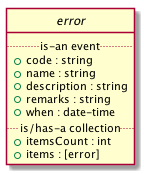

# Order Placement System

## Overview

Lorem ipsum dolor sit amet, sea ad clita sadipscing, mea id antiopam prodesset. Justo scripta vivendum eum id, in vis essent petentium. Qui mutat tritani epicuri et, utamur percipitur an sea. Ad nullam integre eum. Cu atqui inermis pri, tempor causae sanctus at pro. Ea cum tation hendrerit conclusionemque, veri hendrerit definitionem sit at. Vix adipiscing dissentiet eloquentiam eu, decore epicurei liberavisse eu eam.

### Actors

Within the ECi Order Placement system a dealer typically takes on the role of *Buyer*. A vendor or
supplier (typical readers of this document) take the role of *Seller*. A *Consumer* is the buyer's
customer and in rare cases, the buyer. There are nuances to be discussed, we will not attempt to
explain right now rather we will take up the details for the specific use cases as we come across
them.

### Endpoints

There are six endpoints, three provided by the Seller's system

And three provided by the Buyer's system:

### Endpoint Resource Types

These types are intended to represent data in flight and are not meant to represent data at rest.

There are six resource types exchanged between the Buyer's system and the Seller's system:

Not all Seller systems support resources or endpoints for Shipment Methods, Order&Delta;
(accept/reject), or Shipment information. We have chosen to represent resources using
JSON Schema and prefer Seller implementations also choose a JSON representation. The
Buyer's system can be programmed to send and receive resources in other representations,
though this is not part of the standard agreement and will need to be addressed separately.

### Connecting To Endpoints

1.  HTTPS / TLS

    The ECi Order Placement services will always connect using a minimum of TLS 1.2.

2.  Authentication

    1.  Buyer -> Seller

        The Seller is responsible for providing participating dealers (Buyers) a user name
        and password which the ECi system will use to connect to the Seller's system. This
        information will be passed to the seller via HTTP Basic Authentication [RFC 7617](http://www.rfc-editor.org/info/rfc7617).
        Stock and Order resources allow for additional non-schema defined information
        (opaque) to be supplied by the Buyer and delivered to the Seller.

    2.  Seller -> Buyer

        ECi is responsible for assigning and maintaining an ID and an API key to each of
        the Seller systems. This information will be passed to the buyer system via HTTP
        Basic Authentication. Stock and Order resources allow for additional non-schema
        defined information (opaque) to be supplied by the Seller and delivered to the Buyer.

## Endpoint Major Resource Types

### Probe

Lorem ipsum dolor sit amet, sea ad clita sadipscing, mea id antiopam prodesset. Justo scripta vivendum eum id, in vis essent petentium. Qui mutat tritani epicuri et, utamur percipitur an sea. Ad nullam integre eum. Cu atqui inermis pri, tempor causae sanctus at pro. Ea cum tation hendrerit conclusionemque, veri hendrerit definitionem sit at. Vix adipiscing dissentiet eloquentiam eu, decore epicurei liberavisse eu eam.

Probe [documentation](./probe/README.md)

### Shipping Method

Lorem ipsum dolor sit amet, sea ad clita sadipscing, mea id antiopam prodesset. Justo scripta vivendum eum id, in vis essent petentium. Qui mutat tritani epicuri et, utamur percipitur an sea. Ad nullam integre eum. Cu atqui inermis pri, tempor causae sanctus at pro. Ea cum tation hendrerit conclusionemque, veri hendrerit definitionem sit at. Vix adipiscing dissentiet eloquentiam eu, decore epicurei liberavisse eu eam.

Ship Method [documentation](./ship-method/README.md)

### Stock

Lorem ipsum dolor sit amet, sea ad clita sadipscing, mea id antiopam prodesset. Justo scripta vivendum eum id, in vis essent petentium. Qui mutat tritani epicuri et, utamur percipitur an sea. Ad nullam integre eum. Cu atqui inermis pri, tempor causae sanctus at pro. Ea cum tation hendrerit conclusionemque, veri hendrerit definitionem sit at. Vix adipiscing dissentiet eloquentiam eu, decore epicurei liberavisse eu eam.

Stock [documentation](./stock/README.md)

### Order

Lorem ipsum dolor sit amet, sea ad clita sadipscing, mea id antiopam prodesset. Justo scripta vivendum eum id, in vis essent petentium. Qui mutat tritani epicuri et, utamur percipitur an sea. Ad nullam integre eum. Cu atqui inermis pri, tempor causae sanctus at pro. Ea cum tation hendrerit conclusionemque, veri hendrerit definitionem sit at. Vix adipiscing dissentiet eloquentiam eu, decore epicurei liberavisse eu eam.

Order [documentation](./order/README.md)

### Invoice

Lorem ipsum dolor sit amet, sea ad clita sadipscing, mea id antiopam prodesset. Justo scripta vivendum eum id, in vis essent petentium. Qui mutat tritani epicuri et, utamur percipitur an sea. Ad nullam integre eum. Cu atqui inermis pri, tempor causae sanctus at pro. Ea cum tation hendrerit conclusionemque, veri hendrerit definitionem sit at. Vix adipiscing dissentiet eloquentiam eu, decore epicurei liberavisse eu eam.

Invoice [documentation](./invoice/README.md)

### Shipping Receipts

Lorem ipsum dolor sit amet, sea ad clita sadipscing, mea id antiopam prodesset. Justo scripta vivendum eum id, in vis essent petentium. Qui mutat tritani epicuri et, utamur percipitur an sea. Ad nullam integre eum. Cu atqui inermis pri, tempor causae sanctus at pro. Ea cum tation hendrerit conclusionemque, veri hendrerit definitionem sit at. Vix adipiscing dissentiet eloquentiam eu, decore epicurei liberavisse eu eam.

Shipping Receipts [documentation](./receipt/README.md)

## Other (embedded) Resource Types

### Code

1.  Test Results

        echo $(date -u +"%Y-%m-%dT%H:%M:%SZ") started
        xmllint --noout --schema ./other-schema/src/vnd.eci.stg.code.1.0.0.xsd ./other-schema/tst/vnd.eci.stg.code.1.0.0*.xml 2>&1
        ajv -s ./other-schema/src/vnd.eci.stg.code.1.0.0.json -d "./other-schema/tst/vnd.eci.stg.code.1.0.0*.json" 2>&1
        echo $(date -u +"%Y-%m-%dT%H:%M:%SZ") stopped

    <table border="2" cellspacing="0" cellpadding="6" rules="groups" frame="hsides">

    <colgroup>
    <col  class="org-left" />

    <col  class="org-left" />
    </colgroup>
    <tbody>
    <tr>
    <td class="org-left">2018-10-22T08:40:08Z</td>
    <td class="org-left">started</td>
    </tr>

    <tr>
    <td class="org-left">./other-schema/tst/vnd.eci.stg.code.1.0.0.xml</td>
    <td class="org-left">validates</td>
    </tr>

    <tr>
    <td class="org-left">./other-schema/tst/vnd.eci.stg.code.1.0.0.json</td>
    <td class="org-left">valid</td>
    </tr>

    <tr>
    <td class="org-left">2018-10-22T08:40:09Z</td>
    <td class="org-left">stopped</td>
    </tr>
    </tbody>
    </table>

2.  Overview

    At the heart of the order placement 1.0 resource schema is the notion or concept of a code. A code
    is intended to describe a thing of interest to both humans and software.

3.  Discussion

    Lorem ipsum dolor sit amet, sea ad clita sadipscing, mea id antiopam prodesset. Justo scripta vivendum eum id, in vis essent petentium. Qui mutat tritani epicuri et, utamur percipitur an sea. Ad nullam integre eum. Cu atqui inermis pri, tempor causae sanctus at pro. Ea cum tation hendrerit conclusionemque, veri hendrerit definitionem sit at. Vix adipiscing dissentiet eloquentiam eu, decore epicurei liberavisse eu eam.

4.  Definition of Terms

    -   **code:** software facing identity function; used to identify the object to a software system
    -   **name:** human facing identity function; use to identify the object to human readers
    -   **description:** human facing description providing more information than the name allows

5.  Examples

    1.  JSON

            { "code": "wbkbd2345",
              "name": "wireless keyboard",
              "description": "four channel bluetooth Apple layout full size aluminum keyboard with backlit keys",
              "remarks": "requires two AA batteries"
            }

    2.  XML

            <?xml version='1.0' encoding='utf-8'?>

            <code>
              <code>wbkbd2345</code>
              <name>wireless keyboard</name>
              <description>four channel bluetooth Apple layout full size aluminum keyboard with backlit keys</description>
              <remarks>requires two AA batteries</remarks>
            </code>

6.  Resource Schema

    1.  Version 1.0

        1.  JSON

                {
                  "id": "./vnd.eci.stg.code.1.0.0.json",
                  "$schema": "http://json-schema.org/draft-07/schema#",
                  "title": "code",
                  "description": "",

                  "type": "object",
                  "additionalProperties": false,

                  "properties": {

                    "code": {
                      "description": "",
                      "type": "string",
                      "minLength": 1,
                      "maxLength": 32
                    },

                    "name": {
                      "description": "",
                      "type": "string",
                      "minLength": 1,
                      "maxLength": 32
                    },

                    "description": {
                      "description": "",
                      "type": "string",
                      "minLength": 1,
                      "maxLength" : 128
                    },

                    "remarks": {
                      "description": "details of the error that may help users solve the problem",
                      "type": "string",
                      "minLength": 1,
                      "maxLength" : 256
                    }
                  }
                }

        2.  XML

                <?xml version='1.0' encoding='utf-8'?>

                <xs:schema xmlns:xs='http://www.w3.org/2001/XMLSchema'
                           elementFormDefault='qualified'
                           xml:lang='en'>

                  <xs:element name='code' type='CodeType'/>

                  <xs:complexType name='CodeType'>
                    <xs:sequence>
                      <xs:annotation>
                        <xs:documentation>
                          TODO
                        </xs:documentation>
                      </xs:annotation>
                      <xs:element name='code'        type='xs:string'   minOccurs='0' maxOccurs='1' />
                      <xs:element name='name'        type='xs:string'   minOccurs='0' maxOccurs='1' />
                      <xs:element name='description' type='xs:string'   minOccurs='0' maxOccurs='1' />
                      <xs:element name='remarks'     type='xs:string'   minOccurs='0' maxOccurs='1' />
                    </xs:sequence>
                  </xs:complexType>
                </xs:schema>

### Error

1.  Test Results

        echo $(date -u +"%Y-%m-%dT%H:%M:%SZ") started
        xmllint --noout --schema ./other-schema/src/vnd.eci.stg.error.1.5.0.xsd ./other-schema/tst/vnd.eci.stg.error.1.5.0*.xml 2>&1
        ajv -s ./other-schema/src/vnd.eci.stg.error.1.5.0.json -d "./other-schema/tst/vnd.eci.stg.error.1.5.0*.json" 2>&1
        echo $(date -u +"%Y-%m-%dT%H:%M:%SZ") stopped

    <table border="2" cellspacing="0" cellpadding="6" rules="groups" frame="hsides">

    <colgroup>
    <col  class="org-left" />

    <col  class="org-left" />
    </colgroup>
    <tbody>
    <tr>
    <td class="org-left">2018-10-22T08:40:12Z</td>
    <td class="org-left">started</td>
    </tr>

    <tr>
    <td class="org-left">./other-schema/tst/vnd.eci.stg.error.1.5.0-multiple.xml</td>
    <td class="org-left">validates</td>
    </tr>

    <tr>
    <td class="org-left">./other-schema/tst/vnd.eci.stg.error.1.5.0-nested.xml</td>
    <td class="org-left">validates</td>
    </tr>

    <tr>
    <td class="org-left">./other-schema/tst/vnd.eci.stg.error.1.5.0-single.xml</td>
    <td class="org-left">validates</td>
    </tr>

    <tr>
    <td class="org-left">./other-schema/tst/vnd.eci.stg.error.1.5.0-multiple.json</td>
    <td class="org-left">valid</td>
    </tr>

    <tr>
    <td class="org-left">./other-schema/tst/vnd.eci.stg.error.1.5.0-nested.json</td>
    <td class="org-left">valid</td>
    </tr>

    <tr>
    <td class="org-left">./other-schema/tst/vnd.eci.stg.error.1.5.0-single.json</td>
    <td class="org-left">valid</td>
    </tr>

    <tr>
    <td class="org-left">2018-10-22T08:40:12Z</td>
    <td class="org-left">stopped</td>
    </tr>
    </tbody>
    </table>

2.  Overview

    Lorem ipsum dolor sit amet, sea ad clita sadipscing, mea id antiopam prodesset. Justo scripta vivendum eum id, in vis essent petentium. Qui mutat tritani epicuri et, utamur percipitur an sea. Ad nullam integre eum. Cu atqui inermis pri, tempor causae sanctus at pro. Ea cum tation hendrerit conclusionemque, veri hendrerit definitionem sit at. Vix adipiscing dissentiet eloquentiam eu, decore epicurei liberavisse eu eam.

3.  Discussion

    Lorem ipsum dolor sit amet, sea ad clita sadipscing, mea id antiopam prodesset. Justo scripta vivendum eum id, in vis essent petentium. Qui mutat tritani epicuri et, utamur percipitur an sea. Ad nullam integre eum. Cu atqui inermis pri, tempor causae sanctus at pro. Ea cum tation hendrerit conclusionemque, veri hendrerit definitionem sit at. Vix adipiscing dissentiet eloquentiam eu, decore epicurei liberavisse eu eam.

4.  Definition of Terms

    -   **code:** Software facing value that uniquely identifies the error. If `Code` is not populated `Name` MUST be populated
    -   **name:** Human facing value that uniquely identifies the probe. If `Name` is not populated `Code` MUST be populated
    -   **description:** Human facing text. Generally populated when there is a failure or warning of some type. If populated the value should give the human user some idea of where the failure or warning is happening and why it might be happening.
    -   **remarks:** Human facing text. Generally populated with one or more actions the user can take to solve the problem
    -   **when:** The date and time of probe execution. If `When` is populated `HttpStatusCode` MUST also be populated

5.  Examples

    1.  a singe error

        1.  JSON

                { "code": "500",
                  "name": "null pointer exception",
                  "description": "programmer error. you did nothing wrong.",
                  "remarks": "please take careful note of what you were doing just before the error and report it to customer care.",
                  "when": "2018-04-24T17:00:00.000Z"
                }

        2.  XML

                <error>
                  <code>500</code>
                  <name>null pointer exception</name>
                  <description>programmer error. you did nothing wrong.</description>
                  <remarks>please take careful note of what you were doing just before the error and report it to customer care.</remarks>
                  <when>2018-04-24T17:00:00.000Z</when>
                </error>

    2.  multiple errors

        1.  JSON

                { "code": "500",
                  "itemsCount": 2,
                  "items": [{ "code": "500",
                              "name": "null pointer exception",
                              "description": "programmer error. you did nothing wrong.",
                              "remarks": "please take careful note of what you were doing just before the error and report it to customer care.",
                              "when": "2018-04-24T17:00:00.000Z"},
                            { "code": "400",
                              "name": "argument exception",
                              "description": "user input error, a required field is missing.",
                              "remarks": "the field user name is required.",
                              "when": "2018-04-24T17:00:00.000Z"}]}

        2.  XML

                <error>
                  <code>500</code>
                  <itemsCount>2</itemsCount>
                  <items>
                    <item>
                      <code>500</code>
                      <name>null pointer exception</name>
                      <description>programmer error. you did nothing wrong</description>
                      <remarks>please take careful note of what you were doing just before the error and report it to customer care.</remarks>
                      <when>2018-04-24T17:00:00.000Z</when>
                    </item>
                    <item>
                      <code>400</code>
                      <name>argument exception</name>
                      <description>user input error, a required field is missing.</description>
                      <remarks>the field user name is required.</remarks>
                      <when>2018-04-24T17:00:00.000Z</when>
                    </item>
                  </items>
                </error>

    3.  nested errors

        1.  JSON

                { "code": "400",
                  "name": "argument exception",
                  "description": "user input error, one or more required fields are missing or contain data that is not expected.",
                  "remarks": "review the following errors and try again.",
                  "itemsCount": 2,
                  "items": [{ "code": "400",
                              "name": "argument exception",
                              "description": "first name is required.",
                              "remarks": "please provide your first name.",
                              "when": "2018-04-24T17:00:00.000Z"},
                            { "code": "400",
                              "name": "argument exception",
                              "description": "birth date contains unexpected data.",
                              "remarks": "please provide your birthday in the following format MM/DD/YYYY.",
                              "when": "2018-04-24T17:00:00.000Z"}]}

        2.  XML

                <error>
                  <code>400</code>
                  <name>argument exception</name>
                  <description>user input error, one or more required fields are missing or contain data that is not expected.</description>
                  <remarks>review the following errors and try again.</remarks>
                  <itemsCount>2</itemsCount>
                  <items>
                    <item>
                      <code>400</code>
                      <name>argument exception</name>
                      <description>first name is required.</description>
                      <remarks>please provide your first name.</remarks>
                      <when>2018-04-24T17:00:00.000Z</when>
                    </item>
                    <item>
                      <code>400</code>
                      <name>argument exception</name>
                      <description>birth date contains unexpected data.</description>
                      <remarks>please provide your birthday in the following format MM/DD/YYYY.</remarks>
                      <when>2018-04-24T17:00:00.000Z</when>
                    </item>
                  </items>
                </error>

6.  Resource Schema

    1.  Version 1.0

        > Not supported.

    2.  Version 1.5

        1.  JSON

                {
                  "id": "./vnd.eci.stg.error.1.5.0.json",
                  "$schema": "http://json-schema.org/draft-07/schema#",
                  "title": "Error",
                  "description": "defines when an error occurred, what the error was, and perhaps how to resolve it.",
                  "type": "object",
                  "additionalProperties": false,
                  "anyOf": [{"required": ["code"]},
                            {"required": ["name"]},
                            {"required": ["when"]}],

                  "properties" : {

                    "code": {
                      "description": "software facing value used to identify and respond to errors",
                      "type": "string",
                      "minLength": 1,
                      "maxLength": 32
                    },

                    "name": {
                      "description": "human facing value used to identify and respond to errors",
                      "type": "string",
                      "minLength": 1,
                      "maxLength": 32
                    },

                    "description": {
                      "description": "human readable string describing the error",
                      "type": "string",
                      "minLength": 1,
                      "maxLength": 128
                    },

                    "remarks": {
                      "description": "details of the error that may help users solve the problem",
                      "type": "string",
                      "minLength": 1,
                      "maxLength" : 256
                    },

                    "when": {
                      "description": "origination date and time of the error",
                      "type" : "string",
                      "format": "date-time"
                    },

                    "itemsCount": {
                      "description": "number of things in the items collection",
                      "type" : "number",
                      "minimum": 1,
                      "maximum": 1000
                    },

                    "items": {
                      "description": "",
                      "type": "array",
                      "minItems": 1,
                      "maxItems": 1000,
                      "uniqueItems": true,
                      "items" : {
                        "$ref" : "#"
                      }
                    }
                  }
                }

        2.  XML

                <?xml version='1.0' encoding='utf-8'?>

                <xs:schema xmlns:xs='http://www.w3.org/2001/XMLSchema'
                           elementFormDefault='qualified'
                           xml:lang='en'>

                  <xs:element name='error' type='ErrorType'/>

                  <xs:complexType name='ErrorType'>
                    <xs:sequence>
                      <xs:annotation>
                        <xs:documentation>
                          TODO
                        </xs:documentation>
                      </xs:annotation>
                      <xs:element name='code'        type='xs:string'   minOccurs='0' maxOccurs='1' />
                      <xs:element name='name'        type='xs:string'   minOccurs='0' maxOccurs='1' />
                      <xs:element name='description' type='xs:string'   minOccurs='0' maxOccurs='1' />
                      <xs:element name='remarks'     type='xs:string'   minOccurs='0' maxOccurs='1' />
                      <xs:element name='when'        type='xs:dateTime' minOccurs='0' maxOccurs='1' />
                      <xs:element name='itemsCount'  type='xs:integer'  minOccurs='0' maxOccurs='1' />
                      <xs:element name='items'       type='ErrorsType'  minOccurs='0' maxOccurs='1' />
                    </xs:sequence>
                  </xs:complexType>

                  <xs:complexType name='ErrorsType'>
                    <xs:sequence minOccurs='0' maxOccurs='1000'>
                      <xs:element name='item' type='ErrorType'/>
                    </xs:sequence>
                  </xs:complexType>

                </xs:schema>

### Reference

1.  Test Results

        echo $(date -u +"%Y-%m-%dT%H:%M:%SZ") started
        xmllint --noout --schema ./other-schema/src/vnd.eci.stg.reference.1.5.0.xsd ./other-schema/tst/vnd.eci.stg.reference.1.5.0*.xml 2>&1
        ajv -s ./other-schema/src/vnd.eci.stg.reference.1.5.0.json -d "./other-schema/tst/vnd.eci.stg.reference*.json" 2>&1
        echo $(date -u +"%Y-%m-%dT%H:%M:%SZ") stopped

    <table border="2" cellspacing="0" cellpadding="6" rules="groups" frame="hsides">

    <colgroup>
    <col  class="org-left" />

    <col  class="org-left" />
    </colgroup>
    <tbody>
    <tr>
    <td class="org-left">2018-10-22T08:40:16Z</td>
    <td class="org-left">started</td>
    </tr>

    <tr>
    <td class="org-left">./other-schema/tst/vnd.eci.stg.reference.1.5.0-as-code.xml</td>
    <td class="org-left">validates</td>
    </tr>

    <tr>
    <td class="org-left">./other-schema/tst/vnd.eci.stg.reference.1.5.0.xml</td>
    <td class="org-left">validates</td>
    </tr>

    <tr>
    <td class="org-left">./other-schema/tst/vnd.eci.stg.reference.1.5.0-as-code.json</td>
    <td class="org-left">valid</td>
    </tr>

    <tr>
    <td class="org-left">./other-schema/tst/vnd.eci.stg.reference.1.5.0.-as-code.json</td>
    <td class="org-left">valid</td>
    </tr>

    <tr>
    <td class="org-left">./other-schema/tst/vnd.eci.stg.reference.1.5.0.json</td>
    <td class="org-left">valid</td>
    </tr>

    <tr>
    <td class="org-left">2018-10-22T08:40:16Z</td>
    <td class="org-left">stopped</td>
    </tr>
    </tbody>
    </table>

2.  Overview

    Lorem ipsum dolor sit amet, sea ad clita sadipscing, mea id antiopam prodesset. Justo scripta vivendum eum id, in vis essent petentium. Qui mutat tritani epicuri et, utamur percipitur an sea. Ad nullam integre eum. Cu atqui inermis pri, tempor causae sanctus at pro. Ea cum tation hendrerit conclusionemque, veri hendrerit definitionem sit at. Vix adipiscing dissentiet eloquentiam eu, decore epicurei liberavisse eu eam.

3.  Discussion

    In version 1.5 and beyond the code type will be replaced with a reference type. The human facing
    elements are left in place and has an additional `remarks` field. The software facing `code` has
    been extended to allow us to identify a thing in many different systems.

    A contrived example, under my fingers is a keyboard. Using the reference type we can describe the
    keyboard from the viewpoint of different actor's actor systems. This keyboard is known as
    `wbkbd2345` in the buyer's system and as `kbdbt4cha` in the seller's system.

4.  Definition of Terms

    -   **code:** software facing identity function; used to identify the object to a software system
    -   **name:** human facing identity function; use to identify the object to human readers
    -   **description:** human facing description providing more information than the name allows
    -   **remarks:** non-schema human facing information sent back and forth between buyer and seller
    -   **type:** enumeration, telling us the domain of the code
    -   **referencesCount:** the number of references in the references collection
    -   **references:** holds one or more references

5.  Examples

    1.  references are codes

        1.  JSON

                { "code": "wbkbd2345",
                  "name": "wireless keyboard",
                  "description": "four channel bluetooth Apple layout full size aluminum keyboard with backlit keys"
                }

        2.  XML

                <?xml version='1.0' encoding='utf-8'?>

                <reference>
                  <code>wbkbd2345</code>
                  <name>wireless keyboard</name>
                  <description>four channel bluetooth Apple layout full size aluminum keyboard with backlit keys</description>
                </reference>

    2.  references can represent a code from many different perspectives; in the case buyer and seller.

        1.  JSON

                { "name": "wireless keyboard",
                  "description": "four channel bluetooth Apple layout full size aluminum keyboard with backlit keys",
                  "remarks": "requires two AAA batteries",
                  "referencesCount": 2,
                  "references": [{ "code": "wbkbd2345", "type": "buyer" },
                                 { "code": "kbdbt4cha", "type": "seller" }]}

        2.  XML

                <?xml version='1.0' encoding='utf-8'?>

                <reference>
                  <name>wireless keyboard</name>
                  <description>four channel bluetooth Apple layout full size aluminum keyboard with backlit keys</description>
                  <remarks>requires two AAA batteries</remarks>
                  <referencesCount>2</referencesCount>
                  <references>
                    <reference>
                      <code>wbkbd2345</code>
                      <type>buyer</type>
                    </reference>
                    <reference>
                      <code>kbdbt4cha</code>
                      <type>seller</type>
                    </reference>
                  </references>
                </reference>

6.  Resource Schema

    1.  Version 1.0

        > Not supported.

    2.  Version 1.5

        1.  JSON

                {
                  "id": "./vnd.eci.stg.code.1.5.0.json",
                  "$schema": "http://json-schema.org/draft-07/schema#",
                  "title": "reference",
                  "description": "",
                  "type": "object",
                  "additionalProperties": false,

                  "properties": {

                    "code": {
                      "description": "",
                      "type": "string",
                      "minLength": 1,
                      "maxLength": 32
                    },

                    "name": {
                      "description": "",
                      "type": "string",
                      "minLength": 1,
                      "maxLength": 32
                    },

                    "description": {
                      "description": "",
                      "type": "string",
                      "minLength": 1,
                      "maxLength" : 128
                    },

                    "remarks": {
                      "description": "",
                      "type": "string",
                      "minLength": 1,
                      "maxLength" : 256
                    },

                    "type": { "$ref": "#/definitions/referenceType" },

                    "referencesCount": {
                      "description": "number of things in the items collection",
                      "type" : "number",
                      "minimum": 1,
                      "maximum": 1000
                    },

                    "references": {
                      "description": "",
                      "type": "array",
                      "minItems": 1,
                      "maxItems": 1000,
                      "uniqueItems": true,
                      "items" : {
                        "$ref" : "#"
                      }
                    }
                  },

                  "definitions" : {
                    "referenceType": {
                      "type": "string",
                      "enum": ["buyer", "consumer", "manufacturer", "seller" ]
                    }
                  }
                }

        2.  XML

                <xs:schema attributeFormDefault='unqualified'
                           elementFormDefault='qualified'
                           xmlns:xs='http://www.w3.org/2001/XMLSchema'>

                  <xs:element name='reference' type='ReferenceType'/>

                  <xs:complexType name='ReferenceType'>
                    <xs:sequence>
                      <xs:element name='code'        type='xs:string' minOccurs='0' maxOccurs='1' />
                      <xs:element name='name'        type='xs:string' minOccurs='0' maxOccurs='1' />
                      <xs:element name='description' type='xs:string' minOccurs='0' maxOccurs='1' />
                      <xs:element name='remarks'     type='xs:string' minOccurs='0' maxOccurs='1' />
                      <xs:element name='type'        type='ReferenceTypeEnum' minOccurs='0' maxOccurs='1' />

                      <xs:element name='referencesCount'   type='xs:integer'     minOccurs='0' maxOccurs='1' />
                      <xs:element name='references'        type='ReferencesType' minOccurs='0' maxOccurs='1' />
                    </xs:sequence>
                  </xs:complexType>

                  <xs:simpleType name='ReferenceTypeEnum'>
                    <xs:restriction base='xs:string'>
                      <xs:enumeration value='buyer'/>
                      <xs:enumeration value='consumer'/>
                      <xs:enumeration value='manufacturer'/>
                      <xs:enumeration value='seller'/>
                    </xs:restriction>
                  </xs:simpleType>

                  <xs:complexType name='ReferencesType'>
                    <xs:sequence minOccurs='0' maxOccurs='1000'>
                      <xs:element name='reference' type='ReferenceType'/>
                    </xs:sequence>
                  </xs:complexType>

                </xs:schema>

## Testing

### Schemas

1.  JSON

        #!/bin/bash
        #
        # brew install jsonlint
        # npm install jsonlint -g
        # npm install ajv -g
        # npm install ajv-cli -g
        #
        # make sure all of the files are well-formed JSON
        find ./rsrc-schema/tst ./rsrc-schema/src -type f -name '*.json' -exec jsonlint --quiet --compact {} \;

2.  XML

        #!/bin/bash
        #
        # brew install xmllint

        # make sure all of the files are well-formed xml
        find ./rsrc-schema/src -type f -name '*.xsd' -exec xmllint --noout {} \;
        find ./rsrc-schema/tst -type f -name '*.xml' -exec xmllint --noout {} \;

## Test Results

In the spirit of 'test first' here are the the test results of the latest build.

    ./test-json.sh 2>&1
    ./test-xml.sh 2>&1

## About this document

These documents were created using [emacs's](https://www.gnu.org/software/emacs/) org mode in a Literate Programming style with additional
support from packages such as babel, htmlize, graphviz, plantuml, etc. Emacs was hosted on macOS
High Sierra (10.13.3). Supporting libraries and applications were installed and updated using Homebrew.

    emacs version: GNU Emacs 26.1 (build 1, x86_64-apple-darwin14.5.0, NS appkit-1348.17 Version 10.10.5 (Build 14F2511))
     of 2018-05-30
    org version: 9.1.14

Embedded within this document are code fragments that are executed and do actual
work. As an example the next bit of code creates directories to hold images
generated by graphviz, plantuml, etc. as well as folders for schema documents and
source code required to test and demonstrate key concepts. Not all executing code
will be weaved or tangled but may execute "silently".

    (progn (make-directory "./images" t)
           (make-directory "./rsrc-schema/src" t)
           (make-directory "./rsrc-schema/tst" t)
           (make-directory "./other-schema/src" t)
           (make-directory "./other-schema/tst" t))

### Tangle

To tangle documents use the key binding **C-c C-v t**

### Export

To export documents use the key binding **C-c C-e** and choose your preferred export format. For this
project I am using Markdown e.g. **C-c C-e m m**

## © 2018 ECi Software Solutions, Inc. All rights reserved.
