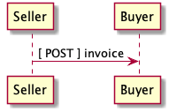

# Invoice

## Test Results

    echo $(date -u +"%Y-%m-%dT%H:%M:%SZ") started
    xmllint --noout --schema ../rsrc-schema/src/vnd.eci.stg.invoice.1.5.0.xsd ../rsrc-schema/tst/vnd.eci.stg.invoice.1.5.0*.xml 2>&1
    ajv -s ../rsrc-schema/src/vnd.eci.stg.invoice.1.5.0.json -d "../rsrc-schema/tst/vnd.eci.stg.invoice*.json" 2>&1
    echo $(date -u +"%Y-%m-%dT%H:%M:%SZ") stopped

<table border="2" cellspacing="0" cellpadding="6" rules="groups" frame="hsides">

<colgroup>
<col  class="org-left" />

<col  class="org-left" />

<col  class="org-left" />

<col  class="org-left" />

<col  class="org-left" />

<col  class="org-left" />

<col  class="org-left" />

<col  class="org-left" />

<col  class="org-left" />

<col  class="org-left" />

<col  class="org-left" />

<col  class="org-left" />

<col  class="org-left" />

<col  class="org-left" />

<col  class="org-left" />

<col  class="org-left" />

<col  class="org-left" />

<col  class="org-left" />

<col  class="org-left" />

<col  class="org-left" />

<col  class="org-left" />

<col  class="org-left" />

<col  class="org-left" />

<col  class="org-left" />

<col  class="org-left" />

<col  class="org-left" />

<col  class="org-left" />

<col  class="org-left" />
</colgroup>
<tbody>
<tr>
<td class="org-left">2018-10-11T02:21:11Z</td>
<td class="org-left">started</td>
<td class="org-left">&#xa0;</td>
<td class="org-left">&#xa0;</td>
<td class="org-left">&#xa0;</td>
<td class="org-left">&#xa0;</td>
<td class="org-left">&#xa0;</td>
<td class="org-left">&#xa0;</td>
<td class="org-left">&#xa0;</td>
<td class="org-left">&#xa0;</td>
<td class="org-left">&#xa0;</td>
<td class="org-left">&#xa0;</td>
<td class="org-left">&#xa0;</td>
<td class="org-left">&#xa0;</td>
<td class="org-left">&#xa0;</td>
<td class="org-left">&#xa0;</td>
<td class="org-left">&#xa0;</td>
<td class="org-left">&#xa0;</td>
<td class="org-left">&#xa0;</td>
<td class="org-left">&#xa0;</td>
<td class="org-left">&#xa0;</td>
<td class="org-left">&#xa0;</td>
<td class="org-left">&#xa0;</td>
<td class="org-left">&#xa0;</td>
<td class="org-left">&#xa0;</td>
<td class="org-left">&#xa0;</td>
<td class="org-left">&#xa0;</td>
<td class="org-left">&#xa0;</td>
</tr>

<tr>
<td class="org-left">../rsrc-schema/tst/vnd.eci.stg.invoice.1.5.0-cost-request.xml:1:</td>
<td class="org-left">element</td>
<td class="org-left">invoice:</td>
<td class="org-left">Schemas</td>
<td class="org-left">validity</td>
<td class="org-left">error</td>
<td class="org-left">:</td>
<td class="org-left">Element</td>
<td class="org-left">'invoice':</td>
<td class="org-left">Missing</td>
<td class="org-left">child</td>
<td class="org-left">element(s).</td>
<td class="org-left">Expected</td>
<td class="org-left">is</td>
<td class="org-left">one</td>
<td class="org-left">of</td>
<td class="org-left">(</td>
<td class="org-left">reference,</td>
<td class="org-left">name,</td>
<td class="org-left">description,</td>
<td class="org-left">remarks,</td>
<td class="org-left">buyer,</td>
<td class="org-left">consumer,</td>
<td class="org-left">seller,</td>
<td class="org-left">shipTo,</td>
<td class="org-left">billTo,</td>
<td class="org-left">shippingCarrier</td>
<td class="org-left">).</td>
</tr>

<tr>
<td class="org-left">../rsrc-schema/tst/vnd.eci.stg.invoice.1.5.0-cost-request.xml</td>
<td class="org-left">fails</td>
<td class="org-left">to</td>
<td class="org-left">validate</td>
<td class="org-left">&#xa0;</td>
<td class="org-left">&#xa0;</td>
<td class="org-left">&#xa0;</td>
<td class="org-left">&#xa0;</td>
<td class="org-left">&#xa0;</td>
<td class="org-left">&#xa0;</td>
<td class="org-left">&#xa0;</td>
<td class="org-left">&#xa0;</td>
<td class="org-left">&#xa0;</td>
<td class="org-left">&#xa0;</td>
<td class="org-left">&#xa0;</td>
<td class="org-left">&#xa0;</td>
<td class="org-left">&#xa0;</td>
<td class="org-left">&#xa0;</td>
<td class="org-left">&#xa0;</td>
<td class="org-left">&#xa0;</td>
<td class="org-left">&#xa0;</td>
<td class="org-left">&#xa0;</td>
<td class="org-left">&#xa0;</td>
<td class="org-left">&#xa0;</td>
<td class="org-left">&#xa0;</td>
<td class="org-left">&#xa0;</td>
<td class="org-left">&#xa0;</td>
<td class="org-left">&#xa0;</td>
</tr>

<tr>
<td class="org-left">../rsrc-schema/tst/vnd.eci.stg.invoice.1.5.0-request.xml:2:</td>
<td class="org-left">element</td>
<td class="org-left">invoice:</td>
<td class="org-left">Schemas</td>
<td class="org-left">validity</td>
<td class="org-left">error</td>
<td class="org-left">:</td>
<td class="org-left">Element</td>
<td class="org-left">'invoice':</td>
<td class="org-left">Missing</td>
<td class="org-left">child</td>
<td class="org-left">element(s).</td>
<td class="org-left">Expected</td>
<td class="org-left">is</td>
<td class="org-left">one</td>
<td class="org-left">of</td>
<td class="org-left">(</td>
<td class="org-left">reference,</td>
<td class="org-left">name,</td>
<td class="org-left">description,</td>
<td class="org-left">remarks,</td>
<td class="org-left">buyer,</td>
<td class="org-left">consumer,</td>
<td class="org-left">seller,</td>
<td class="org-left">shipTo,</td>
<td class="org-left">billTo,</td>
<td class="org-left">shippingCarrier</td>
<td class="org-left">).</td>
</tr>

<tr>
<td class="org-left">../rsrc-schema/tst/vnd.eci.stg.invoice.1.5.0-request.xml</td>
<td class="org-left">fails</td>
<td class="org-left">to</td>
<td class="org-left">validate</td>
<td class="org-left">&#xa0;</td>
<td class="org-left">&#xa0;</td>
<td class="org-left">&#xa0;</td>
<td class="org-left">&#xa0;</td>
<td class="org-left">&#xa0;</td>
<td class="org-left">&#xa0;</td>
<td class="org-left">&#xa0;</td>
<td class="org-left">&#xa0;</td>
<td class="org-left">&#xa0;</td>
<td class="org-left">&#xa0;</td>
<td class="org-left">&#xa0;</td>
<td class="org-left">&#xa0;</td>
<td class="org-left">&#xa0;</td>
<td class="org-left">&#xa0;</td>
<td class="org-left">&#xa0;</td>
<td class="org-left">&#xa0;</td>
<td class="org-left">&#xa0;</td>
<td class="org-left">&#xa0;</td>
<td class="org-left">&#xa0;</td>
<td class="org-left">&#xa0;</td>
<td class="org-left">&#xa0;</td>
<td class="org-left">&#xa0;</td>
<td class="org-left">&#xa0;</td>
<td class="org-left">&#xa0;</td>
</tr>

<tr>
<td class="org-left">../rsrc-schema/tst/vnd.eci.stg.invoice.1.5.0-response.xml:2:</td>
<td class="org-left">element</td>
<td class="org-left">invoice:</td>
<td class="org-left">Schemas</td>
<td class="org-left">validity</td>
<td class="org-left">error</td>
<td class="org-left">:</td>
<td class="org-left">Element</td>
<td class="org-left">'invoice':</td>
<td class="org-left">Missing</td>
<td class="org-left">child</td>
<td class="org-left">element(s).</td>
<td class="org-left">Expected</td>
<td class="org-left">is</td>
<td class="org-left">one</td>
<td class="org-left">of</td>
<td class="org-left">(</td>
<td class="org-left">reference,</td>
<td class="org-left">name,</td>
<td class="org-left">description,</td>
<td class="org-left">remarks,</td>
<td class="org-left">buyer,</td>
<td class="org-left">consumer,</td>
<td class="org-left">seller,</td>
<td class="org-left">shipTo,</td>
<td class="org-left">billTo,</td>
<td class="org-left">shippingCarrier</td>
<td class="org-left">).</td>
</tr>

<tr>
<td class="org-left">../rsrc-schema/tst/vnd.eci.stg.invoice.1.5.0-response.xml</td>
<td class="org-left">fails</td>
<td class="org-left">to</td>
<td class="org-left">validate</td>
<td class="org-left">&#xa0;</td>
<td class="org-left">&#xa0;</td>
<td class="org-left">&#xa0;</td>
<td class="org-left">&#xa0;</td>
<td class="org-left">&#xa0;</td>
<td class="org-left">&#xa0;</td>
<td class="org-left">&#xa0;</td>
<td class="org-left">&#xa0;</td>
<td class="org-left">&#xa0;</td>
<td class="org-left">&#xa0;</td>
<td class="org-left">&#xa0;</td>
<td class="org-left">&#xa0;</td>
<td class="org-left">&#xa0;</td>
<td class="org-left">&#xa0;</td>
<td class="org-left">&#xa0;</td>
<td class="org-left">&#xa0;</td>
<td class="org-left">&#xa0;</td>
<td class="org-left">&#xa0;</td>
<td class="org-left">&#xa0;</td>
<td class="org-left">&#xa0;</td>
<td class="org-left">&#xa0;</td>
<td class="org-left">&#xa0;</td>
<td class="org-left">&#xa0;</td>
<td class="org-left">&#xa0;</td>
</tr>

<tr>
<td class="org-left">../rsrc-schema/tst/vnd.eci.stg.invoice.1.5.0-responses.xml:1:</td>
<td class="org-left">element</td>
<td class="org-left">invoice:</td>
<td class="org-left">Schemas</td>
<td class="org-left">validity</td>
<td class="org-left">error</td>
<td class="org-left">:</td>
<td class="org-left">Element</td>
<td class="org-left">'invoice':</td>
<td class="org-left">Missing</td>
<td class="org-left">child</td>
<td class="org-left">element(s).</td>
<td class="org-left">Expected</td>
<td class="org-left">is</td>
<td class="org-left">one</td>
<td class="org-left">of</td>
<td class="org-left">(</td>
<td class="org-left">reference,</td>
<td class="org-left">name,</td>
<td class="org-left">description,</td>
<td class="org-left">remarks,</td>
<td class="org-left">buyer,</td>
<td class="org-left">consumer,</td>
<td class="org-left">seller,</td>
<td class="org-left">shipTo,</td>
<td class="org-left">billTo,</td>
<td class="org-left">shippingCarrier</td>
<td class="org-left">).</td>
</tr>

<tr>
<td class="org-left">../rsrc-schema/tst/vnd.eci.stg.invoice.1.5.0-responses.xml</td>
<td class="org-left">fails</td>
<td class="org-left">to</td>
<td class="org-left">validate</td>
<td class="org-left">&#xa0;</td>
<td class="org-left">&#xa0;</td>
<td class="org-left">&#xa0;</td>
<td class="org-left">&#xa0;</td>
<td class="org-left">&#xa0;</td>
<td class="org-left">&#xa0;</td>
<td class="org-left">&#xa0;</td>
<td class="org-left">&#xa0;</td>
<td class="org-left">&#xa0;</td>
<td class="org-left">&#xa0;</td>
<td class="org-left">&#xa0;</td>
<td class="org-left">&#xa0;</td>
<td class="org-left">&#xa0;</td>
<td class="org-left">&#xa0;</td>
<td class="org-left">&#xa0;</td>
<td class="org-left">&#xa0;</td>
<td class="org-left">&#xa0;</td>
<td class="org-left">&#xa0;</td>
<td class="org-left">&#xa0;</td>
<td class="org-left">&#xa0;</td>
<td class="org-left">&#xa0;</td>
<td class="org-left">&#xa0;</td>
<td class="org-left">&#xa0;</td>
<td class="org-left">&#xa0;</td>
</tr>

<tr>
<td class="org-left">../rsrc-schema/tst/vnd.eci.stg.invoice.1.5.0-request.json</td>
<td class="org-left">valid</td>
<td class="org-left">&#xa0;</td>
<td class="org-left">&#xa0;</td>
<td class="org-left">&#xa0;</td>
<td class="org-left">&#xa0;</td>
<td class="org-left">&#xa0;</td>
<td class="org-left">&#xa0;</td>
<td class="org-left">&#xa0;</td>
<td class="org-left">&#xa0;</td>
<td class="org-left">&#xa0;</td>
<td class="org-left">&#xa0;</td>
<td class="org-left">&#xa0;</td>
<td class="org-left">&#xa0;</td>
<td class="org-left">&#xa0;</td>
<td class="org-left">&#xa0;</td>
<td class="org-left">&#xa0;</td>
<td class="org-left">&#xa0;</td>
<td class="org-left">&#xa0;</td>
<td class="org-left">&#xa0;</td>
<td class="org-left">&#xa0;</td>
<td class="org-left">&#xa0;</td>
<td class="org-left">&#xa0;</td>
<td class="org-left">&#xa0;</td>
<td class="org-left">&#xa0;</td>
<td class="org-left">&#xa0;</td>
<td class="org-left">&#xa0;</td>
<td class="org-left">&#xa0;</td>
</tr>

<tr>
<td class="org-left">../rsrc-schema/tst/vnd.eci.stg.invoice.1.5.0-response.json</td>
<td class="org-left">valid</td>
<td class="org-left">&#xa0;</td>
<td class="org-left">&#xa0;</td>
<td class="org-left">&#xa0;</td>
<td class="org-left">&#xa0;</td>
<td class="org-left">&#xa0;</td>
<td class="org-left">&#xa0;</td>
<td class="org-left">&#xa0;</td>
<td class="org-left">&#xa0;</td>
<td class="org-left">&#xa0;</td>
<td class="org-left">&#xa0;</td>
<td class="org-left">&#xa0;</td>
<td class="org-left">&#xa0;</td>
<td class="org-left">&#xa0;</td>
<td class="org-left">&#xa0;</td>
<td class="org-left">&#xa0;</td>
<td class="org-left">&#xa0;</td>
<td class="org-left">&#xa0;</td>
<td class="org-left">&#xa0;</td>
<td class="org-left">&#xa0;</td>
<td class="org-left">&#xa0;</td>
<td class="org-left">&#xa0;</td>
<td class="org-left">&#xa0;</td>
<td class="org-left">&#xa0;</td>
<td class="org-left">&#xa0;</td>
<td class="org-left">&#xa0;</td>
<td class="org-left">&#xa0;</td>
</tr>

<tr>
<td class="org-left">2018-10-11T02:21:11Z</td>
<td class="org-left">stopped</td>
<td class="org-left">&#xa0;</td>
<td class="org-left">&#xa0;</td>
<td class="org-left">&#xa0;</td>
<td class="org-left">&#xa0;</td>
<td class="org-left">&#xa0;</td>
<td class="org-left">&#xa0;</td>
<td class="org-left">&#xa0;</td>
<td class="org-left">&#xa0;</td>
<td class="org-left">&#xa0;</td>
<td class="org-left">&#xa0;</td>
<td class="org-left">&#xa0;</td>
<td class="org-left">&#xa0;</td>
<td class="org-left">&#xa0;</td>
<td class="org-left">&#xa0;</td>
<td class="org-left">&#xa0;</td>
<td class="org-left">&#xa0;</td>
<td class="org-left">&#xa0;</td>
<td class="org-left">&#xa0;</td>
<td class="org-left">&#xa0;</td>
<td class="org-left">&#xa0;</td>
<td class="org-left">&#xa0;</td>
<td class="org-left">&#xa0;</td>
<td class="org-left">&#xa0;</td>
<td class="org-left">&#xa0;</td>
<td class="org-left">&#xa0;</td>
<td class="org-left">&#xa0;</td>
</tr>
</tbody>
</table>

## Overview

Lorem ipsum dolor sit amet, sea ad clita sadipscing, mea id antiopam prodesset. Justo scripta vivendum eum id, in vis essent petentium. Qui mutat tritani epicuri et, utamur percipitur an sea. Ad nullam integre eum. Cu atqui inermis pri, tempor causae sanctus at pro. Ea cum tation hendrerit conclusionemque, veri hendrerit definitionem sit at. Vix adipiscing dissentiet eloquentiam eu, decore epicurei liberavisse eu eam.

## Discussion

## Definition of Terms

## Sequence of Events

In the following section, Use Cases, examples of data ( `--data` ) to be sent and
received will be shown. It is assumed that the caller will make the actual *POST*
call with the required headers e.g.

    curl --request POST \
         --header "Content-Type: application/vnd.eci.stg.invoice.1.5.0.xml; charset=utf-8" \
         --user user123:password123 \
         --url http://vendor-host/vendor-invoice-endpoint
         --data ''

## Use Cases

### Version 1.0

1.  Request

    In this example a seller is

    1.  JSON

            {}

    2.  XML

            <?xml version='1.0' encoding='utf-8'?>
            <invoice/>

2.  Response

    The buyer's response is intended to

    1.  JSON

            {}

    2.  XML

            <?xml version='1.0' encoding='utf-8'?>
            <invoice/>

## Resource Schemas

### Version 1.0

No longer published

### Version 1.5

1.  JSON

        {
          "id": "./vnd.eci.stg.invoice.1.5.0.json",
          "$schema": "http://json-schema.org/draft-07/schema#",
          "title": "invoice",
          "description": "",
          "type": "object",
          "additionalProperties": false,
          "properties": {

            "reference": { "$ref": "#/definitions/reference" },

            "name": {
              "description": "",
              "type": "string",
              "minLength": 1,
              "maxLength": 32
            },

            "description": {
              "description": "",
              "type": "string",
              "minLength": 1,
              "maxLength" : 128
            },

            "remarks": {
              "description": "",
              "type": "string",
              "minLength": 1,
              "maxLength" : 256
            },

            "make": {
              "description": "",
              "type": "string",
              "minLength": 1,
              "maxLength": 32
            },

            "model": {
              "description": "",
              "type": "string",
              "minLength": 1,
              "maxLength": 32
            },

            "serialnumber": {
              "description": "",
              "type": "string",
              "minLength": 1,
              "maxLength": 32
            },

            "buyer": { "$ref": "#/definitions/buyer" },

            "consumer": { "$ref": "#/definitions/consumer" },

            "seller": { "$ref": "#/definitions/seller" },

            "shipTo": { "$ref": "#/definitions/shipTo" },

            "billTo": { "$ref": "#/definitions/billTo" },

            "shippingCarrier": { "$ref": "#/definitions/shippingCarrier" },

            "location": { "$ref": "#/definitions/address" },

            "quantity": {
              "description": "",
              "type": "number",
              "minimum" : 0,
              "maximum" : 999999999.999999
            },

            "currency": { "$ref": "#/definitions/currency"},

            "unitCost": {
              "description": "",
              "type": "number",
              "minimum" : 0,
              "maximum" : 999999999999.999999
            },

            "total": { "$ref": "#/definitions/total"},

            "when": {
              "description": "",
              "type" : "string",
              "format": "date-time"
            },

            "whenExpected": {
              "description": "",
              "type" : "string",
              "format": "date-time"
            },

            "itemsCount": {
              "description": "number of things in the items collection",
              "type" : "number",
              "minimum": 1,
              "maximum": 1000
            },

            "items": {
              "description": "",
              "type": "array",
              "minItems": 1,
              "maxItems": 1000,
              "uniqueItems": true,
              "items" : {
                "$ref" : "#"
              }
            }
          },

          "definitions" : {
            "referenceType": {
              "type": "string",
              "enum": ["buyer", "consume", "manufacturer", "seller" ]
            },

            "reference": {
              "type": "object",
              "additionalProperties": false,
              "properties" : {

                "code": {
                  "description": "",
                  "type": "string",
                  "minLength": 1,
                  "maxLength": 32
                },

                "name": {
                  "description": "",
                  "type": "string",
                  "minLength": 1,
                  "maxLength": 32
                },

                "description": {
                  "description": "",
                  "type": "string",
                  "minLength": 1,
                  "maxLength" : 128
                },

                "remarks": {
                  "description": "",
                  "type": "string",
                  "minLength": 1,
                  "maxLength" : 256
                },

                "type": { "$ref": "#/definitions/referenceType" },

                "itemsCount": {
                  "description": "number of things in the items collection",
                  "type" : "number",
                  "minimum": 1,
                  "maximum": 1000
                },

                "items": {
                  "description": "",
                  "type": "array",
                  "minItems": 1,
                  "maxItems": 1000,
                  "uniqueItems": true,
                  "items" : {
                    "$ref" : "#/definitions/reference"
                  }
                }
              }
            },

            "shippingCarrier": {
              "type": "object",
              "additionalProperties": false,
              "properties" : {

                "code": {
                  "description": "",
                  "type": "string",
                  "minLength": 1,
                  "maxLength": 32
                },

                "name": {
                  "description": "",
                  "type": "string",
                  "minLength": 1,
                  "maxLength": 32
                },

                "description": {
                  "description": "",
                  "type": "string",
                  "minLength": 1,
                  "maxLength" : 128
                },

                "remarks": {
                  "description": "",
                  "type": "string",
                  "minLength": 1,
                  "maxLength" : 256
                },

                "type": { "$ref": "#/definitions/referenceType" },

                "itemsCount": {
                  "description": "number of things in the items collection",
                  "type" : "number",
                  "minimum": 1,
                  "maximum": 1000
                },

                "items": {
                  "description": "",
                  "type": "array",
                  "minItems": 1,
                  "maxItems": 1000,
                  "uniqueItems": true,
                  "items" : {
                    "$ref" : "#/definitions/reference"
                  }
                }
              }
            },

            "address": {
              "type": "object",
              "additionalProperties": false,
              "properties" : {

                "reference": { "$ref": "#/definitions/reference" },

                "name": {
                  "description": "",
                  "type": "string",
                  "minLength": 1,
                  "maxLength": 32
                },

                "description": {
                  "description": "",
                  "type": "string",
                  "minLength": 1,
                  "maxLength" : 128
                },

                "remarks": {
                  "description": "",
                  "type": "string",
                  "minLength": 1,
                  "maxLength" : 256
                },

                "msc": {
                  "description": "mail stop code",
                  "type": "string",
                  "minLength": 1,
                  "maxLength": 40
                },

                "mtn": {
                  "description": "attention line",
                  "type": "string",
                  "minLength": 1,
                  "maxLength": 40
                },

                "rcp": {
                  "description": "recipient or business name",
                  "type": "string",
                  "minLength": 1,
                  "maxLength": 40
                },

                "alt": {
                  "description": "alternate location",
                  "type": "string",
                  "minLength": 1,
                  "maxLength": 40
                },

                "dal": {
                  "description": "delivery address line",
                  "type": "string",
                  "minLength": 1,
                  "maxLength": 40
                },

                "city": {
                  "description": "",
                  "type": "string",
                  "minLength": 1,
                  "maxLength": 40
                },

                "region": {
                  "description": "",
                  "type": "string",
                  "minLength": 1,
                  "maxLength": 40
                },

                "postalCode": {
                  "description": "",
                  "type": "string",
                  "minLength": 1,
                  "maxLength": 40
                },

                "country": {
                  "description": "",
                  "type": "string",
                  "minLength": 1,
                  "maxLength": 40
                },

                "binLocation": {
                  "description": "",
                  "type": "string",
                  "minLength": 1,
                  "maxLength": 40
                },

                "warehouse": {
                  "description": "",
                  "type": "string",
                  "minLength": 1,
                  "maxLength": 128
                }
              }
            },

            "billTo": {
              "type": "object",
              "additionalProperties": false,
              "properties" : {

                "reference": { "$ref": "#/definitions/reference" },

                "name": {
                  "description": "",
                  "type": "string",
                  "minLength": 1,
                  "maxLength": 32
                },

                "description": {
                  "description": "",
                  "type": "string",
                  "minLength": 1,
                  "maxLength" : 128
                },

                "remarks": {
                  "description": "",
                  "type": "string",
                  "minLength": 1,
                  "maxLength" : 256
                },

                "location": { "$ref": "#/definitions/address" },

                "email": {
                  "description": "",
                  "type": "string",
                  "minLength": 1,
                  "maxLength": 256
                },

                "phone": {
                  "description": "",
                  "type": "string",
                  "minLength": 1,
                  "maxLength": 32
                },

                "taxID": {
                  "description": "",
                  "type": "string",
                  "minLength": 1,
                  "maxLength": 32
                }
              }
            },

            "buyer": {
              "type": "object",
              "additionalProperties": false,
              "properties" : {

                "reference": { "$ref": "#/definitions/reference" },

                "name": {
                  "description": "",
                  "type": "string",
                  "minLength": 1,
                  "maxLength": 32
                },

                "description": {
                  "description": "",
                  "type": "string",
                  "minLength": 1,
                  "maxLength" : 128
                },

                "remarks": {
                  "description": "",
                  "type": "string",
                  "minLength": 1,
                  "maxLength" : 256
                },

                "location": { "$ref": "#/definitions/address" },

                "email": {
                  "description": "",
                  "type": "string",
                  "minLength": 1,
                  "maxLength": 256
                },

                "phone": {
                  "description": "",
                  "type": "string",
                  "minLength": 1,
                  "maxLength": 32
                },

                "taxID": {
                  "description": "",
                  "type": "string",
                  "minLength": 1,
                  "maxLength": 32
                }
              }
            },

            "consumer": {
              "type": "object",
              "additionalProperties": false,
              "properties" : {

                "reference": { "$ref": "#/definitions/reference" },

                "name": {
                  "description": "",
                  "type": "string",
                  "minLength": 1,
                  "maxLength": 32
                },

                "description": {
                  "description": "",
                  "type": "string",
                  "minLength": 1,
                  "maxLength" : 128
                },

                "remarks": {
                  "description": "",
                  "type": "string",
                  "minLength": 1,
                  "maxLength" : 256
                },

                "location": { "$ref": "#/definitions/address" },

                "contract": { "$ref": "#/definitions/reference" },

                "email": {
                  "description": "",
                  "type": "string",
                  "minLength": 1,
                  "maxLength": 256
                },

                "phone": {
                  "description": "",
                  "type": "string",
                  "minLength": 1,
                  "maxLength": 32
                },

                "taxID": {
                  "description": "",
                  "type": "string",
                  "minLength": 1,
                  "maxLength": 32
                }
              }
            },

            "seller": {
              "type": "object",
              "additionalProperties": false,
              "properties" : {

                "reference": { "$ref": "#/definitions/reference" },

                "name": {
                  "description": "",
                  "type": "string",
                  "minLength": 1,
                  "maxLength": 32
                },

                "description": {
                  "description": "",
                  "type": "string",
                  "minLength": 1,
                  "maxLength" : 128
                },

                "remarks": {
                  "description": "",
                  "type": "string",
                  "minLength": 1,
                  "maxLength" : 256
                },

                "location": { "$ref": "#/definitions/address" },

                "email": {
                  "description": "",
                  "type": "string",
                  "minLength": 1,
                  "maxLength": 256
                },

                "phone": {
                  "description": "",
                  "type": "string",
                  "minLength": 1,
                  "maxLength": 32
                },

                "taxID": {
                  "description": "",
                  "type": "string",
                  "minLength": 1,
                  "maxLength": 32
                }
              }
            },

            "shipTo": {
              "type": "object",
              "additionalProperties": false,
              "properties" : {

                "reference": { "$ref": "#/definitions/reference" },

                "name": {
                  "description": "",
                  "type": "string",
                  "minLength": 1,
                  "maxLength": 32
                },

                "description": {
                  "description": "",
                  "type": "string",
                  "minLength": 1,
                  "maxLength" : 128
                },

                "remarks": {
                  "description": "",
                  "type": "string",
                  "minLength": 1,
                  "maxLength" : 256
                },

                "location": { "$ref": "#/definitions/address" },

                "email": {
                  "description": "",
                  "type": "string",
                  "minLength": 1,
                  "maxLength": 256
                },

                "phone": {
                  "description": "",
                  "type": "string",
                  "minLength": 1,
                  "maxLength": 32
                },

                "isDropShip": {
                  "description": "",
                  "type": "boolean"
                }
              }
            },

            "currency": {
              "type": "object",
              "additionalProperties": false,
              "properties" : {

                "code": {
                  "description": "",
                  "type": "string",
                  "minLength": 1,
                  "maxLength": 32
                },

                "name": {
                  "description": "",
                  "type": "string",
                  "minLength": 1,
                  "maxLength": 32
                },

                "number": {
                  "description": "",
                  "type": "number",
                  "minimum": 1,
                  "maximum": 999
                },

                "precision": {
                  "description": "",
                  "type": "number",
                  "minimum": 0,
                  "maximum": 6
                },

                "scale": {
                  "description": "",
                  "type": "number",
                  "minimum": 1,
                  "maximum": 18
                }
              }
            },

            "total": {
              "type": "object",
              "additionalProperties": false,
              "properties" : {

                "amount": {
                  "description": "",
                  "type": "number",
                  "minimum" : 0,
                  "maximum" : 999999999999.999999
                },

                "discountAmount": {
                  "description": "",
                  "type": "number",
                  "minimum" : 0,
                  "maximum" : 999999999999.999999
                },

                "freightAmount": {
                  "description": "",
                  "type": "number",
                  "minimum" : 0,
                  "maximum" : 999999999999.999999
                },

                "termsAmount": {
                  "description": "",
                  "type": "number",
                  "minimum" : 0,
                  "maximum" : 999999999999.999999
                },

                "taxAmount": {
                  "description": "",
                  "type": "number",
                  "minimum" : 0,
                  "maximum" : 999999999999.999999
                },

                "remarks": {
                  "description": "",
                  "type": "string",
                  "minLength": 1,
                  "maxLength" : 256
                }
              }
            }
          }
        }

2.  XML

        <?xml version='1.0' encoding='utf-8'?>

        <xs:schema xmlns:xs='http://www.w3.org/2001/XMLSchema'
                   elementFormDefault='qualified'
                   xml:lang='en'>

          <xs:element name='invoice' type='InvoiceType'/>

          <xs:complexType name='AddressType'>
            <xs:sequence>
              <xs:element name='reference'   type='ReferenceType' minOccurs='0' maxOccurs='1' />
              <xs:element name='name'        type='xs:string'     minOccurs='0' maxOccurs='1' />
              <xs:element name='description' type='xs:string'     minOccurs='0' maxOccurs='1' />
              <xs:element name='remarks'     type='xs:string'     minOccurs='0' maxOccurs='1' />
              <xs:element name='msc'         type='xs:string'     minOccurs='0' maxOccurs='1' />
              <xs:element name='mtn'         type='xs:string'     minOccurs='0' maxOccurs='1' />
              <xs:element name='rcp'         type='xs:string'     minOccurs='0' maxOccurs='1' />
              <xs:element name='alt'         type='xs:string'     minOccurs='0' maxOccurs='1' />
              <xs:element name='dal'         type='xs:string'     minOccurs='0' maxOccurs='1' />
              <xs:element name='city'        type='xs:string'     minOccurs='0' maxOccurs='1' />
              <xs:element name='region'      type='xs:string'     minOccurs='0' maxOccurs='1' />
              <xs:element name='postalCode'  type='xs:string'     minOccurs='0' maxOccurs='1' />
              <xs:element name='country'     type='xs:string'     minOccurs='0' maxOccurs='1' />
            </xs:sequence>
          </xs:complexType>

          <xs:complexType name='BillToType'>
            <xs:sequence>
              <xs:element name='reference'   type='ReferenceType' minOccurs='0' maxOccurs='1' />
              <xs:element name='name'        type='xs:string'     minOccurs='0' maxOccurs='1' />
              <xs:element name='description' type='xs:string'     minOccurs='0' maxOccurs='1' />
              <xs:element name='remarks'     type='xs:string'     minOccurs='0' maxOccurs='1' />
              <xs:element name='location'    type='AddressType'   minOccurs='0' maxOccurs='1' />
              <xs:element name='email'       type='xs:string'     minOccurs='0' maxOccurs='1' />
              <xs:element name='phone'       type='xs:string'     minOccurs='0' maxOccurs='1' />
              <xs:element name='taxID'       type='xs:string'     minOccurs='0' maxOccurs='1' />
            </xs:sequence>
          </xs:complexType>

          <xs:complexType name='BuyerType'>
            <xs:sequence>
              <xs:element name='reference'   type='ReferenceType' minOccurs='0' maxOccurs='1' />
              <xs:element name='name'        type='xs:string'     minOccurs='0' maxOccurs='1' />
              <xs:element name='description' type='xs:string'     minOccurs='0' maxOccurs='1' />
              <xs:element name='remarks'     type='xs:string'     minOccurs='0' maxOccurs='1' />
              <xs:element name='location'    type='AddressType'   minOccurs='0' maxOccurs='1' />
              <xs:element name='email'       type='xs:string'     minOccurs='0' maxOccurs='1' />
              <xs:element name='phone'       type='xs:string'     minOccurs='0' maxOccurs='1' />
              <xs:element name='taxID'       type='xs:string'     minOccurs='0' maxOccurs='1' />
            </xs:sequence>
          </xs:complexType>

          <xs:complexType name='SellerType'>
            <xs:sequence>
              <xs:element name='reference'   type='ReferenceType' minOccurs='0' maxOccurs='1' />
              <xs:element name='name'        type='xs:string'     minOccurs='0' maxOccurs='1' />
              <xs:element name='description' type='xs:string'     minOccurs='0' maxOccurs='1' />
              <xs:element name='remarks'     type='xs:string'     minOccurs='0' maxOccurs='1' />
              <xs:element name='location'    type='AddressType'   minOccurs='0' maxOccurs='1' />
              <xs:element name='email'       type='xs:string'     minOccurs='0' maxOccurs='1' />
              <xs:element name='phone'       type='xs:string'     minOccurs='0' maxOccurs='1' />
              <xs:element name='taxID'       type='xs:string'     minOccurs='0' maxOccurs='1' />
            </xs:sequence>
          </xs:complexType>

          <xs:complexType name='ConsumerType'>
            <xs:sequence>
              <xs:element name='reference'   type='ReferenceType' minOccurs='0' maxOccurs='1' />
              <xs:element name='name'        type='xs:string'     minOccurs='0' maxOccurs='1' />
              <xs:element name='description' type='xs:string'     minOccurs='0' maxOccurs='1' />
              <xs:element name='remarks'     type='xs:string'     minOccurs='0' maxOccurs='1' />
              <xs:element name='location'    type='AddressType'   minOccurs='0' maxOccurs='1' />
              <xs:element name='contract'    type='ReferenceType' minOccurs='0' maxOccurs='1' />
              <xs:element name='email'       type='xs:string'     minOccurs='0' maxOccurs='1' />
              <xs:element name='phone'       type='xs:string'     minOccurs='0' maxOccurs='1' />
              <xs:element name='taxID'       type='xs:string'     minOccurs='0' maxOccurs='1' />
            </xs:sequence>
          </xs:complexType>

          <xs:complexType name='CurrencyType'>
            <xs:sequence>
              <xs:element name='code'      type='xs:string'  />
              <xs:element name='name'      type='xs:string'  />
              <xs:element name='number'    type='xs:integer' />
              <xs:element name='precision' type='xs:integer' />
              <xs:element name='scale'     type='xs:integer' />
            </xs:sequence>
          </xs:complexType>

          <xs:complexType name='ItemType'>
            <xs:sequence>
              <xs:element name='reference'            type='ReferenceType'   minOccurs='0' maxOccurs='1' />
              <xs:element name='name'                 type='xs:string'       minOccurs='0' maxOccurs='1' />
              <xs:element name='description'          type='xs:string'       minOccurs='0' maxOccurs='1' />
              <xs:element name='remarks'              type='xs:string'       minOccurs='0' maxOccurs='1' />
              <xs:element name='location'             type='AddressType'     minOccurs='0' maxOccurs='1' />
              <xs:element name='when'                 type='xs:dateTime'     minOccurs='0' maxOccurs='1' />
              <xs:element name='whenExpected'         type='xs:dateTime'     minOccurs='0' maxOccurs='1' />
              <xs:element name='lineNumber'           type='xs:integer'      minOccurs='0' maxOccurs='1' />
              <xs:element name='make'                 type='xs:string'       minOccurs='0' maxOccurs='1' />
              <xs:element name='model'                type='xs:string'       minOccurs='0' maxOccurs='1' />
              <xs:element name='serialNumber'         type='xs:string'       minOccurs='0' maxOccurs='1' />
              <xs:element name='quantity'             type='xs:float'        minOccurs='0' maxOccurs='1' />
              <xs:element name='unitCost'             type='MoneyType'       minOccurs='0' maxOccurs='1' />
              <xs:element name='unitMeasure'          type='UnitMeasureType' minOccurs='0' maxOccurs='1' />
            </xs:sequence>
          </xs:complexType>

          <xs:complexType name='ItemsType'>
            <xs:sequence minOccurs='1' maxOccurs='5000'>
              <xs:element name='item' type='ItemType'/>
            </xs:sequence>
          </xs:complexType>

          <xs:complexType name='ReferenceType'>
            <xs:sequence>
              <xs:element name='code'        type='xs:string' minOccurs='0' maxOccurs='1' />
              <xs:element name='name'        type='xs:string' minOccurs='0' maxOccurs='1' />
              <xs:element name='description' type='xs:string' minOccurs='0' maxOccurs='1' />
              <xs:element name='remarks'     type='xs:string' minOccurs='0' maxOccurs='1' />
              <xs:element name='type'                         minOccurs='0' maxOccurs='1'  >
                <xs:simpleType>
                  <xs:restriction base='xs:string'>
                    <xs:enumeration value='buyer'        />
                    <xs:enumeration value='consumer'     />
                    <xs:enumeration value='document'     />
                    <xs:enumeration value='lineNumber'   />
                    <xs:enumeration value='manufacturer' />
                    <xs:enumeration value='seller'       />
                  </xs:restriction>
                </xs:simpleType>
              </xs:element>
            </xs:sequence>
          </xs:complexType>

          <xs:complexType name='ShippingCarrierType'>
            <xs:sequence>
              <xs:element name='code'        type='xs:string' minOccurs='0' maxOccurs='1' />
              <xs:element name='name'        type='xs:string' minOccurs='0' maxOccurs='1' />
              <xs:element name='description' type='xs:string' minOccurs='0' maxOccurs='1' />
              <xs:element name='remarks'     type='xs:string' minOccurs='0' maxOccurs='1' />
              <xs:element name='type'                         minOccurs='0' maxOccurs='1'  >
                <xs:simpleType>
                  <xs:restriction base='xs:string'>
                    <xs:enumeration value='buyer'        />
                    <xs:enumeration value='consumer'     />
                    <xs:enumeration value='document'     />
                    <xs:enumeration value='lineNumber'   />
                    <xs:enumeration value='manufacturer' />
                    <xs:enumeration value='seller'       />
                  </xs:restriction>
                </xs:simpleType>
              </xs:element>
            </xs:sequence>
          </xs:complexType>

          <xs:complexType name='ShipToType'>
            <xs:sequence>
              <xs:element name='reference'   type='ReferenceType' minOccurs='0' maxOccurs='1' />
              <xs:element name='name'        type='xs:string'     minOccurs='0' maxOccurs='1' />
              <xs:element name='description' type='xs:string'     minOccurs='0' maxOccurs='1' />
              <xs:element name='remarks'     type='xs:string'     minOccurs='0' maxOccurs='1' />
              <xs:element name='location'    type='AddressType'   minOccurs='0' maxOccurs='1' />
              <xs:element name='email'       type='xs:string'     minOccurs='0' maxOccurs='1' />
              <xs:element name='phone'       type='xs:string'     minOccurs='0' maxOccurs='1' />
              <xs:element name='isDropShip'  type='xs:boolean'    minOccurs='0' maxOccurs='1' />
            </xs:sequence>
          </xs:complexType>

          <xs:complexType name='InvoiceType'>
            <xs:sequence>
              <xs:element name='reference'       type='ReferenceType'       minOccurs='0' maxOccurs='1' />
              <xs:element name='name'            type='xs:string'           minOccurs='0' maxOccurs='1' />
              <xs:element name='description'     type='xs:string'           minOccurs='0' maxOccurs='1' />
              <xs:element name='remarks'         type='xs:string'           minOccurs='0' maxOccurs='1' />
              <xs:element name='buyer'           type='BuyerType'           minOccurs='0' maxOccurs='1' />
              <xs:element name='consumer'        type='ConsumerType'        minOccurs='0' maxOccurs='1' />
              <xs:element name='seller'          type='SellerType'          minOccurs='0' maxOccurs='1' />
              <xs:element name='shipTo'          type='ShipToType'          minOccurs='0' maxOccurs='1' />
              <xs:element name='billTo'          type='BillToType'          minOccurs='0' maxOccurs='1' />
              <xs:element name='shippingCarrier' type='ShippingCarrierType' minOccurs='0' maxOccurs='1' />
              <xs:element name='when'            type='xs:dateTime'         minOccurs='0' maxOccurs='1' />
              <xs:element name='whenExpected'    type='xs:dateTime'         minOccurs='0' maxOccurs='1' />
              <xs:element name='total'           type='TotalType'           minOccurs='0' maxOccurs='1' />
              <xs:element name='currency'        type='CurrencyType'        minOccurs='0' maxOccurs='1' />
              <xs:element name='itemsCount'      type='xs:integer'          minOccurs='0' maxOccurs='1' />
              <xs:element name='items'           type='ItemsType'           minOccurs='1' maxOccurs='1' />
            </xs:sequence>
          </xs:complexType>

          <xs:simpleType name='MoneyType'>
            <xs:annotation>
              <xs:documentation>
                Every Product must have a unit cost that is equal to or greater than
                0 and must cost just under one trillion monetary units. Version 1.5.0
                assumes the monetary unit is US Dollars.
              </xs:documentation>
            </xs:annotation>
            <xs:restriction base='xs:decimal'>
              <xs:minInclusive value='0'/>
              <xs:maxInclusive value='999999999999.999999'/>
              <xs:fractionDigits value='6'/>
              <xs:totalDigits value='18'/>
            </xs:restriction>
          </xs:simpleType>

          <xs:complexType name='TotalType'>
            <xs:sequence>
              <xs:element name='amount'         type='MoneyType' minOccurs='0' maxOccurs='1' />
              <xs:element name='discountAmount' type='MoneyType' minOccurs='0' maxOccurs='1' />
              <xs:element name='freightAmount'  type='MoneyType' minOccurs='0' maxOccurs='1' />
              <xs:element name='termsAmount'    type='MoneyType' minOccurs='0' maxOccurs='1' />
              <xs:element name='tax'            type='MoneyType' minOccurs='0' maxOccurs='1' />
              <xs:element name='remarks'        type='xs:string' minOccurs='0' maxOccurs='1' />
            </xs:sequence>
          </xs:complexType>

          <xs:complexType name='UnitMeasureType'>
            <xs:sequence>
              <xs:element name='name'        type='xs:string'  />
              <xs:element name='description' type='xs:string'  />
              <xs:element name='remarks'     type='xs:string'  />
              <xs:element name='code'        type='xs:string'  />
              <xs:element name='quantity'    type='xs:decimal' />
            </xs:sequence>
          </xs:complexType>

          <xs:simpleType name='IDType'>
            <xs:annotation>
              <xs:documentation>
                Every Product must have at least one ID and that ID must uniquely locate
                only one product; a Product may have more than one ID but a ID must relate
                to only a single product.
              </xs:documentation>
            </xs:annotation>
            <xs:restriction base='xs:token'>
              <xs:minLength value='1'/>
              <xs:maxLength value='32'/>
            </xs:restriction>
          </xs:simpleType>

          <xs:simpleType name='QuantityType'>
            <xs:restriction base='xs:unsignedInt'/>
          </xs:simpleType>

        </xs:schema>

### Version 2.0

1.  JSON

    1.  TODO include updated json schema

2.  XML

    1.  TODO include updated xml schema

## © 2018 ECi Software Solutions, Inc. All rights reserved.
