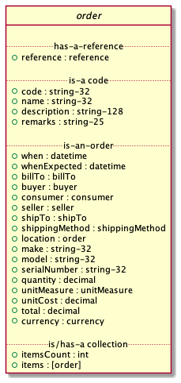

# Order

## Test Results

    echo $(date -u +"%Y-%m-%dT%H:%M:%SZ") started
    xmllint --noout --schema ../rsrc-schema/src/vnd.eci.stg.order.1.5.0.xsd ../rsrc-schema/tst/vnd.eci.stg.order.1.5.?-*.xml 2>&1
    ajv -s ../rsrc-schema/src/vnd.eci.stg.order.1.5.0.json -d "../rsrc-schema/tst/vnd.eci.stg.order.1.5.?-*.json" 2>&1
    echo $(date -u +"%Y-%m-%dT%H:%M:%SZ") stopped

<table border="2" cellspacing="0" cellpadding="6" rules="groups" frame="hsides">

<colgroup>
<col  class="org-left" />

<col  class="org-left" />
</colgroup>
<tbody>
<tr>
<td class="org-left">2019-06-19T14:50:05Z</td>
<td class="org-left">started</td>
</tr>

<tr>
<td class="org-left">../rsrc-schema/tst/vnd.eci.stg.order.1.5.0-currency-request.xml</td>
<td class="org-left">validates</td>
</tr>

<tr>
<td class="org-left">../rsrc-schema/tst/vnd.eci.stg.order.1.5.0-known-buyer-request.xml</td>
<td class="org-left">validates</td>
</tr>

<tr>
<td class="org-left">../rsrc-schema/tst/vnd.eci.stg.order.1.5.0-currency-request.json</td>
<td class="org-left">valid</td>
</tr>

<tr>
<td class="org-left">../rsrc-schema/tst/vnd.eci.stg.order.1.5.0-example-request.json</td>
<td class="org-left">valid</td>
</tr>

<tr>
<td class="org-left">../rsrc-schema/tst/vnd.eci.stg.order.1.5.0-item-location-request.json</td>
<td class="org-left">valid</td>
</tr>

<tr>
<td class="org-left">../rsrc-schema/tst/vnd.eci.stg.order.1.5.0-known-buyer-request.json</td>
<td class="org-left">valid</td>
</tr>

<tr>
<td class="org-left">2019-06-19T14:50:06Z</td>
<td class="org-left">stopped</td>
</tr>
</tbody>
</table>

## Overview

### TODO

In the following section, Use Cases, examples of data ( `--data` ) to be sent and
received will be shown. It is assumed that the caller will make the actual *POST*
call with the required headers e.g.

    curl --request POST \
         --header "Content-Type: application/vnd.eci.stg.order.1.5.0.xml; charset=utf-8" \
         --user user123:password123 \
         --url http://vendor-host/vendor-order-endpoint
         --data ''

## Definition of Terms

-   **reference:** an identify function that relates an entity to an actor. [required] when describing the stock request and [required] when describing an item in the collection
-   **name:** [optional] name of the stock request or stock item
-   **description:** [optional] description of the stock request or stock item
-   **remarks:** [optional] human to human communication
-   **location:** [optional] when a good or service is being ordered for a specific asset the location tells you exactly where to find the asset
-   **buyer:** [required] when describing the stock requrest. the person or organization inquiring about goods and services
-   **consumer:** [optional] the person or organization the buyer is acting for
-   **billTo:** [optional] the person or organization the paying for or financing the goods and sevices
-   **shipTo:** the location of where purchases will be sent or services provided. also may include location contact information. [required] when describing the stock request.
-   **shipppingMethod:** [optional] name of the carrier and method or SLA.
-   **when:** [optional] date and time when the request was placed
-   **whenExepcted:** [optional] when the buyer expects the good or service to be delivered
-   **make:** [optional] make of the good being ordered or serviced
-   **model:** [optional] model of the good being ordered or serviced
-   **serialNumber:** [optional] manufacturer serial number of the good being ordered for, or serviced
-   **quantity:** [required] required when describing a good or service. the number of goods or services the buyer wishes to purchase
-   **unitCost:** [required] required when describing a good or server. the amount of currency required to purchase the good or service
-   **unitMeasure:** [optional] each, box, etc.
-   **total:** [optional] financial details of the transaction
-   **currency:** [optional] describes the transactional currency
-   **itemsCount:** [optional] if there is only one item in the request. [required] if there is more than one item in the request
-   **items:** the goods or services being ordered. [optional] if there is only one item in the request. [required] if there is more than one item in the request

## Example

Below is an example of a JSON order request and response. In the use cases section below, we break this
down into smaller chunks.

1.  Request

        { "reference": { "referencesCount": 2,
                         "references": [ {"code": "PO-2159403-2",
                                          "type": "buyer" },
                                         {"code": "PO-abc-q",
                                          "type": "consumer" }]},

          "buyer": { "reference": { "code": "buyer-abc",
                                     "type": "seller" }},

          "consumer": { "reference": { "code": "consumer-xyz",
                                        "type": "seller" },
                         "contract": { "code": "contract-789",
                                        "type": "seller" }},

          "shipTo": { "location": { "mtn": "Jane Doe",
                                     "rcp": "ECi Solutions, STG",
                                     "alt": "Suite #200",
                                     "dal": "4626 N 300 W",
                                     "city": "Provo",
                                     "region": "UT",
                                     "postalCode": "84604"},
                       "email": "shipping-contact@example.com",
                       "phone": "1-555-555-5555"},

          "shippingMethod": { "code": "shipper-123",
                               "name": "usps-2day" },

          "when": "2018-04-24T17:00:00.000Z",

          "currency": { "code": "DKK",
                        "name": "Danish krone",
                        "number": 208,
                        "precision": 18,
                        "scale": 2},

          "itemsCount": 1,
          "items": [{ "reference": { "code": "abc-123",
                                     "type": "seller"},
                      "quantity": 24 }]}

## Use Cases

### TODO Provoide text and diagrams

### As a buyer known to the seller I would like to submit an order

The buyer must populate and send information that will uniquely identify them to the seller. In the
example below the seller's identity for the buyer is `buyer-abc`.

The buyer must populate and send information that will uniquely identify the shipping location.

The buyer may populate and send information that will uniqely identify the shipping method and carrier.

1.  Request

    1.  JSON

            { "reference": { "referencesCount": 2,
                             "references": [ {"code": "PO-2159403-2",
                                              "type": "buyer" },
                                             {"code": "PO-abc-q",
                                              "type": "consumer" }]},

              "buyer": { "reference": { "code": "buyer-abc",
                                        "type": "seller" }},

              "shipTo": { "location": { "mtn": "Jane Doe",
                                        "rcp": "ECi Solutions, STG",
                                        "alt": "Suite #200",
                                        "dal": "4626 N 300 W",
                                        "city": "Provo",
                                        "region": "UT",
                                        "postalCode": "84604"},
                          "email": "shipping-contact@example.com",
                          "phone": "1-555-555-5555"},

              "itemsCount": 1,
              "items": [{ "reference": { "code": "abc-123",
                                         "type": "seller"},
                          "quantity": 24,
                          "unitCost": 24.95 }]}

    2.  XML

            <?xml version='1.0' encoding='utf-8'?>

            <order>
              <reference>
                <referencesCount>2</referencesCount>
                <references>
                  <reference>
                    <code>PO-2159403-2</code>
                    <type>buyer</type>
                  </reference>
                  <reference>
                    <code>PO-abc-q</code>
                    <type>consumer</type>
                  </reference>
                </references>
              </reference>

              <buyer>
                <reference>
                  <code>buyer-abc</code>
                  <type>seller</type>
                </reference>
              </buyer>

              <shipTo>
                <location>
                  <mtn>Jane Doe</mtn>
                  <rcp>ECi Solutions, STG</rcp>
                  <alt>Suite #200</alt>
                  <dal>4626 N 300 W</dal>
                  <city>Provo</city>
                  <region>UT</region>
                  <postalCode>84604</postalCode>
                </location>
                <email>shipping-contact@example.com</email>
                <phone>1-555-555-5555></phone>
              </shipTo>

              <itemsCount>1</itemsCount>
              <items>
                <item>
                  <reference>
                    <code>abc-123</code>
                    <type>seller</type>
                  </reference>
                  <quantity>24</quantity>
                  <unitCost>24.95</unitCost>
                </item>
              </items>
            </order>

### As a buyer I would to like specify the currency the cost should be expressed in

In the example below the buyer would like to see costs and other monetary values using Danish krone

1.  Request

    1.  JSON

            { "reference": { "referencesCount": 2,
                             "references": [ {"code": "PO-2159403-2",
                                              "type": "buyer" },
                                             {"code": "PO-abc-q",
                                              "type": "consumer" }]},

              "buyer": { "reference": { "code": "buyer-abc",
                                        "type": "seller" }},

              "shipTo": { "location": { "mtn": "Jane Doe",
                                        "rcp": "ECi Solutions, STG",
                                        "alt": "Suite #200",
                                        "dal": "4626 N 300 W",
                                        "city": "Provo",
                                        "region": "UT",
                                        "postalCode": "84604"},
                          "email": "shipping-contact@example.com",
                          "phone": "1-555-555-5555"},

              "currency": { "code": "DKK",
                            "name": "Danish krone",
                            "number": 208,
                            "precision": 18,
                            "scale": 2},

              "itemsCount": 1,
              "items": [{ "reference": { "code": "abc-123",
                                         "type": "seller"},
                          "quantity": 24,
                          "unitCost": 24.95 }]}

    2.  XML

            <order>
              <reference>
                <referencesCount>2</referencesCount>
                <references>
                  <reference>
                    <code>PO-2159403-2</code>
                    <type>buyer</type>
                  </reference>
                  <reference>
                    <code>PO-abc-q</code>
                    <type>consumer</type>
                  </reference>
                </references>
              </reference>

              <buyer>
                <reference>
                  <code>buyer-abc</code>
                  <type>seller</type>
                </reference>
              </buyer>

              <shipTo>
                <location>
                  <mtn>Jane Doe</mtn>
                  <rcp>ECi Solutions, STG</rcp>
                  <alt>Suite #200</alt>
                  <dal>4626 N 300 W</dal>
                  <city>Provo</city>
                  <region>UT</region>
                  <postalCode>84604</postalCode>
                </location>
                <email>shipping-contact@example.com</email>
                <phone>1-555-555-5555></phone>
              </shipTo>

              <currency>
                <code>DKK</code>
                <name>Danish krone</name>
                <number>208</number>
                <precision>18</precision>
                <scale>2</scale>
              </currency>

              <itemsCount>1</itemsCount>
              <items>
                <item>
                  <reference>
                    <code>abc-123</code>
                    <type>seller</type>
                  </reference>
                  <quantity>24</quantity>
                  <unitCost>24.95</unitCost>
                </item>
              </items>
            </order>

### As a buyer, I want individual line items delivered to a specific location in my organziation

    { "reference": { "referencesCount": 2,
                     "references": [ {"code": "PO-2159403-2",
                                      "type": "buyer" },
                                     {"code": "PO-abc-q",
                                      "type": "consumer" }]},

      "buyer": { "reference": { "code": "buyer-abc",
                                "type": "seller" }},

      "shipTo": { "location": { "mtn": "Jane Doe",
                                "rcp": "ECi Solutions, STG",
                                "alt": "Suite #200",
                                "dal": "4626 N 300 W",
                                "city": "Provo",
                                "region": "UT",
                                "postalCode": "84604"},
                  "email": "shipping-contact@example.com",
                  "phone": "1-555-555-5555"},

      "currency": { "code": "DKK",
                    "name": "Danish krone",
                    "number": 208,
                    "precision": 18,
                    "scale": 2},

      "itemsCount": 1,
      "items": [{ "reference": { "code": "abc-123",
                                 "type": "seller"},
                  "quantity": 24,
                  "unitCost": 24.95,
                  "shipTo": { "remarks": "HP Laser printer third floor"}}]}

## Resource Schemas

### Version 1.0

No longer published

### Version 1.5

1.  JSON

        {
          "id": "./vnd.eci.stg.order.1.5.0.json",
          "$schema": "http://json-schema.org/draft-07/schema#",
          "title": "order",
          "description": "",
          "type": "object",
          "additionalProperties": false,
          "required": ["reference"],
          "properties": {

            "reference": { "$ref": "#/definitions/reference" },

            "name": {
              "description": "",
              "type": "string",
              "minLength": 1,
              "maxLength": 32
            },

            "description": {
              "description": "",
              "type": "string",
              "minLength": 1,
              "maxLength": 128
            },

            "remarks": {
              "description": "",
              "type": "string",
              "minLength": 1,
              "maxLength": 256
            },

            "make": {
              "description": "",
              "type": "string",
              "minLength": 1,
              "maxLength": 32
            },

            "model": {
              "description": "",
              "type": "string",
              "minLength": 1,
              "maxLength": 32
            },

            "serialnumber": {
              "description": "",
              "type": "string",
              "minLength": 1,
              "maxLength": 32
            },

            "buyer": { "$ref": "#/definitions/buyer" },

            "consumer": { "$ref": "#/definitions/consumer" },

            "seller": { "$ref": "#/definitions/seller" },

            "shipTo": { "$ref": "#/definitions/shipTo" },

            "billTo": { "$ref": "#/definitions/billTo" },

            "shippingMethod": { "$ref": "#/definitions/shippingMethod" },

            "location": { "$ref": "#" },

            "quantity": {
              "description": "",
              "type": "number",
              "minimum": 0,
              "maximum": 999999999.999999
            },

            "currency": { "$ref": "#/definitions/currency"},

            "unitCost": {
              "description": "",
              "type": "number",
              "minimum": 0,
              "maximum": 999999999999.999999
            },

            "total": { "$ref": "#/definitions/total"},

            "when": {
              "description": "",
              "type": "string",
              "format": "date-time"
            },

            "whenExpected": {
              "description": "",
              "type": "string",
              "format": "date-time"
            },

            "itemsCount": {
              "description": "number of things in the items collection",
              "type": "number",
              "minimum": 1,
              "maximum": 1000
            },

            "items": {
              "description": "",
              "type": "array",
              "minItems": 1,
              "maxItems": 1000,
              "uniqueItems": true,
              "items": {
                "$ref": "#"
              }
            }
          },

          "definitions": {

            "reference": {
              "type": "object",
              "additionalProperties": false,

              "properties": {

                "code": {
                  "description": "",
                  "type": "string",
                  "minLength": 1,
                  "maxLength": 32
                },

                "name": {
                  "description": "",
                  "type": "string",
                  "minLength": 1,
                  "maxLength": 32
                },

                "description": {
                  "description": "",
                  "type": "string",
                  "minLength": 1,
                  "maxLength": 128
                },

                "remarks": {
                  "description": "",
                  "type": "string",
                  "minLength": 1,
                  "maxLength": 256
                },

                "type": { "$ref": "#/definitions/referenceTypeEnum" },

                "referencesCount": {
                  "description": "number of things in the references collection",
                  "type": "number",
                  "minimum": 1,
                  "maximum": 1000
                },

                "references": {
                  "description": "",
                  "type": "array",
                  "minItems": 1,
                  "maxItems": 1000,
                  "uniqueItems": true,
                  "items": {
                    "$ref": "#/definitions/reference"
                  }
                }
              }
            },

            "referenceTypeEnum": {
              "type": "string",
              "enum": ["buyer", "consumer", "manufacturer", "seller" ]
            },

            "tax": {
              "type": "object",
              "properties": {

                "code": {
                  "description": "",
                  "type": "string",
                  "minLength": 1,
                  "maxLength": 32
                },

                "name": {
                  "description": "",
                  "type": "string",
                  "minLength": 1,
                  "maxLength": 32
                },

                "description": {
                  "description": "",
                  "type": "string",
                  "minLength": 1,
                  "maxLength": 128
                },

                "remarks": {
                  "description": "",
                  "type": "string",
                  "minLength": 1,
                  "maxLength": 256
                },

                "amount": {
                  "description": "",
                  "type": "number",
                  "minimum": 0,
                  "maximum": 999999999999.999999
                },

                "authority": {
                  "description": "",
                  "type": "string",
                  "minLength": 1,
                  "maxLength": 32
                },

                "itemsCount": {
                  "description": "number of things in the items collection",
                  "type": "number",
                  "minimum": 1,
                  "maximum": 1000
                },

                "items": {
                  "description": "",
                  "type": "array",
                  "minItems": 1,
                  "maxItems": 1000,
                  "uniqueItems": true,
                  "items": {
                    "$ref": "#/definitions/tax"
                  }
                }
              },

              "additionalProperties": false
            },

            "shippingMethod": {
              "type": "object",
              "additionalProperties": false,
              "properties": {

                "code": {
                  "description": "",
                  "type": "string",
                  "minLength": 1,
                  "maxLength": 32
                },

                "name": {
                  "description": "",
                  "type": "string",
                  "minLength": 1,
                  "maxLength": 32
                },

                "description": {
                  "description": "",
                  "type": "string",
                  "minLength": 1,
                  "maxLength": 128
                },

                "remarks": {
                  "description": "",
                  "type": "string",
                  "minLength": 1,
                  "maxLength": 256
                },

                "billTo": { "$ref": "#/definitions/billTo" },

                "itemsCount": {
                  "description": "number of shipping methods in the collection",
                  "type": "number",
                  "minimum": 1,
                  "maximum": 1000
                },

                "items": {
                  "description": "",
                  "type": "array",
                  "minItems": 1,
                  "maxItems": 1000,
                  "uniqueItems": true,
                  "items": {
                    "$ref": "#/definitions/shippingMethod"
                  }
                }
              }
            },

            "address": {
              "type": "object",
              "additionalProperties": false,
              "properties": {

                "reference": { "$ref": "#/definitions/reference" },

                "code": {
                  "description": "",
                  "type": "string",
                  "minLength": 1,
                  "maxLength": 32
                },

                "name": {
                  "description": "",
                  "type": "string",
                  "minLength": 1,
                  "maxLength": 32
                },

                "description": {
                  "description": "",
                  "type": "string",
                  "minLength": 1,
                  "maxLength": 128
                },

                "remarks": {
                  "description": "",
                  "type": "string",
                  "minLength": 1,
                  "maxLength": 256
                },

                "msc": {
                  "description": "mail stop code",
                  "type": "string",
                  "minLength": 1,
                  "maxLength": 40
                },

                "mtn": {
                  "description": "attention line",
                  "type": "string",
                  "minLength": 1,
                  "maxLength": 40
                },

                "rcp": {
                  "description": "recipient or business name",
                  "type": "string",
                  "minLength": 1,
                  "maxLength": 40
                },

                "alt": {
                  "description": "alternate location",
                  "type": "string",
                  "minLength": 1,
                  "maxLength": 40
                },

                "dal": {
                  "description": "delivery address line",
                  "type": "string",
                  "minLength": 1,
                  "maxLength": 40
                },

                "city": {
                  "description": "",
                  "type": "string",
                  "minLength": 1,
                  "maxLength": 40
                },

                "region": {
                  "description": "",
                  "type": "string",
                  "minLength": 1,
                  "maxLength": 40
                },

                "postalCode": {
                  "description": "",
                  "type": "string",
                  "minLength": 1,
                  "maxLength": 40
                },

                "country": {
                  "description": "",
                  "type": "string",
                  "minLength": 1,
                  "maxLength": 40
                },

                "binLocation": {
                  "description": "",
                  "type": "string",
                  "minLength": 1,
                  "maxLength": 40
                },

                "warehouse": {
                  "description": "",
                  "type": "string",
                  "minLength": 1,
                  "maxLength": 128
                }
              }
            },

            "billTo": {
              "type": "object",
              "additionalProperties": false,
              "properties": {

                "reference": { "$ref": "#/definitions/reference" },

                "code": {
                  "description": "",
                  "type": "string",
                  "minLength": 1,
                  "maxLength": 32
                },

                "name": {
                  "description": "",
                  "type": "string",
                  "minLength": 1,
                  "maxLength": 32
                },

                "description": {
                  "description": "",
                  "type": "string",
                  "minLength": 1,
                  "maxLength": 128
                },

                "remarks": {
                  "description": "",
                  "type": "string",
                  "minLength": 1,
                  "maxLength": 256
                },

                "location": { "$ref": "#/definitions/address" },

                "email": {
                  "description": "",
                  "type": "string",
                  "minLength": 1,
                  "maxLength": 256
                },

                "phone": {
                  "description": "",
                  "type": "string",
                  "minLength": 1,
                  "maxLength": 32
                },

                "taxID": {
                  "description": "",
                  "type": "string",
                  "minLength": 1,
                  "maxLength": 32
                },

                "contact": { "$ref": "#/definitions/contact" }
              }
            },

            "buyer": {
              "type": "object",
              "additionalProperties": false,
              "properties": {

                "reference": { "$ref": "#/definitions/reference" },

                "code": {
                  "description": "",
                  "type": "string",
                  "minLength": 1,
                  "maxLength": 32
                },

                "name": {
                  "description": "",
                  "type": "string",
                  "minLength": 1,
                  "maxLength": 32
                },

                "description": {
                  "description": "",
                  "type": "string",
                  "minLength": 1,
                  "maxLength": 128
                },

                "remarks": {
                  "description": "",
                  "type": "string",
                  "minLength": 1,
                  "maxLength": 256
                },

                "location": { "$ref": "#/definitions/address" },

                "email": {
                  "description": "",
                  "type": "string",
                  "minLength": 1,
                  "maxLength": 256
                },

                "phone": {
                  "description": "",
                  "type": "string",
                  "minLength": 1,
                  "maxLength": 32
                },

                "taxID": {
                  "description": "",
                  "type": "string",
                  "minLength": 1,
                  "maxLength": 32
                },

                "contact": { "$ref": "#/definitions/contact" }
              }
            },

            "consumer": {
              "type": "object",
              "additionalProperties": false,
              "properties": {

                "reference": { "$ref": "#/definitions/reference" },

                "code": {
                  "description": "",
                  "type": "string",
                  "minLength": 1,
                  "maxLength": 32
                },

                "name": {
                  "description": "",
                  "type": "string",
                  "minLength": 1,
                  "maxLength": 32
                },

                "description": {
                  "description": "",
                  "type": "string",
                  "minLength": 1,
                  "maxLength": 128
                },

                "remarks": {
                  "description": "",
                  "type": "string",
                  "minLength": 1,
                  "maxLength": 256
                },

                "location": { "$ref": "#/definitions/address" },

                "contract": { "$ref": "#/definitions/reference" },

                "email": {
                  "description": "",
                  "type": "string",
                  "minLength": 1,
                  "maxLength": 256
                },

                "phone": {
                  "description": "",
                  "type": "string",
                  "minLength": 1,
                  "maxLength": 32
                },

                "taxID": {
                  "description": "",
                  "type": "string",
                  "minLength": 1,
                  "maxLength": 32
                },

                "contact": { "$ref": "#/definitions/contact" }
              }
            },

            "seller": {
              "type": "object",
              "additionalProperties": false,
              "properties": {

                "reference": { "$ref": "#/definitions/reference" },

                "code": {
                  "description": "",
                  "type": "string",
                  "minLength": 1,
                  "maxLength": 32
                },

                "name": {
                  "description": "",
                  "type": "string",
                  "minLength": 1,
                  "maxLength": 32
                },

                "description": {
                  "description": "",
                  "type": "string",
                  "minLength": 1,
                  "maxLength": 128
                },

                "remarks": {
                  "description": "",
                  "type": "string",
                  "minLength": 1,
                  "maxLength": 256
                },

                "location": { "$ref": "#/definitions/address" },

                "email": {
                  "description": "",
                  "type": "string",
                  "minLength": 1,
                  "maxLength": 256
                },

                "phone": {
                  "description": "",
                  "type": "string",
                  "minLength": 1,
                  "maxLength": 32
                },

                "taxID": {
                  "description": "",
                  "type": "string",
                  "minLength": 1,
                  "maxLength": 32
                },

                "contact": { "$ref": "#/definitions/contact" }
              }
            },

            "shipTo": {
              "type": "object",
              "additionalProperties": false,
              "properties": {

                "reference": { "$ref": "#/definitions/reference" },

                "code": {
                  "description": "",
                  "type": "string",
                  "minLength": 1,
                  "maxLength": 32
                },

                "name": {
                  "description": "",
                  "type": "string",
                  "minLength": 1,
                  "maxLength": 32
                },

                "description": {
                  "description": "",
                  "type": "string",
                  "minLength": 1,
                  "maxLength": 128
                },

                "remarks": {
                  "description": "",
                  "type": "string",
                  "minLength": 1,
                  "maxLength": 256
                },

                "location": { "$ref": "#/definitions/address" },

                "email": {
                  "description": "",
                  "type": "string",
                  "minLength": 1,
                  "maxLength": 256
                },

                "phone": {
                  "description": "",
                  "type": "string",
                  "minLength": 1,
                  "maxLength": 32
                },

                "isDropShip": {
                  "description": "",
                  "type": "boolean"
                },

                "contact": { "$ref": "#/definitions/contact" }
              }
            },

            "currency": {
              "type": "object",
              "additionalProperties": false,
              "properties": {

                "code": {
                  "description": "",
                  "type": "string",
                  "minLength": 1,
                  "maxLength": 32
                },

                "name": {
                  "description": "",
                  "type": "string",
                  "minLength": 1,
                  "maxLength": 32
                },

                "number": {
                  "description": "",
                  "type": "number",
                  "minimum": 1,
                  "maximum": 999
                },

                "precision": {
                  "description": "",
                  "type": "number",
                  "minimum": 0,
                  "maximum": 18
                },

                "scale": {
                  "description": "",
                  "type": "number",
                  "minimum": 1,
                  "maximum": 6
                }
              }
            },

            "total": {
              "type": "object",
              "additionalProperties": false,
              "properties": {

                "amount": {
                  "description": "",
                  "type": "number",
                  "minimum": 0,
                  "maximum": 999999999999.999999
                },

                "discountAmount": {
                  "description": "",
                  "type": "number",
                  "minimum": 0,
                  "maximum": 999999999999.999999
                },

                "freightAmount": {
                  "description": "",
                  "type": "number",
                  "minimum": 0,
                  "maximum": 999999999999.999999
                },

                "termsAmount": {
                  "description": "",
                  "type": "number",
                  "minimum": 0,
                  "maximum": 999999999999.999999
                },

                "tax": { "$ref": "#/definitions/tax" },

                "remarks": {
                  "description": "",
                  "type": "string",
                  "minLength": 1,
                  "maxLength": 256
                }
              }
            },

            "contact": {
              "type": "object",
              "additionalProperties": false,
              "properties": {

                "reference": { "$ref": "#/definitions/reference" },

                "code": {
                  "description": "",
                  "type": "string",
                  "minLength": 1,
                  "maxLength": 32
                },

                "name": {
                  "description": "",
                  "type": "string",
                  "minLength": 1,
                  "maxLength": 32
                },

                "description": {
                  "description": "",
                  "type": "string",
                  "minLength": 1,
                  "maxLength": 128
                },

                "remarks": {
                  "description": "",
                  "type": "string",
                  "minLength": 1,
                  "maxLength": 256
                },

                "location": { "$ref": "#/definitions/address" },

                "email": {
                  "description": "",
                  "type": "string",
                  "minLength": 1,
                  "maxLength": 256
                },

                "phone": {
                  "description": "",
                  "type": "string",
                  "minLength": 1,
                  "maxLength": 32
                }
              }
            }
          }
        }

2.  XML

        <?xml version='1.0' encoding='utf-8'?>

        <xs:schema xmlns:xs='http://www.w3.org/2001/XMLSchema'
                   elementFormDefault='qualified'
                   xml:lang='en'>

          <xs:element name='order' type='ItemType'/>

          <xs:complexType name='AddressType'>
            <xs:sequence>
              <xs:element name='reference'   type='ReferenceType' minOccurs='0' maxOccurs='1' />
              <xs:element name='name'        type='xs:string'     minOccurs='0' maxOccurs='1' />
              <xs:element name='description' type='xs:string'     minOccurs='0' maxOccurs='1' />
              <xs:element name='remarks'     type='xs:string'     minOccurs='0' maxOccurs='1' />
              <xs:element name='msc'         type='xs:string'     minOccurs='0' maxOccurs='1' />
              <xs:element name='mtn'         type='xs:string'     minOccurs='0' maxOccurs='1' />
              <xs:element name='rcp'         type='xs:string'     minOccurs='0' maxOccurs='1' />
              <xs:element name='alt'         type='xs:string'     minOccurs='0' maxOccurs='1' />
              <xs:element name='dal'         type='xs:string'     minOccurs='0' maxOccurs='1' />
              <xs:element name='city'        type='xs:string'     minOccurs='0' maxOccurs='1' />
              <xs:element name='region'      type='xs:string'     minOccurs='0' maxOccurs='1' />
              <xs:element name='postalCode'  type='xs:string'     minOccurs='0' maxOccurs='1' />
              <xs:element name='country'     type='xs:string'     minOccurs='0' maxOccurs='1' />
            </xs:sequence>
          </xs:complexType>

          <xs:complexType name='BillToType'>
            <xs:sequence>
              <xs:element name='reference'   type='ReferenceType' minOccurs='0' maxOccurs='1' />
              <xs:element name='name'        type='xs:string'     minOccurs='0' maxOccurs='1' />
              <xs:element name='description' type='xs:string'     minOccurs='0' maxOccurs='1' />
              <xs:element name='remarks'     type='xs:string'     minOccurs='0' maxOccurs='1' />
              <xs:element name='location'    type='ItemType'   minOccurs='0' maxOccurs='1' />
              <xs:element name='email'       type='xs:string'     minOccurs='0' maxOccurs='1' />
              <xs:element name='phone'       type='xs:string'     minOccurs='0' maxOccurs='1' />
              <xs:element name='taxID'       type='xs:string'     minOccurs='0' maxOccurs='1' />
            </xs:sequence>
          </xs:complexType>

          <xs:complexType name='BuyerType'>
            <xs:sequence>
              <xs:element name='reference'   type='ReferenceType' minOccurs='0' maxOccurs='1' />
              <xs:element name='name'        type='xs:string'     minOccurs='0' maxOccurs='1' />
              <xs:element name='description' type='xs:string'     minOccurs='0' maxOccurs='1' />
              <xs:element name='remarks'     type='xs:string'     minOccurs='0' maxOccurs='1' />
              <xs:element name='location'    type='AddressType'   minOccurs='0' maxOccurs='1' />
              <xs:element name='email'       type='xs:string'     minOccurs='0' maxOccurs='1' />
              <xs:element name='phone'       type='xs:string'     minOccurs='0' maxOccurs='1' />
              <xs:element name='taxID'       type='xs:string'     minOccurs='0' maxOccurs='1' />
            </xs:sequence>
          </xs:complexType>
          <xs:complexType name='ConsumerType'>
            <xs:sequence>
              <xs:element name='reference'   type='ReferenceType' minOccurs='0' maxOccurs='1' />
              <xs:element name='name'        type='xs:string'     minOccurs='0' maxOccurs='1' />
              <xs:element name='description' type='xs:string'     minOccurs='0' maxOccurs='1' />
              <xs:element name='remarks'     type='xs:string'     minOccurs='0' maxOccurs='1' />
              <xs:element name='location'    type='AddressType'   minOccurs='0' maxOccurs='1' />
              <xs:element name='contract'    type='ReferenceType' minOccurs='0' maxOccurs='1' />
              <xs:element name='email'       type='xs:string'     minOccurs='0' maxOccurs='1' />
              <xs:element name='phone'       type='xs:string'     minOccurs='0' maxOccurs='1' />
              <xs:element name='taxID'       type='xs:string'     minOccurs='0' maxOccurs='1' />
            </xs:sequence>
          </xs:complexType>

          <xs:complexType name='CurrencyType'>
            <xs:sequence>
              <xs:element name='code'      type='xs:string'  />
              <xs:element name='name'      type='xs:string'  />
              <xs:element name='number'    type='xs:integer' />
              <xs:element name='precision' type='xs:integer' />
              <xs:element name='scale'     type='xs:integer' />
            </xs:sequence>
          </xs:complexType>

          <xs:complexType name='ItemType'>
            <xs:sequence>
              <xs:element name='reference'       type='ReferenceType'       minOccurs='1' maxOccurs='1' />
              <xs:element name='name'            type='xs:string'           minOccurs='0' maxOccurs='1' />
              <xs:element name='description'     type='xs:string'           minOccurs='0' maxOccurs='1' />
              <xs:element name='remarks'         type='xs:string'           minOccurs='0' maxOccurs='1' />
              <xs:element name='location'        type='AddressType'         minOccurs='0' maxOccurs='1' />
              <xs:element name='buyer'           type='BuyerType'           minOccurs='0' maxOccurs='1' />
              <xs:element name='consumer'        type='ConsumerType'        minOccurs='0' maxOccurs='1' />
              <xs:element name='seller'          type='SellerType'          minOccurs='0' maxOccurs='1' />
              <xs:element name='shipTo'          type='ShipToType'          minOccurs='0' maxOccurs='1' />
              <xs:element name='billTo'          type='BillToType'          minOccurs='0' maxOccurs='1' />
              <xs:element name='shippingMethod'  type='ShippingMethodType'  minOccurs='0' maxOccurs='1' />
              <xs:element name='when'            type='xs:dateTime'         minOccurs='0' maxOccurs='1' />
              <xs:element name='whenExpected'    type='xs:dateTime'         minOccurs='0' maxOccurs='1' />
              <xs:element name='lineNumber'      type='xs:integer'          minOccurs='0' maxOccurs='1' />
              <xs:element name='make'            type='xs:string'           minOccurs='0' maxOccurs='1' />
              <xs:element name='model'           type='xs:string'           minOccurs='0' maxOccurs='1' />
              <xs:element name='serialNumber'    type='xs:string'           minOccurs='0' maxOccurs='1' />
              <xs:element name='quantity'        type='xs:float'            minOccurs='0' maxOccurs='1' />
              <xs:element name='unitCost'        type='MoneyType'           minOccurs='0' maxOccurs='1' />
              <xs:element name='unitMeasure'     type='UnitMeasureType'     minOccurs='0' maxOccurs='1' />
              <xs:element name='total'           type='TotalType'           minOccurs='0' maxOccurs='1' />
              <xs:element name='currency'        type='CurrencyType'        minOccurs='0' maxOccurs='1' />
              <xs:element name='itemsCount'      type='xs:integer'          minOccurs='0' maxOccurs='1' />
              <xs:element name='items'           type='ItemsType'           minOccurs='0' maxOccurs='1' />
            </xs:sequence>
          </xs:complexType>

          <xs:complexType name='ItemsType'>
            <xs:sequence minOccurs='1' maxOccurs='5000'>
              <xs:element name='item' type='ItemType'/>
            </xs:sequence>
          </xs:complexType>

          <xs:simpleType name='MoneyType'>
            <xs:annotation>
              <xs:documentation>
                Every Product must have a unit cost that is equal to or greater than
                0 and must cost just under one trillion monetary units. Version 1.5.0
                assumes the monetary unit is US Dollars.
              </xs:documentation>
            </xs:annotation>
            <xs:restriction base='xs:decimal'>
              <xs:minInclusive value='0'/>
              <xs:maxInclusive value='999999999999.999999'/>
              <xs:fractionDigits value='6'/>
              <xs:totalDigits value='18'/>
            </xs:restriction>
          </xs:simpleType>

          <xs:complexType name='ReferenceType'>
            <xs:sequence>
              <xs:element name='code'        type='xs:string' minOccurs='0' maxOccurs='1' />
              <xs:element name='name'        type='xs:string' minOccurs='0' maxOccurs='1' />
              <xs:element name='description' type='xs:string' minOccurs='0' maxOccurs='1' />
              <xs:element name='remarks'     type='xs:string' minOccurs='0' maxOccurs='1' />
              <xs:element name='type'        type='ReferenceTypeEnum' minOccurs='0' maxOccurs='1' />

              <xs:element name='referencesCount'   type='xs:integer'     minOccurs='0' maxOccurs='1' />
              <xs:element name='references'        type='ReferencesType' minOccurs='0' maxOccurs='1' />
            </xs:sequence>
          </xs:complexType>

          <xs:simpleType name='ReferenceTypeEnum'>
            <xs:restriction base='xs:string'>
              <xs:enumeration value='buyer'/>
              <xs:enumeration value='consumer'/>
              <xs:enumeration value='manufacturer'/>
              <xs:enumeration value='seller'/>
            </xs:restriction>
          </xs:simpleType>

          <xs:complexType name='ReferencesType'>
            <xs:sequence minOccurs='0' maxOccurs='1000'>
              <xs:element name='reference' type='ReferenceType'/>
            </xs:sequence>
          </xs:complexType>

          <xs:complexType name='SellerType'>
            <xs:sequence>
              <xs:element name='reference'   type='ReferenceType' minOccurs='0' maxOccurs='1' />
              <xs:element name='name'        type='xs:string'     minOccurs='0' maxOccurs='1' />
              <xs:element name='description' type='xs:string'     minOccurs='0' maxOccurs='1' />
              <xs:element name='remarks'     type='xs:string'     minOccurs='0' maxOccurs='1' />
              <xs:element name='location'    type='AddressType'   minOccurs='0' maxOccurs='1' />
              <xs:element name='email'       type='xs:string'     minOccurs='0' maxOccurs='1' />
              <xs:element name='phone'       type='xs:string'     minOccurs='0' maxOccurs='1' />
              <xs:element name='taxID'       type='xs:string'     minOccurs='0' maxOccurs='1' />
            </xs:sequence>
          </xs:complexType>

          <xs:complexType name='ShippingMethodType'>
            <xs:sequence>
              <xs:element name='code'        type='xs:string' minOccurs='0' maxOccurs='1' />
              <xs:element name='name'        type='xs:string' minOccurs='0' maxOccurs='1' />
              <xs:element name='description' type='xs:string' minOccurs='0' maxOccurs='1' />
              <xs:element name='remarks'     type='xs:string' minOccurs='0' maxOccurs='1' />
              <xs:element name='type'                         minOccurs='0' maxOccurs='1'  >
                <xs:simpleType>
                  <xs:restriction base='xs:string'>
                    <xs:enumeration value='buyer'        />
                    <xs:enumeration value='consumer'     />
                    <xs:enumeration value='document'     />
                    <xs:enumeration value='lineNumber'   />
                    <xs:enumeration value='manufacturer' />
                    <xs:enumeration value='seller'       />
                  </xs:restriction>
                </xs:simpleType>
              </xs:element>
            </xs:sequence>
          </xs:complexType>

          <xs:complexType name='ShipToType'>
            <xs:sequence>
              <xs:element name='reference'   type='ReferenceType' minOccurs='0' maxOccurs='1' />
              <xs:element name='name'        type='xs:string'     minOccurs='0' maxOccurs='1' />
              <xs:element name='description' type='xs:string'     minOccurs='0' maxOccurs='1' />
              <xs:element name='remarks'     type='xs:string'     minOccurs='0' maxOccurs='1' />
              <xs:element name='location'    type='AddressType'   minOccurs='0' maxOccurs='1' />
              <xs:element name='email'       type='xs:string'     minOccurs='0' maxOccurs='1' />
              <xs:element name='phone'       type='xs:string'     minOccurs='0' maxOccurs='1' />
              <xs:element name='isDropShip'  type='xs:boolean'    minOccurs='0' maxOccurs='1' />
            </xs:sequence>
          </xs:complexType>

          <xs:complexType name='TaxType'>
            <xs:sequence>
              <xs:element name='code'            type='xs:string'  minOccurs='0' maxOccurs='1' />
              <xs:element name='name'            type='xs:string'  minOccurs='0' maxOccurs='1' />
              <xs:element name='description'     type='xs:string'  minOccurs='0' maxOccurs='1' />
              <xs:element name='remarks'         type='xs:string'  minOccurs='0' maxOccurs='1' />
              <xs:element name='amount'          type='MoneyType'  minOccurs='0' maxOccurs='1' />
              <xs:element name='authority'       type='xs:string'  minOccurs='0' maxOccurs='1' />
              <xs:element name='itemsCount'      type='xs:integer' minOccurs='0' maxOccurs='1' />
              <xs:element name='items'           type='ItemsType'  minOccurs='0' maxOccurs='1' />
            </xs:sequence>
          </xs:complexType>

          <xs:complexType name='TotalType'>
            <xs:sequence>
              <xs:element name='amount'         type='MoneyType' minOccurs='0' maxOccurs='1' />
              <xs:element name='discountAmount' type='MoneyType' minOccurs='0' maxOccurs='1' />
              <xs:element name='freightAmount'  type='MoneyType' minOccurs='0' maxOccurs='1' />
              <xs:element name='termsAmount'    type='MoneyType' minOccurs='0' maxOccurs='1' />
              <xs:element name='tax'            type='TaxType'   minOccurs='0' maxOccurs='1' />
              <xs:element name='remarks'        type='xs:string' minOccurs='0' maxOccurs='1' />
            </xs:sequence>
          </xs:complexType>

          <xs:complexType name='UnitMeasureType'>
            <xs:sequence>
              <xs:element name='name'        type='xs:string'  />
              <xs:element name='description' type='xs:string'  />
              <xs:element name='remarks'     type='xs:string'  />
              <xs:element name='code'        type='xs:string'  />
              <xs:element name='quantity'    type='xs:decimal' />
            </xs:sequence>
          </xs:complexType>

        </xs:schema>

##  2018-2019 ECi Software Solutions, Inc. All rights reserved.
