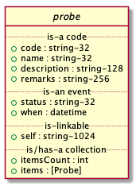

# Probe

Client applications that do not send an `Accept` header, or choose to accept non-vendor content types,
or ab unversioned vendor content type, should receive the latest version of the probe representation.

    Accept: application/json
    Accept: application/xml
    Accept: application/vnd.eci.stg.probe.json
    Accept: application/vnd.eci.stg.probe.xml
    Accept: application/vnd.eci.stg.probe-1.5.0.json
    Accept: application/vnd.eci.stg.probe-1.5.0.xml

## Test Results

All examples in this document are validated against its [schema](#orgd523d7a) when it is published *(C-c C-e)* or
when working in this document e.g. *(C-c C-c)* in the source buffer. Readers can test their work
similar to what we have done below or can copy the [schema](#orgd523d7a) and document into an online validator/lint
such as [this one.](https://www.jsonschemavalidator.net)

    echo $(date -u +"%Y-%m-%dT%H:%M:%SZ") started
    xmllint --noout --schema ../rsrc-schema/src/vnd.eci.stg.probe.1.5.0.xsd ../rsrc-schema/tst/vnd.eci.stg.probe.1.5.?-*.xml 2>&1
    ajv -s ../rsrc-schema/src/vnd.eci.stg.probe.1.5.0.json -d "../rsrc-schema/tst/vnd.eci.stg.probe.1.5.?-*.json" 2>&1
    echo $(date -u +"%Y-%m-%dT%H:%M:%SZ") stopped

<table border="2" cellspacing="0" cellpadding="6" rules="groups" frame="hsides">

<colgroup>
<col  class="org-left" />

<col  class="org-left" />
</colgroup>
<tbody>
<tr>
<td class="org-left">2019-07-29T19:27:21Z</td>
<td class="org-left">started</td>
</tr>

<tr>
<td class="org-left">../rsrc-schema/tst/vnd.eci.stg.probe.1.5.0-list.xml</td>
<td class="org-left">validates</td>
</tr>

<tr>
<td class="org-left">../rsrc-schema/tst/vnd.eci.stg.probe.1.5.0-probes-bottom.xml</td>
<td class="org-left">validates</td>
</tr>

<tr>
<td class="org-left">../rsrc-schema/tst/vnd.eci.stg.probe.1.5.0-bottom.json</td>
<td class="org-left">valid</td>
</tr>

<tr>
<td class="org-left">../rsrc-schema/tst/vnd.eci.stg.probe.1.5.0-list.json</td>
<td class="org-left">valid</td>
</tr>

<tr>
<td class="org-left">2019-07-29T19:27:22Z</td>
<td class="org-left">stopped</td>
</tr>
</tbody>
</table>

## Overview

The purpose of a Probe is to allow buyer and seller health monitoring applications and staff to detect
problems before customers do and provide actionable information, allowing problems to be identified
and corrected as quickly as possible. It is expected that QA, IT, and Support health monitoring
systems and staff will have access to these probes and will access them multiple times throughout
the day.

All "conversations" between buyer and seller systems will be initiated by the buyer's system or by
an agent of the buyer, e.g. IT or Support staff through one of three well-defined probe routes for
each service and any number of custom or special purpose routes available. Discussion of the
function of each route is found in the Use Cases section of this document.

The three well-defined probe routes are:

    ./probes
    ./probes/top
    ./probes/bottom

All converstations will be initiated by IT, Developers and Testers, or Support staff and systems.

Information returned from the probes that return a body may be cached by the client, the server, or
both. If implementors decide to cache on the server, please note that these probes are designed
to be accessed, via HTTP GET, several times per hour. The cache time needs to be balanced against
the purpose of the probes, which is to alert IT systems and staff of problems before customers and
customer support staff experience the problem. The means and length of time probe results can be cached
at the implementor's discretion. The date and time field in the probe resource, called `When`,
will tell readers when the probe was last executed and, with a bit of simple math, how long the
results have been cached.

Custom probes will be executed on demand by IT, QA, and Support staff and should not be used by
frequent running software as they may strain the API and have a negative impact on users and
systems.

Implementors may instruct browsers and client applications to cache results for a certain period of
time, in this example 5 minutes, using HTTP/1.1 Cache-Control.

    Cache-Control: public, max-age=300

Implementors may also include an HTTP/1.0 `Expires` header (not shown). To further decrease unwanted
volume or strain, implementors may wish protect probe routes by traditional DDOS mitigation measures,
including white listing.

## Definition of Terms

-   **code:** software facing value that uniquely identifies the probe. If `code` is not populated, `name` must be.
-   **description:** human facing text that describes the purpose of the probe and the purpose of the activity or function being probed.
-   **name:** human facing value that uniquely identifies the probe. If `name` is not populated, `description` must be.
-   **remarks:** human facing text, populated when there is a failure or warning. The text should give the human user some idea of where and why the failure or warning is occurring and what can be done to correct the problem.
-   **status:** human and Software facing value populated in the returned body of an HTTP GET for all probes except the top probe. Values in the **200s** are successful, values in the **500s** indicate something is wrong with the API. If `status` is populated, `when` must also be populated.
-   **when:** date and time of probe execution. If `when` is populated, `status` must be.
-   **self:** URL identifying the probe that was executed. It is always required.
-   **itemsCount:** if the resource is being used as a collection of probes, not an instance of a probe, this value tells us how many probes are to be expected in the items collection
-   **items:** a collection of one or more probes.

## Use Cases

### Execute top probe `./probes/top`

> As an IT administrator I can easily know when a web application (app, api, service, etc.) is up
> (can be reached) and when it is down (it cannot be reached) so that I am aware of problems, ideally,
> before my customers experience them.
>
> Required for ECI implementations
>
> Recommended for Seller implementations

This probe must be a light weight and fast running indicator of API availability; think of it like
a **ping**. It must do as little as possible yet still be able to announce that the API is up and
running. It is expected this probe will be called one or more times per minute. Calling applications
are required to check the HTTP Status Code and interpret it as pass, **200 - 299**, or fail, **500 - 599**.

A body must not be returned to the caller.

Example of calling the top probe from the command line:

    $ curl --silent --output /dev/null -w "%{http_code}" http://www.example.org/probes/top
    200
    $

### Execute bottom probe `./probes/bottom`

> Required for ECI implementations.
>
> Recommended for Seller implementations.

The bottom probe should test all of the layers of the API or application and all vital connections
to other systems, APIs, databases, etc. IT, QA, and Support staff and their applications must be
able to execute this modest impact probe by an HTTP GET. This probe will be called several times per
hour by automated systems and on demand by staff.

Implementors are required to return a valid, meaningful HTTP Status Code.

Calling applications are required to check the HTTP Status Code. Calling applications are also
required to read and obey HTTP/1.1 Cache-Control headers.

A body is optional. When a body is provided, it must contain one or more probe objects, each of which
will contain its own HTTP Status Code. If the probe is a single object, the HTTP Status Code must match
the value returned by the HTTP GET.

The bottom probe's `code` value must be `bottom`.

1.  Version 1.0

    > Not supported.

2.  Version 1.5

    1.  JSON

            { "code": "bottom",
               "name": "Bottom Probe",
               "description": "Ensures the API can reach all of the systems, databases, files, and other resources required to operate normally.",
               "remarks": "The database cannot be contacted. Ensure the database is running and network reachable.",
               "status": "500",
               "when": "2018-04-23T18:25:40.611Z",
               "self": "https://some-host/some-api/probes/bottom"
            }

    2.  XML

            <probe>
              <code>bottom</code>
              <name>Bottom Probe</name>
              <description>The database cannot be contacted. Ensure the database is running and network reachable.</description>
              <remarks>The database cannot be contacted. Ensure the database is running and network reachable.</remarks>
              <status>500</status>
              <when>2018-04-23T18:25:40.611Z</when>
              <self>https://some-host/some-api/probes/bottom</self>
            </probe>

### List custom probes `./probes`

> Optional.

In addition to top and bottom probes, implementors may choose to support additional probes that can
provide useful information to QA, IT, and Support staff. The purpose of this route is to enumerate
all of the probes supported by the API, including top and bottom. With this probe, IT, QA, and Support
staff and their applications can expect a list of probes they can execute. Each probe provides a
unique URL, called `self`. Users and applications will execute the probe by means of an HTTP GET.

Custom probes should be run on demand by staff and should not be routinely executed by automated
systems and applications.

1.  Version 1.0

    > Not supported.

2.  Version 1.5

    1.  JSON

            { "code": "probes",
              "self": "https://some-host/some-api/probes",
              "itemsCount": 3,
              "items": [{ "self": "https://some-host/some-api/probes/top",
                          "code": "top",
                          "name": "Top Probe" },
                        { "self": "https://some-host/some-api/probes/bottom",
                          "code": "bottom",
                          "name": "Bottom Probe",
                          "description": "The database cannot be contacted. Ensure the database is running and network reachable." },
                        { "self": "https://some-host/some-api/probes/auth",
                          "code": "auth" },
                        { "self": "https://some-host/some-api/probes/con-db",
                          "code": "con-db",
                          "name": "database connection test" }]}

    2.  XML

            <probe>
              <code>probes</code>
              <self>https://some-host/some-api/probes</self>
              <itemsCount>3</itemsCount>
              <items>
                <item>
                  <code>top</code>
                  <name>Top Item</name>
                  <self>https://some-host/some-api/items/top</self>
                </item>
                <item>
                  <code>bottom</code>
                  <name>Bottom Item</name>
                  <description>The database cannot be contacted. Ensure the database is running and network reachable.</description>
                  <self>https://some-host/some-api/items/bottom</self>
                </item>
                <item>
                  <code>auth</code>
                  <self>https://some-host/some-api/items/auth</self>
                </item>
                <item>
                  <code>db</code>
                  <name>database connection test</name>
                  <self>https://some-host/some-api/items/con-db</self>
                </item>
              </items>
            </probe>

## Resource Schema

### Version 1.0

> Not supported.

### Version 1.5

1.  JSON

        {
          "id": "./vnd.eci.stg.probe.1.5.0.json",
          "$schema": "http://json-schema.org/draft-07/schema#",
          "title": "Probe",
          "description": "Defines the location and description of a probe. Upon execution ( HTTP GET ) defines the state of the probe.",
          "type": "object",
          "additionalProperties": false,
          "required": ["self"],
          "anyOf": [{"required": ["code"]},
                    {"required": ["name"]}],
          "dependencies": {
            "status": { "required": [ "when" ]},
            "when":  { "required": [ "status" ]}},

          "properties": {
            "code": {
              "description": "software facing value that uniquely identifies the probe",
              "type": "string",
              "minLength": 1,
              "maxLength": 32
            },

            "name": {
              "description": "human readable string describing the probe's purpose",
              "type": "string",
              "minLength": 1,
              "maxLength": 32
            },

            "description": {
              "description": "details from the probe that may help users understand the health of an endpoint",
              "type": "string",
              "minLength": 1,
              "maxLength": 128
            },

            "remarks": {
              "description": "details of the error that may help users solve the problem",
              "type": "string",
              "minLength": 1,
              "maxLength": 256
            },

            "status": {
              "description": "populated by bottom and custom probes.",
              "type": "string",
              "minLength": 1,
              "maxLength": 32
            },

            "when": {
              "description": "origination date and time of probe execution",
              "type": "string",
              "format": "date-time"
            },

            "self": {
              "description": "system function identifying a unique system owned resource as a URL",
              "type": "string",
              "minLength": 1,
              "maxLength": 1024
            },

            "itemsCount": {
              "description": "number of things in the items collection",
              "type": "number",
              "minimum": 1,
              "maximum": 1000
            },

            "items": {
              "description": "one or more probes.",
              "type": "array",
              "minItems": 1,
              "maxItems": 1000,
              "uniqueItems": true,
              "items": {
                "$ref": "#"
              }
            }
          }
        }

2.  XML

        <?xml version='1.0' encoding='utf-8'?>

        <xs:schema xmlns:xs='http://www.w3.org/2001/XMLSchema'
                   elementFormDefault='qualified'
                   xml:lang='en'>

          <xs:element name='probe' type='itemType' />

          <xs:complexType name='itemType'>
            <xs:sequence>
              <xs:annotation>
                <xs:documentation>
                  The purpose of a Probe is to allow ECI and Seller health monitoring applications and staff to detect
                  problems before customers do and provide actionable information, allowing problems to be identified
                  and corrected as quickly as possible. It is expected that QA, IT, and Support health monitoring
                  systems and staff will have access to these probes and will access them multiple times throughout
                  the day.
                </xs:documentation>
              </xs:annotation>
              <xs:element name='code'        type='string-32'    minOccurs='0' maxOccurs='1' />
              <xs:element name='name'        type='string-32'    minOccurs='0' maxOccurs='1' />
              <xs:element name='description' type='string-128'   minOccurs='0' maxOccurs='1' />
              <xs:element name='remarks'     type='string-256'   minOccurs='0' maxOccurs='1' />
              <xs:element name='status'      type='string-32'    minOccurs='0' maxOccurs='1' />
              <xs:element name='when'        type='xs:dateTime'  minOccurs='0' maxOccurs='1' />
              <xs:element name='self'        type='string-1024'  minOccurs='0' maxOccurs='1' />
              <xs:element name='itemsCount'  type='xs:integer'   minOccurs='0' maxOccurs='1' />
              <xs:element name='items'                           minOccurs='0' maxOccurs='1'>
                <xs:complexType>
                  <xs:sequence minOccurs='1' maxOccurs='500'>
                    <xs:element name='item' type='itemType'/>
                  </xs:sequence>
                </xs:complexType>
              </xs:element>
            </xs:sequence>
          </xs:complexType>

          <xs:simpleType name='string-32'>
            <xs:restriction base='xs:string'>
              <xs:maxLength value='32' />
              <xs:minLength value='0' />
              <xs:whiteSpace value='preserve' />
            </xs:restriction>
          </xs:simpleType>

          <xs:simpleType name='string-128'>
            <xs:restriction base='xs:string'>
              <xs:maxLength value='128' />
              <xs:minLength value='0' />
              <xs:whiteSpace value='preserve' />
            </xs:restriction>
          </xs:simpleType>

          <xs:simpleType name='string-256'>
            <xs:restriction base='xs:string'>
              <xs:maxLength value='256' />
              <xs:minLength value='0' />
              <xs:whiteSpace value='preserve' />
            </xs:restriction>
          </xs:simpleType>

          <xs:simpleType name='string-1024'>
            <xs:restriction base='xs:string'>
              <xs:maxLength value='1024' />
              <xs:minLength value='0' />
              <xs:whiteSpace value='preserve' />
            </xs:restriction>
          </xs:simpleType>

        </xs:schema>

## © 2018-2019 ECI Software Solutions, Inc. All rights reserved.
