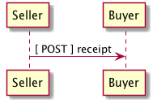

# Receipt

## Test Results

    echo $(date -u +"%Y-%m-%dT%H:%M:%SZ") started
    xmllint --noout --schema ../rsrc-schema/src/vnd.eci.stg.receipt.1.5.0.xsd ../rsrc-schema/tst/vnd.eci.stg.receipt.1.5.0*.xml 2>&1
    ajv -s ../rsrc-schema/src/vnd.eci.stg.receipt.1.5.0.json -d "../rsrc-schema/tst/vnd.eci.stg.receipt*.json" 2>&1
    echo $(date -u +"%Y-%m-%dT%H:%M:%SZ") stopped

<table border="2" cellspacing="0" cellpadding="6" rules="groups" frame="hsides">

<colgroup>
<col  class="org-left" />

<col  class="org-left" />

<col  class="org-left" />

<col  class="org-left" />

<col  class="org-left" />

<col  class="org-left" />

<col  class="org-left" />

<col  class="org-left" />
</colgroup>
<tbody>
<tr>
<td class="org-left">2018-10-25T23:29:39Z</td>
<td class="org-left">started</td>
<td class="org-left">&#xa0;</td>
<td class="org-left">&#xa0;</td>
<td class="org-left">&#xa0;</td>
<td class="org-left">&#xa0;</td>
<td class="org-left">&#xa0;</td>
<td class="org-left">&#xa0;</td>
</tr>

<tr>
<td class="org-left">warning:</td>
<td class="org-left">failed</td>
<td class="org-left">to</td>
<td class="org-left">load</td>
<td class="org-left">external</td>
<td class="org-left">entity</td>
<td class="org-left">../rsrc-schema/tst/vnd.eci.stg.receipt.1.5.0\*.xml</td>
<td class="org-left">&#xa0;</td>
</tr>

<tr>
<td class="org-left">schema</td>
<td class="org-left">../rsrc-schema/src/vnd.eci.stg.receipt.1.5.0.json</td>
<td class="org-left">is</td>
<td class="org-left">invalid</td>
<td class="org-left">&#xa0;</td>
<td class="org-left">&#xa0;</td>
<td class="org-left">&#xa0;</td>
<td class="org-left">&#xa0;</td>
</tr>

<tr>
<td class="org-left">error:</td>
<td class="org-left">can't</td>
<td class="org-left">resolve</td>
<td class="org-left">reference</td>
<td class="org-left">#/definitions/referenceTypeEnum</td>
<td class="org-left">from</td>
<td class="org-left">id</td>
<td class="org-left">vnd.eci.stg.receipt.1.5.0.json#</td>
</tr>

<tr>
<td class="org-left">2018-10-25T23:29:39Z</td>
<td class="org-left">stopped</td>
<td class="org-left">&#xa0;</td>
<td class="org-left">&#xa0;</td>
<td class="org-left">&#xa0;</td>
<td class="org-left">&#xa0;</td>
<td class="org-left">&#xa0;</td>
<td class="org-left">&#xa0;</td>
</tr>
</tbody>
</table>

## Overview

Lorem ipsum dolor sit amet, sea ad clita sadipscing, mea id antiopam prodesset. Justo scripta vivendum eum id, in vis essent petentium. Qui mutat tritani epicuri et, utamur percipitur an sea. Ad nullam integre eum. Cu atqui inermis pri, tempor causae sanctus at pro. Ea cum tation hendrerit conclusionemque, veri hendrerit definitionem sit at. Vix adipiscing dissentiet eloquentiam eu, decore epicurei liberavisse eu eam.

## Sequence of Events

In the following section, Use Cases, examples of data ( `--data` ) to be sent and
received will be shown. It is assumed that the caller will make the actual *POST*
call with the required headers e.g.

    curl --request POST \
         --header "Content-Type: application/vnd.eci.stg.receipt.1.0.0.xml; charset=utf-8" \
         --user user123:password123 \
         --url http://vendor-host/vendor-receipt-endpoint
         --data ''

## Use Cases

### TODO write some use cases

## Resource Schemas

### Version 1.0

No longer published

### Version 1.5

1.  JSON

        {
          "id": "./vnd.eci.stg.receipt.1.5.0.json",
          "$schema": "http://json-schema.org/draft-07/schema#",
          "title": "receipt",
          "description": "",
          "type": "object",
          "additionalProperties": false,
          "properties": {

            "reference": { "$ref": "#/definitions/reference" },

            "name": {
              "description": "",
              "type": "string",
              "minLength": 1,
              "maxLength": 32
            },

            "description": {
              "description": "",
              "type": "string",
              "minLength": 1,
              "maxLength": 128
            },

            "remarks": {
              "description": "",
              "type": "string",
              "minLength": 1,
              "maxLength": 256
            },

            "make": {
              "description": "",
              "type": "string",
              "minLength": 1,
              "maxLength": 32
            },

            "model": {
              "description": "",
              "type": "string",
              "minLength": 1,
              "maxLength": 32
            },

            "serialnumber": {
              "description": "",
              "type": "string",
              "minLength": 1,
              "maxLength": 32
            },

            "buyer": { "$ref": "#/definitions/buyer" },

            "consumer": { "$ref": "#/definitions/consumer" },

            "seller": { "$ref": "#/definitions/seller" },

            "shipTo": { "$ref": "#/definitions/shipTo" },

            "billTo": { "$ref": "#/definitions/billTo" },

            "shippingCarrier": { "$ref": "#/definitions/shippingCarrier" },

            "location": { "$ref": "#/definitions/address" },

            "quantity": {
              "description": "",
              "type": "number",
              "minimum": 0,
              "maximum": 999999999.999999
            },

            "currency": { "$ref": "#/definitions/currency"},

            "unitCost": {
              "description": "",
              "type": "number",
              "minimum": 0,
              "maximum": 999999999999.999999
            },

            "total": { "$ref": "#/definitions/total"},

            "when": {
              "description": "",
              "type": "string",
              "format": "date-time"
            },

            "whenExpected": {
              "description": "",
              "type": "string",
              "format": "date-time"
            },

            "order": {
              "description": "",
              "$ref": "#/definitions/reference"
            },

            "package": {
              "description": "",
              "type": "integer",
              "minimum": 1
            },

            "shipment": {
              "description": "",
              "type": "integer",
              "minimum": 1
            },

            "tracking": {
              "description": "",
              "type": "string",
              "minLength": 1,
              "maxLength": 32
            },

            "itemsCount": {
              "description": "number of things in the items collection",
              "type": "number",
              "minimum": 1,
              "maximum": 1000
            },

            "items": {
              "description": "",
              "type": "array",
              "minItems": 1,
              "maxItems": 1000,
              "uniqueItems": true,
              "items": {
                "$ref": "#"
              }
            }
          },

          "definitions": {
            "reference": {
              "type": "object",
              "additionalProperties": false,

              "properties": {

                "code": {
                  "description": "",
                  "type": "string",
                  "minLength": 1,
                  "maxLength": 32
                },

                "name": {
                  "description": "",
                  "type": "string",
                  "minLength": 1,
                  "maxLength": 32
                },

                "description": {
                  "description": "",
                  "type": "string",
                  "minLength": 1,
                  "maxLength": 128
                },

                "remarks": {
                  "description": "",
                  "type": "string",
                  "minLength": 1,
                  "maxLength": 256
                },

                "type": { "$ref": "#/definitions/referenceTypeEnum" },

                "referencesCount": {
                  "description": "number of things in the references collection",
                  "type": "number",
                  "minimum": 1,
                  "maximum": 1000
                },

                "references": {
                  "description": "",
                  "type": "array",
                  "minItems": 1,
                  "maxItems": 1000,
                  "uniqueItems": true,
                  "items": {
                    "$ref": "#/definitions/reference"
                  }
                }
              },

              "definitions": {
                "referenceTypeEnum": {
                  "type": "string",
                  "enum": ["buyer", "consumer", "manufacturer", "seller" ]
                }
              }
            },

            "tax": {
              "type": "object",
              "properties": {

                "code": {
                  "description": "",
                  "type": "string",
                  "minLength": 1,
                  "maxLength": 32
                },

                "name": {
                  "description": "",
                  "type": "string",
                  "minLength": 1,
                  "maxLength": 32
                },

                "description": {
                  "description": "",
                  "type": "string",
                  "minLength": 1,
                  "maxLength": 128
                },

                "remarks": {
                  "description": "",
                  "type": "string",
                  "minLength": 1,
                  "maxLength": 256
                },

                "amount": {
                  "description": "",
                  "type": "number",
                  "minimum": 0,
                  "maximum": 999999999999.999999
                },

                "authority": {
                  "description": "",
                  "type": "string",
                  "minLength": 1,
                  "maxLength": 32
                },

                "itemsCount": {
                  "description": "number of things in the items collection",
                  "type": "number",
                  "minimum": 1,
                  "maximum": 1000
                },

                "items": {
                  "description": "",
                  "type": "array",
                  "minItems": 1,
                  "maxItems": 1000,
                  "uniqueItems": true,
                  "items": {
                    "$ref": "#/definitions/tax"
                  }
                }
              },

              "additionalProperties": false
            },

            "shippingCarrier": {
              "type": "object",
              "additionalProperties": false,
              "properties": {

                "code": {
                  "description": "",
                  "type": "string",
                  "minLength": 1,
                  "maxLength": 32
                },

                "name": {
                  "description": "",
                  "type": "string",
                  "minLength": 1,
                  "maxLength": 32
                },

                "description": {
                  "description": "",
                  "type": "string",
                  "minLength": 1,
                  "maxLength": 128
                },

                "remarks": {
                  "description": "",
                  "type": "string",
                  "minLength": 1,
                  "maxLength": 256
                },

                "itemsCount": {
                  "description": "number of shipping carriers in the collection",
                  "type": "number",
                  "minimum": 1,
                  "maximum": 1000
                },

                "items": {
                  "description": "",
                  "type": "array",
                  "minItems": 1,
                  "maxItems": 1000,
                  "uniqueItems": true,
                  "items": {
                    "$ref": "#/definitions/shippingCarrier"
                  }
                }
              }
            },

            "address": {
              "type": "object",
              "additionalProperties": false,
              "properties": {

                "reference": { "$ref": "#/definitions/reference" },

                "name": {
                  "description": "",
                  "type": "string",
                  "minLength": 1,
                  "maxLength": 32
                },

                "description": {
                  "description": "",
                  "type": "string",
                  "minLength": 1,
                  "maxLength": 128
                },

                "remarks": {
                  "description": "",
                  "type": "string",
                  "minLength": 1,
                  "maxLength": 256
                },

                "msc": {
                  "description": "mail stop code",
                  "type": "string",
                  "minLength": 1,
                  "maxLength": 40
                },

                "mtn": {
                  "description": "attention line",
                  "type": "string",
                  "minLength": 1,
                  "maxLength": 40
                },

                "rcp": {
                  "description": "recipient or business name",
                  "type": "string",
                  "minLength": 1,
                  "maxLength": 40
                },

                "alt": {
                  "description": "alternate location",
                  "type": "string",
                  "minLength": 1,
                  "maxLength": 40
                },

                "dal": {
                  "description": "delivery address line",
                  "type": "string",
                  "minLength": 1,
                  "maxLength": 40
                },

                "city": {
                  "description": "",
                  "type": "string",
                  "minLength": 1,
                  "maxLength": 40
                },

                "region": {
                  "description": "",
                  "type": "string",
                  "minLength": 1,
                  "maxLength": 40
                },

                "postalCode": {
                  "description": "",
                  "type": "string",
                  "minLength": 1,
                  "maxLength": 40
                },

                "country": {
                  "description": "",
                  "type": "string",
                  "minLength": 1,
                  "maxLength": 40
                },

                "binLocation": {
                  "description": "",
                  "type": "string",
                  "minLength": 1,
                  "maxLength": 40
                },

                "warehouse": {
                  "description": "",
                  "type": "string",
                  "minLength": 1,
                  "maxLength": 128
                }
              }
            },

            "billTo": {
              "type": "object",
              "additionalProperties": false,
              "properties": {

                "reference": { "$ref": "#/definitions/reference" },

                "name": {
                  "description": "",
                  "type": "string",
                  "minLength": 1,
                  "maxLength": 32
                },

                "description": {
                  "description": "",
                  "type": "string",
                  "minLength": 1,
                  "maxLength": 128
                },

                "remarks": {
                  "description": "",
                  "type": "string",
                  "minLength": 1,
                  "maxLength": 256
                },

                "location": { "$ref": "#/definitions/address" },

                "email": {
                  "description": "",
                  "type": "string",
                  "minLength": 1,
                  "maxLength": 256
                },

                "phone": {
                  "description": "",
                  "type": "string",
                  "minLength": 1,
                  "maxLength": 32
                },

                "taxID": {
                  "description": "",
                  "type": "string",
                  "minLength": 1,
                  "maxLength": 32
                }
              }
            },

            "buyer": {
              "type": "object",
              "additionalProperties": false,
              "properties": {

                "reference": { "$ref": "#/definitions/reference" },

                "name": {
                  "description": "",
                  "type": "string",
                  "minLength": 1,
                  "maxLength": 32
                },

                "description": {
                  "description": "",
                  "type": "string",
                  "minLength": 1,
                  "maxLength": 128
                },

                "remarks": {
                  "description": "",
                  "type": "string",
                  "minLength": 1,
                  "maxLength": 256
                },

                "location": { "$ref": "#/definitions/address" },

                "email": {
                  "description": "",
                  "type": "string",
                  "minLength": 1,
                  "maxLength": 256
                },

                "phone": {
                  "description": "",
                  "type": "string",
                  "minLength": 1,
                  "maxLength": 32
                },

                "taxID": {
                  "description": "",
                  "type": "string",
                  "minLength": 1,
                  "maxLength": 32
                }
              }
            },

            "consumer": {
              "type": "object",
              "additionalProperties": false,
              "properties": {

                "reference": { "$ref": "#/definitions/reference" },

                "name": {
                  "description": "",
                  "type": "string",
                  "minLength": 1,
                  "maxLength": 32
                },

                "description": {
                  "description": "",
                  "type": "string",
                  "minLength": 1,
                  "maxLength": 128
                },

                "remarks": {
                  "description": "",
                  "type": "string",
                  "minLength": 1,
                  "maxLength": 256
                },

                "location": { "$ref": "#/definitions/address" },

                "contract": { "$ref": "#/definitions/reference" },

                "email": {
                  "description": "",
                  "type": "string",
                  "minLength": 1,
                  "maxLength": 256
                },

                "phone": {
                  "description": "",
                  "type": "string",
                  "minLength": 1,
                  "maxLength": 32
                },

                "taxID": {
                  "description": "",
                  "type": "string",
                  "minLength": 1,
                  "maxLength": 32
                }
              }
            },

            "seller": {
              "type": "object",
              "additionalProperties": false,
              "properties": {

                "reference": { "$ref": "#/definitions/reference" },

                "name": {
                  "description": "",
                  "type": "string",
                  "minLength": 1,
                  "maxLength": 32
                },

                "description": {
                  "description": "",
                  "type": "string",
                  "minLength": 1,
                  "maxLength": 128
                },

                "remarks": {
                  "description": "",
                  "type": "string",
                  "minLength": 1,
                  "maxLength": 256
                },

                "location": { "$ref": "#/definitions/address" },

                "email": {
                  "description": "",
                  "type": "string",
                  "minLength": 1,
                  "maxLength": 256
                },

                "phone": {
                  "description": "",
                  "type": "string",
                  "minLength": 1,
                  "maxLength": 32
                },

                "taxID": {
                  "description": "",
                  "type": "string",
                  "minLength": 1,
                  "maxLength": 32
                }
              }
            },

            "shipTo": {
              "type": "object",
              "additionalProperties": false,
              "properties": {

                "reference": { "$ref": "#/definitions/reference" },

                "name": {
                  "description": "",
                  "type": "string",
                  "minLength": 1,
                  "maxLength": 32
                },

                "description": {
                  "description": "",
                  "type": "string",
                  "minLength": 1,
                  "maxLength": 128
                },

                "remarks": {
                  "description": "",
                  "type": "string",
                  "minLength": 1,
                  "maxLength": 256
                },

                "location": { "$ref": "#/definitions/address" },

                "email": {
                  "description": "",
                  "type": "string",
                  "minLength": 1,
                  "maxLength": 256
                },

                "phone": {
                  "description": "",
                  "type": "string",
                  "minLength": 1,
                  "maxLength": 32
                },

                "isDropShip": {
                  "description": "",
                  "type": "boolean"
                }
              }
            },

            "currency": {
              "type": "object",
              "additionalProperties": false,
              "properties": {

                "code": {
                  "description": "",
                  "type": "string",
                  "minLength": 1,
                  "maxLength": 32
                },

                "name": {
                  "description": "",
                  "type": "string",
                  "minLength": 1,
                  "maxLength": 32
                },

                "number": {
                  "description": "",
                  "type": "number",
                  "minimum": 1,
                  "maximum": 999
                },

                "precision": {
                  "description": "",
                  "type": "number",
                  "minimum": 0,
                  "maximum": 18
                },

                "scale": {
                  "description": "",
                  "type": "number",
                  "minimum": 1,
                  "maximum": 6
                }
              }
            },

            "total": {
              "type": "object",
              "additionalProperties": false,
              "properties": {

                "amount": {
                  "description": "",
                  "type": "number",
                  "minimum": 0,
                  "maximum": 999999999999.999999
                },

                "discountAmount": {
                  "description": "",
                  "type": "number",
                  "minimum": 0,
                  "maximum": 999999999999.999999
                },

                "freightAmount": {
                  "description": "",
                  "type": "number",
                  "minimum": 0,
                  "maximum": 999999999999.999999
                },

                "termsAmount": {
                  "description": "",
                  "type": "number",
                  "minimum": 0,
                  "maximum": 999999999999.999999
                },

                "tax": { "$ref": "#/definitions/tax" },

                "remarks": {
                  "description": "",
                  "type": "string",
                  "minLength": 1,
                  "maxLength": 256
                }
              }
            }
          }
        }

2.  XML

        <xs:schema attributeFormDefault="unqualified" elementFormDefault="qualified" xmlns:xs="http://www.w3.org/2001/XMLSchema">
          <xs:element name="Receipt" type="ReceiptType"/>

          <xs:complexType name="AddressType">
            <xs:sequence>
              <xs:element type="xs:string" name="AlternateLocation"/>
              <xs:element type="xs:string" name="Attention"/>
              <xs:element type="xs:string" name="City"/>
              <xs:element type="xs:string" name="Country"/>
              <xs:element type="xs:string" name="MailStopCode"/>
              <xs:element type="xs:string" name="Recipient"/>
              <xs:element type="xs:string" name="Remarks"/>
              <xs:element type="xs:string" name="State"/>
              <xs:element type="xs:string" name="Street"/>
              <xs:element type="xs:string" name="Tag"/>
              <xs:element type="xs:string" name="Zip"/>
            </xs:sequence>
          </xs:complexType>

          <xs:complexType name='ReferenceType'>
            <xs:sequence>
              <xs:element name='code'        type='xs:string' minOccurs='0' maxOccurs='1' />
              <xs:element name='name'        type='xs:string' minOccurs='0' maxOccurs='1' />
              <xs:element name='description' type='xs:string' minOccurs='0' maxOccurs='1' />
              <xs:element name='remarks'     type='xs:string' minOccurs='0' maxOccurs='1' />
              <xs:element name='type'        type='ReferenceTypeEnum' minOccurs='0' maxOccurs='1' />

              <xs:element name='refsCount'   type='xs:integer'     minOccurs='0' maxOccurs='1' />
              <xs:element name='refs'        type='ReferencesType' minOccurs='0' maxOccurs='1' />
            </xs:sequence>
          </xs:complexType>

          <xs:simpleType name='ReferenceTypeEnum'>
            <xs:restriction base='xs:string'>
              <xs:enumeration value='buyer'/>
              <xs:enumeration value='consumer'/>
              <xs:enumeration value='manufacturer'/>
              <xs:enumeration value='seller'/>
            </xs:restriction>
          </xs:simpleType>

          <xs:complexType name='ReferencesType'>
            <xs:sequence minOccurs='0' maxOccurs='1000'>
              <xs:element name='reference' type='ReferenceType'/>
            </xs:sequence>
          </xs:complexType>

          <xs:complexType name="BillToType">
            <xs:sequence>
              <xs:element type="AddressType" name="Address"/>
              <xs:element type="xs:string" name="Email"/>
              <xs:element type="xs:string" name="Name"/>
              <xs:element type="xs:string" name="Phone"/>
              <xs:element type="ReferenceType" name="Reference"/>
              <xs:element type="xs:string" name="Remarks"/>
            </xs:sequence>
          </xs:complexType>

          <xs:complexType name="BuyerType">
            <xs:sequence>
              <xs:element type="AddressType" name="Address"/>
              <xs:element type="xs:string" name="Email"/>
              <xs:element type="xs:string" name="Name"/>
              <xs:element type="xs:string" name="Phone"/>
              <xs:element type="ReferenceType" name="Reference"/>
              <xs:element type="xs:string" name="Remarks"/>
              <xs:element type="xs:string" name="TaxNumber"/>
            </xs:sequence>
          </xs:complexType>

          <xs:complexType name="CarrierType">
            <xs:sequence>
              <xs:element type="xs:string" name="Name"/>
              <xs:element type="xs:string" name="Remarks"/>
            </xs:sequence>
          </xs:complexType>

          <xs:complexType name="ConsumerType">
            <xs:sequence>
              <xs:element type="AddressType" name="Address"/>
              <xs:element type="xs:string" name="ContractId"/>
              <xs:element type="xs:string" name="Email"/>
              <xs:element type="xs:string" name="Name"/>
              <xs:element type="xs:string" name="Phone"/>
              <xs:element type="ReferenceType" name="Reference"/>
              <xs:element type="xs:string" name="Remarks"/>
              <xs:element type="xs:string" name="TaxNumber"/>
            </xs:sequence>
          </xs:complexType>

          <xs:complexType name="CurrencyType">
            <xs:sequence>
              <xs:element type="xs:string" name="Code"/>
              <xs:element type="xs:byte" name="Number"/>
              <xs:element type="xs:byte" name="Precision"/>
              <xs:element type="xs:byte" name="Scale"/>
            </xs:sequence>
          </xs:complexType>

          <xs:complexType name="AmountType">
            <xs:sequence>
              <xs:element type="xs:float" name="Amount"/>
              <xs:element type="CurrencyType" name="Type"/>
            </xs:sequence>
          </xs:complexType>

          <xs:complexType name="AmountSubjectToTermsType">
            <xs:sequence>
              <xs:element type="xs:float" name="Amount"/>
              <xs:element type="CurrencyType" name="Type"/>
            </xs:sequence>
          </xs:complexType>

          <xs:complexType name="DiscountType">
            <xs:sequence>
              <xs:element type="xs:float" name="Amount"/>
              <xs:element type="CurrencyType" name="Type"/>
            </xs:sequence>
          </xs:complexType>

          <xs:complexType name="FreightType">
            <xs:sequence>
              <xs:element type="xs:float" name="Amount"/>
              <xs:element type="CurrencyType" name="Type"/>
            </xs:sequence>
          </xs:complexType>

          <xs:complexType name="CodeType">
            <xs:simpleContent>
              <xs:extension base="xs:string">
                <xs:attribute type="xs:string" name="null"/>
              </xs:extension>
            </xs:simpleContent>
          </xs:complexType>

          <xs:complexType name="TaxType">
            <xs:sequence>
              <xs:element type="AmountType" name="Amount"/>
              <xs:element type="CodeType" name="Code"/>
            </xs:sequence>
          </xs:complexType>

          <xs:complexType name="UnitType">
            <xs:sequence>
              <xs:element type="xs:string" name="Description"/>
              <xs:element type="xs:string" name="MachineFacingID"/>
              <xs:element type="xs:float" name="Quantity"/>
            </xs:sequence>
          </xs:complexType>

          <xs:complexType name="UnitCostType">
            <xs:sequence>
              <xs:element type="xs:float" name="Amount"/>
              <xs:element type="CurrencyType" name="Type"/>
            </xs:sequence>
          </xs:complexType>

          <xs:complexType name="elementType">
            <xs:sequence>
              <xs:element type="AmountType" name="Amount" minOccurs="0"/>
              <xs:element type="AmountSubjectToTermsType" name="AmountSubjectToTerms" minOccurs="0"/>
              <xs:element type="xs:string" name="Description" minOccurs="0"/>
              <xs:element type="DiscountType" name="Discount" minOccurs="0"/>
              <xs:element type="BillToType" name="BillTo" minOccurs="0"/>
              <xs:element type="BuyerType" name="Buyer" minOccurs="0"/>
              <xs:element type="xs:string" name="BuyerReference" minOccurs="0"/>
              <xs:element type="CarrierType" name="Carrier" minOccurs="0"/>
              <xs:element type="ConsumerType" name="Consumer" minOccurs="0"/>
              <xs:element type="xs:byte" name="CountEmbedded" minOccurs="0"/>
              <xs:element type="CurrencyType" name="Currency" minOccurs="0"/>
              <xs:element type="xs:dateTime" name="Date" minOccurs="0"/>
              <xs:element type="xs:dateTime" name="ExpectedDate"/>
              <xs:element type="FreightType" name="Freight" minOccurs="0"/>
              <xs:element type="xs:string" name="Id" minOccurs="0"/>
              <xs:element type="xs:byte" name="LineNumber" minOccurs="0"/>
              <xs:element type="xs:string" name="Make" minOccurs="0"/>
              <xs:element type="xs:string" name="Model" minOccurs="0"/>
              <xs:element type="xs:float" name="Quantity" minOccurs="0"/>
              <xs:element type="xs:float" name="QuantityAcknowledged" minOccurs="0"/>
              <xs:element type="ItemsType" name="Items" minOccurs="0"/>
              <xs:element type="xs:string" name="OptionAllowBackorder" minOccurs="0"/>
              <xs:element type="xs:string" name="OptionAllowCostChanges" minOccurs="0"/>
              <xs:element type="xs:string" name="OptionAllowPartialShipments" minOccurs="0"/>
              <xs:element type="xs:string" name="OptionAllowSubstitutions" minOccurs="0"/>
              <xs:element type="xs:string" name="OptionDropShip" minOccurs="0"/>
              <xs:element type="ReferenceType" name="Reference"/>
              <xs:element type="xs:string" name="Remarks"/>
              <xs:element type="xs:string" name="SerialNumber" minOccurs="0"/>
              <xs:element type="TaxType" name="Tax" minOccurs="0"/>
              <xs:element type="UnitType" name="Unit" minOccurs="0"/>
              <xs:element type="UnitCostType" name="UnitCost" minOccurs="0"/>
              <xs:element type="xs:string" name="SellerReference" minOccurs="0"/>
              <xs:element type="ShipToType" name="ShipTo" minOccurs="0"/>
            </xs:sequence>
          </xs:complexType>

          <xs:complexType name="ItemsType">
            <xs:sequence>
              <xs:element type="elementType" name="element"/>
            </xs:sequence>
          </xs:complexType>

          <xs:complexType name="ShipToType">
            <xs:sequence>
              <xs:element type="AddressType" name="Address"/>
              <xs:element type="xs:string" name="Email"/>
              <xs:element type="xs:string" name="Name"/>
              <xs:element type="xs:string" name="Phone"/>
              <xs:element type="ReferenceType" name="Reference"/>
              <xs:element type="xs:string" name="Remarks"/>
            </xs:sequence>
          </xs:complexType>

          <xs:complexType name="OrdersType">
            <xs:sequence>
              <xs:element type="elementType" name="element"/>
            </xs:sequence>
          </xs:complexType>

          <xs:complexType name="SellerType">
            <xs:sequence>
              <xs:element type="xs:string" name="Id"/>
            </xs:sequence>
          </xs:complexType>

          <xs:complexType name="ReceiptType">
            <xs:sequence>
              <xs:element type="xs:dateTime" name="Date"/>
              <xs:element type="xs:string" name="Id"/>
              <xs:element type="OrdersType" name="Orders"/>
              <xs:element type="xs:string" name="Remarks"/>
              <xs:element type="SellerType" name="Seller"/>
              <xs:element type="ShipToType" name="ShipTo"/>
            </xs:sequence>
          </xs:complexType>
        </xs:schema>

### Version 2.0

1.  JSON

2.  XML

## © 2018 ECi Software Solutions, Inc. All rights reserved.
