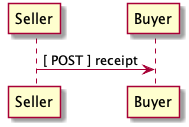

# Provide a non-technical overview of the business cases

## TODO provide a non-technical overview of the business cases

# Sequence of Events

In the following section, Use Cases, examples of data ( `--data` ) to be sent and
received will be shown. It is assumed that the caller will make the actual *POST*
call with the required headers e.g.

    curl --request POST \
         --header "Content-Type: application/vnd.eci.stg.receipt.1.0.0.xml; charset=utf-8" \
         --user user123:password123 \
         --url http://vendor-host/vendor-receipt-endpoint
         --data ''

# Use Cases

## TODO write some use cases

# Resource Schemas

## Version 1.0

No longer published

## Version 1.5

### JSON

    {}

### XML

    <xs:schema attributeFormDefault="unqualified" elementFormDefault="qualified" xmlns:xs="http://www.w3.org/2001/XMLSchema">
      <xs:element name="Receipt" type="ReceiptType"/>

      <xs:complexType name="AddressType">
        <xs:sequence>
          <xs:element type="xs:string" name="AlternateLocation"/>
          <xs:element type="xs:string" name="Attention"/>
          <xs:element type="xs:string" name="City"/>
          <xs:element type="xs:string" name="Country"/>
          <xs:element type="xs:string" name="MailStopCode"/>
          <xs:element type="xs:string" name="Recipient"/>
          <xs:element type="xs:string" name="Remarks"/>
          <xs:element type="xs:string" name="State"/>
          <xs:element type="xs:string" name="Street"/>
          <xs:element type="xs:string" name="Tag"/>
          <xs:element type="xs:string" name="Zip"/>
        </xs:sequence>
      </xs:complexType>

      <xs:complexType name="ReferenceType">
        <xs:sequence>
          <xs:element type="xs:string" name="BuyerReference"/>
          <xs:element type="xs:string" name="ConsumerReference"/>
          <xs:element type="xs:string" name="Description"/>
          <xs:element type="xs:string" name="DocumentReference"/>
          <xs:element type="xs:string" name="LineNumberReference"/>
          <xs:element type="xs:string" name="ManufacturerReference"/>
          <xs:element type="xs:string" name="SellerReference"/>
        </xs:sequence>
      </xs:complexType>

      <xs:complexType name="BillToType">
        <xs:sequence>
          <xs:element type="AddressType" name="Address"/>
          <xs:element type="xs:string" name="Email"/>
          <xs:element type="xs:string" name="Name"/>
          <xs:element type="xs:string" name="Phone"/>
          <xs:element type="ReferenceType" name="Reference"/>
          <xs:element type="xs:string" name="Remarks"/>
        </xs:sequence>
      </xs:complexType>

      <xs:complexType name="BuyerType">
        <xs:sequence>
          <xs:element type="AddressType" name="Address"/>
          <xs:element type="xs:string" name="Email"/>
          <xs:element type="xs:string" name="Name"/>
          <xs:element type="xs:string" name="Phone"/>
          <xs:element type="ReferenceType" name="Reference"/>
          <xs:element type="xs:string" name="Remarks"/>
          <xs:element type="xs:string" name="TaxNumber"/>
        </xs:sequence>
      </xs:complexType>

      <xs:complexType name="CarrierType">
        <xs:sequence>
          <xs:element type="xs:string" name="Name"/>
          <xs:element type="xs:string" name="Remarks"/>
        </xs:sequence>
      </xs:complexType>

      <xs:complexType name="ConsumerType">
        <xs:sequence>
          <xs:element type="AddressType" name="Address"/>
          <xs:element type="xs:string" name="ContractId"/>
          <xs:element type="xs:string" name="Email"/>
          <xs:element type="xs:string" name="Name"/>
          <xs:element type="xs:string" name="Phone"/>
          <xs:element type="ReferenceType" name="Reference"/>
          <xs:element type="xs:string" name="Remarks"/>
          <xs:element type="xs:string" name="TaxNumber"/>
        </xs:sequence>
      </xs:complexType>

      <xs:complexType name="CurrencyType">
        <xs:sequence>
          <xs:element type="xs:string" name="Code"/>
          <xs:element type="xs:byte" name="Number"/>
          <xs:element type="xs:byte" name="Precision"/>
          <xs:element type="xs:byte" name="Scale"/>
        </xs:sequence>
      </xs:complexType>

      <xs:complexType name="AmountType">
        <xs:sequence>
          <xs:element type="xs:float" name="Amount"/>
          <xs:element type="CurrencyType" name="Type"/>
        </xs:sequence>
      </xs:complexType>

      <xs:complexType name="AmountSubjectToTermsType">
        <xs:sequence>
          <xs:element type="xs:float" name="Amount"/>
          <xs:element type="CurrencyType" name="Type"/>
        </xs:sequence>
      </xs:complexType>

      <xs:complexType name="DiscountType">
        <xs:sequence>
          <xs:element type="xs:float" name="Amount"/>
          <xs:element type="CurrencyType" name="Type"/>
        </xs:sequence>
      </xs:complexType>

      <xs:complexType name="FreightType">
        <xs:sequence>
          <xs:element type="xs:float" name="Amount"/>
          <xs:element type="CurrencyType" name="Type"/>
        </xs:sequence>
      </xs:complexType>

      <xs:complexType name="CodeType">
        <xs:simpleContent>
          <xs:extension base="xs:string">
            <xs:attribute type="xs:string" name="null"/>
          </xs:extension>
        </xs:simpleContent>
      </xs:complexType>

      <xs:complexType name="TaxType">
        <xs:sequence>
          <xs:element type="AmountType" name="Amount"/>
          <xs:element type="CodeType" name="Code"/>
        </xs:sequence>
      </xs:complexType>

      <xs:complexType name="UnitType">
        <xs:sequence>
          <xs:element type="xs:string" name="Description"/>
          <xs:element type="xs:string" name="MachineFacingID"/>
          <xs:element type="xs:float" name="Quantity"/>
        </xs:sequence>
      </xs:complexType>

      <xs:complexType name="UnitCostType">
        <xs:sequence>
          <xs:element type="xs:float" name="Amount"/>
          <xs:element type="CurrencyType" name="Type"/>
        </xs:sequence>
      </xs:complexType>

      <xs:complexType name="elementType">
        <xs:sequence>
          <xs:element type="AmountType" name="Amount" minOccurs="0"/>
          <xs:element type="AmountSubjectToTermsType" name="AmountSubjectToTerms" minOccurs="0"/>
          <xs:element type="xs:string" name="Description" minOccurs="0"/>
          <xs:element type="DiscountType" name="Discount" minOccurs="0"/>
          <xs:element type="BillToType" name="BillTo" minOccurs="0"/>
          <xs:element type="BuyerType" name="Buyer" minOccurs="0"/>
          <xs:element type="xs:string" name="BuyerReference" minOccurs="0"/>
          <xs:element type="CarrierType" name="Carrier" minOccurs="0"/>
          <xs:element type="ConsumerType" name="Consumer" minOccurs="0"/>
          <xs:element type="xs:byte" name="CountEmbedded" minOccurs="0"/>
          <xs:element type="CurrencyType" name="Currency" minOccurs="0"/>
          <xs:element type="xs:dateTime" name="Date" minOccurs="0"/>
          <xs:element type="xs:dateTime" name="ExpectedDate"/>
          <xs:element type="FreightType" name="Freight" minOccurs="0"/>
          <xs:element type="xs:string" name="Id" minOccurs="0"/>
          <xs:element type="xs:byte" name="LineNumber" minOccurs="0"/>
          <xs:element type="xs:string" name="Make" minOccurs="0"/>
          <xs:element type="xs:string" name="Model" minOccurs="0"/>
          <xs:element type="xs:float" name="Quantity" minOccurs="0"/>
          <xs:element type="xs:float" name="QuantityAcknowledged" minOccurs="0"/>
          <xs:element type="ItemsType" name="Items" minOccurs="0"/>
          <xs:element type="xs:string" name="OptionAllowBackorder" minOccurs="0"/>
          <xs:element type="xs:string" name="OptionAllowCostChanges" minOccurs="0"/>
          <xs:element type="xs:string" name="OptionAllowPartialShipments" minOccurs="0"/>
          <xs:element type="xs:string" name="OptionAllowSubstitutions" minOccurs="0"/>
          <xs:element type="xs:string" name="OptionDropShip" minOccurs="0"/>
          <xs:element type="ReferenceType" name="Reference"/>
          <xs:element type="xs:string" name="Remarks"/>
          <xs:element type="xs:string" name="SerialNumber" minOccurs="0"/>
          <xs:element type="TaxType" name="Tax" minOccurs="0"/>
          <xs:element type="UnitType" name="Unit" minOccurs="0"/>
          <xs:element type="UnitCostType" name="UnitCost" minOccurs="0"/>
          <xs:element type="xs:string" name="SellerReference" minOccurs="0"/>
          <xs:element type="ShipToType" name="ShipTo" minOccurs="0"/>
        </xs:sequence>
      </xs:complexType>

      <xs:complexType name="ItemsType">
        <xs:sequence>
          <xs:element type="elementType" name="element"/>
        </xs:sequence>
      </xs:complexType>

      <xs:complexType name="ShipToType">
        <xs:sequence>
          <xs:element type="AddressType" name="Address"/>
          <xs:element type="xs:string" name="Email"/>
          <xs:element type="xs:string" name="Name"/>
          <xs:element type="xs:string" name="Phone"/>
          <xs:element type="ReferenceType" name="Reference"/>
          <xs:element type="xs:string" name="Remarks"/>
        </xs:sequence>
      </xs:complexType>

      <xs:complexType name="OrdersType">
        <xs:sequence>
          <xs:element type="elementType" name="element"/>
        </xs:sequence>
      </xs:complexType>

      <xs:complexType name="SellerType">
        <xs:sequence>
          <xs:element type="xs:string" name="Id"/>
        </xs:sequence>
      </xs:complexType>

      <xs:complexType name="ReceiptType">
        <xs:sequence>
          <xs:element type="xs:dateTime" name="Date"/>
          <xs:element type="xs:string" name="Id"/>
          <xs:element type="OrdersType" name="Orders"/>
          <xs:element type="xs:string" name="Remarks"/>
          <xs:element type="SellerType" name="Seller"/>
          <xs:element type="ShipToType" name="ShipTo"/>
        </xs:sequence>
      </xs:complexType>
    </xs:schema>

## Version 2.0

### JSON

### XML

# Testing

    ../test-json.sh 2>&1
    ../test-xml.sh 2>&1
    xmllint --noout --schema ../rsrc-schema/src/vnd.eci.stg.receipt.1.5.0.xsd ../rsrc-schema/tst/vnd.eci.stg.receipt.1.5.0*.xml
