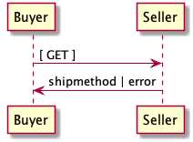

# Technical Overview

Lorem ipsum dolor sit amet, sea ad clita sadipscing, mea id antiopam prodesset. Justo scripta vivendum eum id, in vis essent petentium. Qui mutat tritani epicuri et, utamur percipitur an sea. Ad nullam integre eum. Cu atqui inermis pri, tempor causae sanctus at pro. Ea cum tation hendrerit conclusionemque, veri hendrerit definitionem sit at. Vix adipiscing dissentiet eloquentiam eu, decore epicurei liberavisse eu eam.

# Sequence of Events

In the following section, Use Cases, examples of data ( `--data` ) to be sent and
received will be shown. It is assumed that the caller will make the actual *POST*
call with the required headers e.g.

    curl --request GET \
         --header "Accepts: application/vnd.eci.stg.shipmethod.1.5.0.xml; charset=utf-8" \
         --user user123:password123 \
         --url http://vendor-host/vendor-shipmethod-endpoint

# Use Cases

## TODO

Version 1.0

### Request

In this example a buyer is

1.  JSON

        {}

2.  XML

        <?xml version='1.0' encoding='utf-8'?>
        <shipmethod/>

### Response

The seller's response is intended to

1.  JSON

        {}

2.  XML

        <?xml version='1.0' encoding='utf-8'?>
        <shipmethod/>

# Resource Schemas

## Version 1.0

No longer published

## Version 1.5

### JSON

    {
      "id": "./vnd.eci.stg.shipmethod.1.5.0.json",
      "$schema": "http://json-schema.org/draft-08/schema#",
      "title": "ShipMethod"
    }

### XML

    <?xml version='1.0' encoding='utf-8'?>
    <shipmethod/>

## Version 2.0

### JSON

### XML

# Testing

    ../test-json.sh 2>&1
    ../test-xml.sh 2>&1
    xmllint --noout --schema ../rsrc-schema/src/vnd.eci.stg.shipmethod.1.5.0.xsd ../rsrc-schema/tst/vnd.eci.stg.shipmethod.1.5.0*.xml
