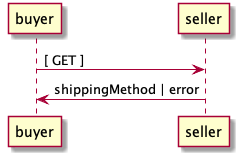
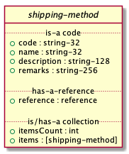

# Shipping Method

    Accept: application/json
    Accept: application/xml
    Accept: application/vnd.eci.stg.shipping-method.json
    Accept: application/vnd.eci.stg.shipping-method.xml
    Accept: application/vnd.eci.stg.shipping-method-1.5.0.json
    Accept: application/vnd.eci.stg.shipping-method-1.5.0.xml

## Test Results

    echo $(date -u +"%Y-%m-%dT%H:%M:%SZ") started
    xmllint --noout --schema ../rsrc-schema/src/vnd.eci.stg.shipping-method.1.5.0.xsd ../rsrc-schema/tst/vnd.eci.stg.shipping-method.1.5.0-*.xml 2>&1
    ajv -s ../rsrc-schema/src/vnd.eci.stg.shipping-method.1.5.0.json -d "../rsrc-schema/tst/vnd.eci.stg.shipping-method.1.5.?-*.json" 2>&1
    echo $(date -u +"%Y-%m-%dT%H:%M:%SZ") stopped

<table border="2" cellspacing="0" cellpadding="6" rules="groups" frame="hsides">

<colgroup>
<col  class="org-left" />

<col  class="org-left" />

<col  class="org-left" />

<col  class="org-left" />

<col  class="org-left" />

<col  class="org-left" />

<col  class="org-left" />
</colgroup>
<tbody>
<tr>
<td class="org-left">2019-05-05T01:21:09Z</td>
<td class="org-left">started</td>
<td class="org-left">&#xa0;</td>
<td class="org-left">&#xa0;</td>
<td class="org-left">&#xa0;</td>
<td class="org-left">&#xa0;</td>
<td class="org-left">&#xa0;</td>
</tr>

<tr>
<td class="org-left">../rsrc-schema/tst/vnd.eci.stg.shipping-method.1.5.0-best-available.xml</td>
<td class="org-left">validates</td>
<td class="org-left">&#xa0;</td>
<td class="org-left">&#xa0;</td>
<td class="org-left">&#xa0;</td>
<td class="org-left">&#xa0;</td>
<td class="org-left">&#xa0;</td>
</tr>

<tr>
<td class="org-left">../rsrc-schema/tst/vnd.eci.stg.shipping-method.1.5.0-response.xml</td>
<td class="org-left">validates</td>
<td class="org-left">&#xa0;</td>
<td class="org-left">&#xa0;</td>
<td class="org-left">&#xa0;</td>
<td class="org-left">&#xa0;</td>
<td class="org-left">&#xa0;</td>
</tr>

<tr>
<td class="org-left">/bin/bash:</td>
<td class="org-left">line</td>
<td class="org-left">3:</td>
<td class="org-left">ajv:</td>
<td class="org-left">command</td>
<td class="org-left">not</td>
<td class="org-left">found</td>
</tr>

<tr>
<td class="org-left">2019-05-05T01:21:09Z</td>
<td class="org-left">stopped</td>
<td class="org-left">&#xa0;</td>
<td class="org-left">&#xa0;</td>
<td class="org-left">&#xa0;</td>
<td class="org-left">&#xa0;</td>
<td class="org-left">&#xa0;</td>
</tr>
</tbody>
</table>

## Overview

## Definition of Terms

-   **code:** software facing identity function; used to identify the object to a software system
-   **name:** [optional] human facing name of the shipping method
-   **description:** [optional] human facing description of the shipping method
-   **remarks:** [optional] human to human communication
-   **reference:** an identify function that relates an entity to an actor. a reference is [optional] when describing the stock request and [required] when describing an item in the collection
-   **itemsCount:** [optional] if there is only one item in the request. [required] if there is more than one item in the request
-   **items:** an array of shipping methods. [optional] if there is only one item in the request. [required] if there is more than one item in the request

## Example

It is assumed that the caller will make the http *GET* call with the required headers e.g.

### HTTP GET

    curl --request GET \
         --header "Accepts: application/vnd.eci.stg.shipping-method.1.5.0.xml; charset=utf-8" \
         --user user123:password123 \
         --url http://vendor-host/vendor-shippping-method-endpoint

### JSON Response

    { "itemsCount": 3,
      "items": [{ "reference": {"code": "FEDX-1",
                                "name": "Federal Express, One Day",
                                "type": "seller" }},
                { "reference": {"code": "FEDX-2",
                                "name": "Federal Express, Two Day",
                                "type": "seller" }},
                { "reference": { "code": "USPS",
                                 "name": "United States Postal Service",
                                 "type": "seller" }}]}

## Use Cases

### As an unidentified buyer, I would like to see a list of shipping methods that are available:

1.  Response

    1.  Seller supports buyer selection of, or influence on, the shipping method

        The seller's response is intended to tell the buyer that there are three shipping methods available

        -   Federal Express, One Day
        -   Federal Express, Two Day
        -   United States Postal Service

        1.  JSON

                { "itemsCount": 3,
                  "items": [{ "reference": {"code": "FEDX-1",
                                            "name": "Federal Express, One Day",
                                            "type": "seller" }},
                            { "reference": {"code": "FEDX-2",
                                            "name": "Federal Express, Two Day",
                                            "type": "seller" }},
                            { "reference": { "code": "USPS",
                                             "name": "United States Postal Service",
                                             "type": "seller" }}]}

        2.  XML

                <?xml version='1.0' encoding='utf-8'?>

                <shippingMethod>
                  <itemsCount>3</itemsCount>
                  <items>
                    <item>
                      <reference>
                        <code>FEDX-1</code>
                        <name>Federal Express, One Day</name>
                        <type>seller</type>
                      </reference>
                    </item>
                    <item>
                      <reference>
                        <code>FEDX-2</code>
                        <name>Federal Express, Two Day</name>
                        <type>seller</type>
                      </reference>
                    </item>
                    <item>
                      <reference>
                        <code>USPS</code>
                        <name>United States Postal Service</name>
                        <type>seller</type>
                      </reference>
                    </item>
                  </items>
                </shippingMethod>

    2.  Seller does not support buyer selection of, or influence on, the shipping method

        If the seller does not now or in the future intend on providing this capability, do not provide
        an endpoint, instead, when discussing your implementation with ECi let them know and when adding
        the seller to the order placement system they will configure things such that no attempt will be
        made to contact the seller system.

        However, if the seller may want to provide this option to the user in the future, return a single
        shipping method that indicates the seller will choose the shipping method, or something like that.
        Then, in the future, when the seller is ready, things "just work".

        1.  JSON

                { "itemsCount": 1,
                  "items": [{ "reference": {"code": "best",
                                            "name": "Best Available",
                                            "type": "seller" }}]}

        2.  XML

                <?xml version='1.0' encoding='utf-8'?>

                <shippingMethod>
                  <itemsCount>1</itemsCount>
                  <items>
                    <item>
                      <reference>
                        <code>best</code>
                        <name>Best Available</name>
                        <type>seller</type>
                      </reference>
                    </item>
                  </items>
                </shippingMethod>

## Resource Schemas

### Version 1.0

No longer published

### Version 1.5

1.  JSON

        {
          "id": "./vnd.eci.stg.shipping-method.1.5.0.json",
          "$schema": "http://json-schema.org/draft-07/schema#",
          "title": "Shipping Method",
          "description": "",
          "type": "object",
          "additionalProperties": false,
          "properties": {

            "code": {
              "description": "",
              "type": "string",
              "minLength": 1,
              "maxLength": 32
            },

            "name": {
              "description": "",
              "type": "string",
              "minLength": 1,
              "maxLength": 32
            },

            "description": {
              "description": "",
              "type": "string",
              "minLength": 1,
              "maxLength": 128
            },

            "remarks": {
              "description": "",
              "type": "string",
              "minLength": 1,
              "maxLength": 256
            },

            "reference": { "$ref": "#/definitions/reference" },

            "itemsCount": {
              "description": "number of things in the items collection",
              "type": "number",
              "minimum": 1,
              "maximum": 1000
            },

            "items": {
              "description": "",
              "type": "array",
              "minItems": 1,
              "maxItems": 1000,
              "uniqueItems": true,
              "items": {
                "$ref": "#"
              }
            }
          },

          "definitions": {

            "reference": {
              "type": "object",
              "additionalProperties": false,

              "properties": {

                "code": {
                  "description": "",
                  "type": "string",
                  "minLength": 1,
                  "maxLength": 32
                },

                "name": {
                  "description": "",
                  "type": "string",
                  "minLength": 1,
                  "maxLength": 32
                },

                "description": {
                  "description": "",
                  "type": "string",
                  "minLength": 1,
                  "maxLength": 128
                },

                "remarks": {
                  "description": "",
                  "type": "string",
                  "minLength": 1,
                  "maxLength": 256
                },

                "type": { "$ref": "#/definitions/reference/definitions/referenceTypeEnum" },

                "referencesCount": {
                  "description": "number of things in the references collection",
                  "type": "number",
                  "minimum": 1,
                  "maximum": 1000
                },

                "references": {
                  "description": "",
                  "type": "array",
                  "minItems": 1,
                  "maxItems": 1000,
                  "uniqueItems": true,
                  "items": {
                    "$ref": "#/definitions/reference"
                  }
                }
              },

              "definitions": {
                "referenceTypeEnum": {
                  "type": "string",
                  "enum": ["buyer", "consumer", "manufacturer", "seller" ]
                }
              }
            }
          }
        }

2.  XML

        <?xml version='1.0' encoding='utf-8'?>

        <xs:schema xmlns:xs='http://www.w3.org/2001/XMLSchema'
                   elementFormDefault='qualified'
                   xml:lang='en'>

          <xs:element name='shippingMethod' type='ItemType'/>

          <xs:complexType name='ItemType'>
            <xs:sequence>
              <xs:element name='code'            type='string-32'     minOccurs='0' maxOccurs='1' />
              <xs:element name='name'            type='string-32'     minOccurs='0' maxOccurs='1' />
              <xs:element name='description'     type='string-128'    minOccurs='0' maxOccurs='1' />
              <xs:element name='remarks'         type='string-256'    minOccurs='0' maxOccurs='1' />
              <xs:element name='reference'       type='ReferenceType' minOccurs='0' maxOccurs='1' />
              <xs:element name='itemsCount'      type='xs:integer'    minOccurs='0' maxOccurs='1' />
              <xs:element name='items'           type='ItemsType'     minOccurs='0' maxOccurs='1' />
            </xs:sequence>
          </xs:complexType>

          <xs:complexType name='ItemsType'>
            <xs:sequence minOccurs='1' maxOccurs='5000'>
              <xs:element name='item' type='ItemType'/>
            </xs:sequence>
          </xs:complexType>

          <xs:complexType name='ReferenceType'>
            <xs:sequence>
              <xs:element name='code'        type='string-32'  minOccurs='0' maxOccurs='1' />
              <xs:element name='name'        type='string-32'  minOccurs='0' maxOccurs='1' />
              <xs:element name='description' type='string-128' minOccurs='0' maxOccurs='1' />
              <xs:element name='remarks'     type='string-256' minOccurs='0' maxOccurs='1' />
              <xs:element name='type'        type='ReferenceTypeEnum' minOccurs='0' maxOccurs='1' />

              <xs:element name='referencesCount' type='xs:integer'     minOccurs='0' maxOccurs='1' />
              <xs:element name='references'      type='ReferencesType' minOccurs='0' maxOccurs='1' />
            </xs:sequence>
          </xs:complexType>

          <xs:simpleType name='ReferenceTypeEnum'>
            <xs:restriction base='xs:string'>
              <xs:enumeration value='buyer'/>
              <xs:enumeration value='consumer'/>
              <xs:enumeration value='manufacturer'/>
              <xs:enumeration value='seller'/>
            </xs:restriction>
          </xs:simpleType>

          <xs:complexType name='ReferencesType'>
            <xs:sequence minOccurs='0' maxOccurs='1000'>
              <xs:element name='reference' type='ReferenceType'/>
            </xs:sequence>
          </xs:complexType>

          <xs:simpleType name='string-32'>
            <xs:restriction base='xs:string'>
              <xs:maxLength value='32' />
              <xs:minLength value='0' />
              <xs:whiteSpace value='preserve' />
            </xs:restriction>
          </xs:simpleType>

          <xs:simpleType name='string-128'>
            <xs:restriction base='xs:string'>
              <xs:maxLength value='128' />
              <xs:minLength value='0' />
              <xs:whiteSpace value='preserve' />
            </xs:restriction>
          </xs:simpleType>

          <xs:simpleType name='string-256'>
            <xs:restriction base='xs:string'>
              <xs:maxLength value='256' />
              <xs:minLength value='0' />
              <xs:whiteSpace value='preserve' />
            </xs:restriction>
          </xs:simpleType>

        </xs:schema>

## © 2018-2019 ECi Software Solutions, Inc. All rights reserved.
