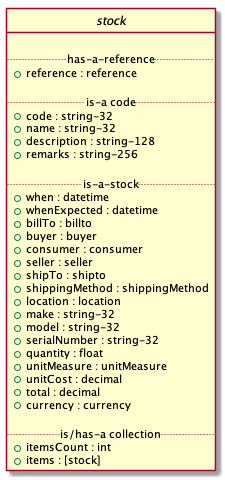

# Stock

    Accept: application/json
    Accept: application/xml
    Accept: application/vnd.eci.stg.stock.json
    Accept: application/vnd.eci.stg.stock.xml
    Accept: application/vnd.eci.stg.stock-1.5.0.json
    Accept: application/vnd.eci.stg.stock-1.5.0.xml

## Test Results

    echo $(date -u +"%Y-%m-%dT%H:%M:%SZ") started
    xmllint --noout --schema ../rsrc-schema/src/vnd.eci.stg.stock.1.5.0.xsd ../rsrc-schema/tst/vnd.eci.stg.stock.1.5.0*.xml 2>&1
    ajv -s ../rsrc-schema/src/vnd.eci.stg.stock.1.5.0.json -d "../rsrc-schema/tst/vnd.eci.stg.stock*.json" 2>&1
    echo $(date -u +"%Y-%m-%dT%H:%M:%SZ") stopped

<table border="2" cellspacing="0" cellpadding="6" rules="groups" frame="hsides">

<colgroup>
<col  class="org-left" />

<col  class="org-left" />
</colgroup>
<tbody>
<tr>
<td class="org-left">2018-11-06T22:21:25Z</td>
<td class="org-left">started</td>
</tr>

<tr>
<td class="org-left">../rsrc-schema/tst/vnd.eci.stg.stock.1.5.0-cost-response.xml</td>
<td class="org-left">validates</td>
</tr>

<tr>
<td class="org-left">../rsrc-schema/tst/vnd.eci.stg.stock.1.5.0-currency-request.xml</td>
<td class="org-left">validates</td>
</tr>

<tr>
<td class="org-left">../rsrc-schema/tst/vnd.eci.stg.stock.1.5.0-currency-response.xml</td>
<td class="org-left">validates</td>
</tr>

<tr>
<td class="org-left">../rsrc-schema/tst/vnd.eci.stg.stock.1.5.0-discount-response.xml</td>
<td class="org-left">validates</td>
</tr>

<tr>
<td class="org-left">../rsrc-schema/tst/vnd.eci.stg.stock.1.5.0-known-buyer-request.xml</td>
<td class="org-left">validates</td>
</tr>

<tr>
<td class="org-left">../rsrc-schema/tst/vnd.eci.stg.stock.1.5.0-known-consumer-contract-request.xml</td>
<td class="org-left">validates</td>
</tr>

<tr>
<td class="org-left">../rsrc-schema/tst/vnd.eci.stg.stock.1.5.0-known-consumer-request.xml</td>
<td class="org-left">validates</td>
</tr>

<tr>
<td class="org-left">../rsrc-schema/tst/vnd.eci.stg.stock.1.5.0-location-response-a.xml</td>
<td class="org-left">validates</td>
</tr>

<tr>
<td class="org-left">../rsrc-schema/tst/vnd.eci.stg.stock.1.5.0-location-response-b.xml</td>
<td class="org-left">validates</td>
</tr>

<tr>
<td class="org-left">../rsrc-schema/tst/vnd.eci.stg.stock.1.5.0-quantity-request.xml</td>
<td class="org-left">validates</td>
</tr>

<tr>
<td class="org-left">../rsrc-schema/tst/vnd.eci.stg.stock.1.5.0-quantity-response-a.xml</td>
<td class="org-left">validates</td>
</tr>

<tr>
<td class="org-left">../rsrc-schema/tst/vnd.eci.stg.stock.1.5.0-quantity-response-b.xml</td>
<td class="org-left">validates</td>
</tr>

<tr>
<td class="org-left">../rsrc-schema/tst/vnd.eci.stg.stock.1.5.0-quantity-response-c.xml</td>
<td class="org-left">validates</td>
</tr>

<tr>
<td class="org-left">../rsrc-schema/tst/vnd.eci.stg.stock.1.5.0-quantity-response-d.xml</td>
<td class="org-left">validates</td>
</tr>

<tr>
<td class="org-left">../rsrc-schema/tst/vnd.eci.stg.stock.1.5.0-quantity-response-e.xml</td>
<td class="org-left">validates</td>
</tr>

<tr>
<td class="org-left">../rsrc-schema/tst/vnd.eci.stg.stock.1.5.0-shipping-cost-request.xml</td>
<td class="org-left">validates</td>
</tr>

<tr>
<td class="org-left">../rsrc-schema/tst/vnd.eci.stg.stock.1.5.0-shipping-cost-response.xml</td>
<td class="org-left">validates</td>
</tr>

<tr>
<td class="org-left">../rsrc-schema/tst/vnd.eci.stg.stock.1.5.0-tax-response-a.xml</td>
<td class="org-left">validates</td>
</tr>

<tr>
<td class="org-left">../rsrc-schema/tst/vnd.eci.stg.stock.1.5.0-tax-response-b.xml</td>
<td class="org-left">validates</td>
</tr>

<tr>
<td class="org-left">../rsrc-schema/tst/vnd.eci.stg.stock.1.5.0-unknown-buyer-request.xml</td>
<td class="org-left">validates</td>
</tr>

<tr>
<td class="org-left">../rsrc-schema/tst/vnd.eci.stg.stock.1.5.0-when-expected-request.xml</td>
<td class="org-left">validates</td>
</tr>

<tr>
<td class="org-left">../rsrc-schema/tst/vnd.eci.stg.stock.1.5.0-when-expected-response-a.xml</td>
<td class="org-left">validates</td>
</tr>

<tr>
<td class="org-left">../rsrc-schema/tst/vnd.eci.stg.stock.1.5.0-when-expected-response-b.xml</td>
<td class="org-left">validates</td>
</tr>

<tr>
<td class="org-left">../rsrc-schema/tst/vnd.eci.stg.stock.1.5.0-when-expected-response-c.xml</td>
<td class="org-left">validates</td>
</tr>

<tr>
<td class="org-left">../rsrc-schema/tst/vnd.eci.stg.stock.1.5.0-cost-response.json</td>
<td class="org-left">valid</td>
</tr>

<tr>
<td class="org-left">../rsrc-schema/tst/vnd.eci.stg.stock.1.5.0-currency-request.json</td>
<td class="org-left">valid</td>
</tr>

<tr>
<td class="org-left">../rsrc-schema/tst/vnd.eci.stg.stock.1.5.0-currency-response.json</td>
<td class="org-left">valid</td>
</tr>

<tr>
<td class="org-left">../rsrc-schema/tst/vnd.eci.stg.stock.1.5.0-discount-response.json</td>
<td class="org-left">valid</td>
</tr>

<tr>
<td class="org-left">../rsrc-schema/tst/vnd.eci.stg.stock.1.5.0-example-request.json</td>
<td class="org-left">valid</td>
</tr>

<tr>
<td class="org-left">../rsrc-schema/tst/vnd.eci.stg.stock.1.5.0-example-response.json</td>
<td class="org-left">valid</td>
</tr>

<tr>
<td class="org-left">../rsrc-schema/tst/vnd.eci.stg.stock.1.5.0-known-buyer-request.json</td>
<td class="org-left">valid</td>
</tr>

<tr>
<td class="org-left">../rsrc-schema/tst/vnd.eci.stg.stock.1.5.0-known-consumer-contract-request.json</td>
<td class="org-left">valid</td>
</tr>

<tr>
<td class="org-left">../rsrc-schema/tst/vnd.eci.stg.stock.1.5.0-known-consumer-request.json</td>
<td class="org-left">valid</td>
</tr>

<tr>
<td class="org-left">../rsrc-schema/tst/vnd.eci.stg.stock.1.5.0-location-response-a.json</td>
<td class="org-left">valid</td>
</tr>

<tr>
<td class="org-left">../rsrc-schema/tst/vnd.eci.stg.stock.1.5.0-location-response-b.json</td>
<td class="org-left">valid</td>
</tr>

<tr>
<td class="org-left">../rsrc-schema/tst/vnd.eci.stg.stock.1.5.0-quantity-request.json</td>
<td class="org-left">valid</td>
</tr>

<tr>
<td class="org-left">../rsrc-schema/tst/vnd.eci.stg.stock.1.5.0-quantity-response-a.json</td>
<td class="org-left">valid</td>
</tr>

<tr>
<td class="org-left">../rsrc-schema/tst/vnd.eci.stg.stock.1.5.0-quantity-response-b.json</td>
<td class="org-left">valid</td>
</tr>

<tr>
<td class="org-left">../rsrc-schema/tst/vnd.eci.stg.stock.1.5.0-quantity-response-c.json</td>
<td class="org-left">valid</td>
</tr>

<tr>
<td class="org-left">../rsrc-schema/tst/vnd.eci.stg.stock.1.5.0-quantity-response-d.json</td>
<td class="org-left">valid</td>
</tr>

<tr>
<td class="org-left">../rsrc-schema/tst/vnd.eci.stg.stock.1.5.0-quantity-response-e.json</td>
<td class="org-left">valid</td>
</tr>

<tr>
<td class="org-left">../rsrc-schema/tst/vnd.eci.stg.stock.1.5.0-shipping-cost-request.json</td>
<td class="org-left">valid</td>
</tr>

<tr>
<td class="org-left">../rsrc-schema/tst/vnd.eci.stg.stock.1.5.0-shipping-cost-response.json</td>
<td class="org-left">valid</td>
</tr>

<tr>
<td class="org-left">../rsrc-schema/tst/vnd.eci.stg.stock.1.5.0-tax-response-a.json</td>
<td class="org-left">valid</td>
</tr>

<tr>
<td class="org-left">../rsrc-schema/tst/vnd.eci.stg.stock.1.5.0-tax-response-b.json</td>
<td class="org-left">valid</td>
</tr>

<tr>
<td class="org-left">../rsrc-schema/tst/vnd.eci.stg.stock.1.5.0-unknown-buyer-request.json</td>
<td class="org-left">valid</td>
</tr>

<tr>
<td class="org-left">../rsrc-schema/tst/vnd.eci.stg.stock.1.5.0-when-expected-request.json</td>
<td class="org-left">valid</td>
</tr>

<tr>
<td class="org-left">../rsrc-schema/tst/vnd.eci.stg.stock.1.5.0-when-expected-response-a.json</td>
<td class="org-left">valid</td>
</tr>

<tr>
<td class="org-left">../rsrc-schema/tst/vnd.eci.stg.stock.1.5.0-when-expected-response-b.json</td>
<td class="org-left">valid</td>
</tr>

<tr>
<td class="org-left">../rsrc-schema/tst/vnd.eci.stg.stock.1.5.0-when-expected-response-c.json</td>
<td class="org-left">valid</td>
</tr>

<tr>
<td class="org-left">2018-11-06T22:21:25Z</td>
<td class="org-left">stopped</td>
</tr>
</tbody>
</table>

## Overview

In the following section, Use Cases, examples of data ( `--data` ) to be sent and
received will be shown. It is assumed that the caller will make the actual *POST*
call with the required headers e.g.

    curl --request POST \
         --header "Content-Type: application/vnd.eci.stg.stock.1.5.0.json; charset=utf-8" \
         --user user123:password123 \
         --url http://vendor-host/vendor-stock-endpoint
         --data ''

## Definition of Terms

-   **reference:** an identify function that relates an entity to an actor. a reference is [optional] when describing the stock request and [required] when describing an item in the collection
-   **name:** [optional] name of the stock request or stock item
-   **description:** [optional] description of the stock request or stock item
-   **remarks:** [optional] human to human communication
-   **location:** [optional] when a good or service is being ordered for a specific asset the location tells you exactly where to find the asset
-   **buyer:** [optional] the person or organization inquiring about goods and services
-   **consumer:** [optional]the person or organization the buyer is acting for
-   **shipTo:** [optional] the location of where purchases will be sent or services provided. also may include location contact information
-   **when:** [optional] date and time when the request was placed
-   whenExepcted [optional] when the buyer expects the good or service to be delivered
-   **make:** [optional] make of the good being ordered or serviced
-   **model:** [optional] model of the good being ordered or serviced
-   **serialNumber:** [optional] manufacturer serial number of the good being ordered for, or serviced
-   **quantity:** the number of goods or services the buyer wishes to purchase
-   **unitMeasure:** [optional] each, box, etc.
-   **currency:** [optional] describes the transactional currency
-   **itemsCount:** [optional] if there is only one item in the request. [required] if there is more than one item in the request
-   **items:** the goods or services being ordered. [optional] if there is only one item in the request. [required] if there is more than one item in the request

## Example

Below is an example of a JSON request and response. In the use cases section below, we break this
down into smaller chunks.

1.  Request

        { "reference": { "referencesCount": 2,
                         "references": [ {"code": "PO-2159403-2",
                                          "type": "buyer" },
                                         {"code": "PO-abc-q",
                                          "type": "consumer" }]},

          "buyer": { "reference": { "code": "buyer-abc",
                                     "type": "seller" }},

          "consumer": { "reference": { "code": "consumer-xyz",
                                        "type": "seller" },
                         "contract": { "code": "contract-789",
                                        "type": "seller" }},

          "shipTo": { "location": { "mtn": "Jane Doe",
                                     "rcp": "ECi Solutions, STG",
                                     "alt": "Suite #200",
                                     "dal": "4626 N 300 W",
                                     "city": "Provo",
                                     "region": "UT",
                                     "postalCode": "84604"},
                       "email": "shipping-contact@example.com",
                       "phone": "1-555-555-5555"},

          "when": "2018-04-24T17:00:00.000Z",

          "currency": { "code": "DKK",
                        "name": "Danish krone",
                        "number": 208,
                        "precision": 18,
                        "scale": 2},

          "itemsCount": 2,
          "items": [{ "reference": { "code": "abc-123",
                                     "type": "seller"},
                      "quantity": 24 }]}

2.  Response

        { "reference": { "referencesCount": 3,
                         "references": [ {"code": "PO-2159403-2",
                                          "type": "buyer" },
                                         {"code": "PO-abc-q",
                                          "type": "consumer" },
                                        { "code": "SO-33445953_2",
                                          "type": "seller" }]},

          "buyer": { "reference": { "code": "buyer-abc",
                                     "type": "seller" }},

          "consumer": { "reference": { "code": "consumer-xyz",
                                        "type": "seller" },
                         "contract": { "code": "contract-789",
                                        "type": "seller" }},

          "shipTo": { "location": { "mtn": "Jane Doe",
                                     "rcp": "ECi Solutions, STG",
                                     "alt": "Suite #200",
                                     "dal": "4626 N 300 W",
                                     "city": "Provo",
                                     "region": "UT",
                                     "postalCode": "84604"},
                       "email": "shipping-contact@example.com",
                       "phone": "1-555-555-5555"},

          "when": "2018-04-24T17:00:00.000Z",

          "whenExpected": "2018-04-26T17:00:00.000Z",

          "total": { "amount": 2623.55,
                     "freightAmount": 199.99,
                     "discountAmount": 11.18,
                     "tax": { "amount": 34.98 }},

          "currency": { "code": "DKK",
                        "name": "Danish krone",
                        "number": 208,
                        "precision": 18,
                        "scale": 2},

          "itemsCount": 2,
          "items": [{ "reference": { "code": "abc-123",
                                     "type": "seller"},
                      "quantity": 24,
                      "location": { "name": "Main Warehouse",
                                    "city": "Dallas",
                                    "region": "TX" },
                      "unitCost": 99.99}]}

## Use Cases

There are many use cases, most of the variation is contained in the seller's response. Therefore we
will assume that that buyer request will be one of the next two use cases and will now show the
buyer's request unless it differs from these two. When we do show the buyer's request, for clarity,
we will show it as an unknown buyer.

The stock check system supports requests from buyers are not known to the seller and from buyers that
are known to the seller. Sellers may, or may not, allow unknown buyers to request stock information.
If unknown buyer requests are not supported that seller's system should return a 4xx http status code
and an optional error body.

### As a buyer not known to the seller I would like to submit stock requests

The buyer system simply lists the items they wish to inquire about. In this example, the buyer wants
to get information about an item in the seller's system identified as `abc-123`.

1.  Request

    1.  JSON

            { "itemsCount": 1,
              "items": [{ "reference": { "code": "abc-123",
                                         "type": "seller" }}]}

    2.  XML

            <?xml version='1.0' encoding='utf-8'?>

            <stock>
              <itemsCount>1</itemsCount>
              <items>
                <item>
                  <reference>
                    <code>abc-123</code>
                    <type>seller</type>
                  </reference>
                </item>
              </items>
            </stock>

### As a buyer known to the seller I would like to submit stock requests

The buyer must populate and send information that will uniquely identify them to the seller. In this
example the buyer has provided the seller assigned unique identifier `buyer-abc` in code property of
the buyer object. After that, the request is the same as the unknown buyer.

1.  Request

    1.  JSON

            { "buyer": { "reference": { "code": "buyer-abc",
                                         "type": "seller" }},
              "itemsCount": 1,
              "items": [{ "reference": { "code": "abc-123",
                                         "type": "seller" }}]}

    2.  XML

            <?xml version='1.0' encoding='utf-8'?>

            <stock>
              <buyer>
                <reference>
                  <code>buyer-abc</code>
                  <type>seller</type>
                </reference>
              </buyer>
              <itemsCount>1</itemsCount>
              <items>
                <item>
                  <reference>
                    <code>abc-123</code>
                    <type>seller</type>
                  </reference>
                </item>
              </items>
            </stock>

### As a buyer I would like to see the cost for one or more items

1.  Response

    The seller's response is intended to inform the buyer that the item will cost her *99.99$USD*.

    1.  JSON

            { "itemsCount": 1,
              "items": [{ "reference": { "code": "abc-123",
                                         "type": "seller" },
                          "unitCost": 99.99}]}

    2.  XML

            <?xml version='1.0' encoding='utf-8'?>

            <stock>
              <itemsCount>1</itemsCount>
              <items>
                <item>
                  <reference>
                    <code>abc-123</code>
                    <type>seller</type>
                  </reference>
                  <unitCost>99.99</unitCost>
                </item>
              </items>
            </stock>

### As a buyer I would to like specify the currency the cost should be expressed in

In the example below the buyer would like to see costs and other monetary values using Danish krone

1.  Request

    1.  JSON

            { "currency": { "code": "DKK",
                            "name": "Danish krone",
                            "number": 208,
                            "precision": 18,
                            "scale": 2},
              "itemsCount": 1,
              "items": [{ "reference": { "code": "abc-123",
                                         "type": "seller" }}]}

    2.  XML

            <?xml version='1.0' encoding='utf-8'?>

            <stock>
              <currency>
                <code>DKK</code>
                <name>Danish krone</name>
                <number>208</number>
                <precision>18</precision>
                <scale>2</scale>
              </currency>
              <itemsCount>1</itemsCount>
              <items>
                <item>
                  <reference>
                    <code>abc-123</code>
                    <type>seller</type>
                  </reference>
                </item>
              </items>
            </stock>

2.  Response

    1.  JSON

            { "currency": { "code": "DKK",
                            "name": "Danish krone",
                            "number": 208,
                            "precision": 18,
                            "scale": 2},
              "itemsCount": 1,
              "items": [{ "reference": { "code": "abc-123",
                                         "type": "seller" },
                          "unitCost": 99.99}]}

    2.  XML

            <?xml version='1.0' encoding='utf-8'?>

            <stock>
              <currency>
                <code>DKK</code>
                <name>Danish krone</name>
                <number>208</number>
                <precision>18</precision>
                <scale>2</scale>
              </currency>
              <itemsCount>1</itemsCount>
              <items>
                <item>
                  <reference>
                    <code>abc-123</code>
                    <type>seller</type>
                  </reference>
                  <unitCost>99.99</unitCost>
                </item>
              </items>
            </stock>

### As a known buyer, with a known customer, I would like to know the cost for one or more items

In these examples, the response is no different any other cost request. The request contains
information about the buyer and the buyer's customer. Here we are just providing the value
`consumer-xyz`, which should be the unique id by which the seller's system will recognize the
buyer's customer.

1.  Request

    1.  JSON

            { "buyer": { "reference": { "code": "buyer-abc",
                                         "type": "seller" }},
              "consumer": { "reference": { "code": "consumer-xyz",
                                            "type": "seller" }},
              "itemsCount": 1,
              "items": [{ "reference": { "code": "abc-123",
                                         "type": "seller" }}]}

    2.  XML

            <?xml version='1.0' encoding='utf-8'?>

            <stock>
              <buyer>
                <reference>
                  <code>buyer-abc</code>
                  <type>seller</type>
                </reference>
              </buyer>
              <consumer>
                <reference>
                  <code>consumer-xyz</code>
                  <type>seller</type>
                </reference>
              </consumer>
              <itemsCount>1</itemsCount>
              <items>
                <item>
                  <reference>
                    <code>abc-123</code>
                    <type>seller</type>
                  </reference>
                </item>
              </items>
            </stock>

### As a known buyer, with a known customer contract, I would like to know the cost for one or more items

In these examples, the response is no different any other cost request. The request contains
information about the buyer and the buyer's customer. Here we are just providing the value
`consumer-xyz`, which should be the unique id by which the seller's system will recognize the
buyer's customer's contract `contract-789`.

1.  Request

    1.  JSON

            { "buyer": { "reference": { "code": "buyer-abc",
                                         "type": "seller" }},
              "consumer": { "reference": { "code": "consumer-xyz",
                                            "type": "seller" },
                             "contract": { "code": "contract-789",
                                            "type": "seller" }},
              "itemsCount": 1,
              "items": [{ "reference": { "code": "abc-123",
                                         "type": "seller" }}]}

    2.  XML

            <?xml version='1.0' encoding='utf-8'?>

            <stock>
              <buyer>
                <reference>
                  <code>buyer-abc</code>
                  <type>seller</type>
                </reference>
              </buyer>
              <consumer>
                <reference>
                  <code>consumer-xyz</code>
                  <type>seller</type>
                </reference>
                <contract>
                  <code>contract-789</code>
                  <type>seller</type>
                </contract>
              </consumer>
              <itemsCount>1</itemsCount>
              <items>
                <item>
                  <reference>
                    <code>abc-123</code>
                    <type>seller</type>
                  </reference>
                </item>
              </items>
            </stock>

### As a buyer I would like to know if the seller has enough stock to satisfy my order

In this case the buyer's intent is to understand if the seller an supply the requested number of
items ( *24* ) for a product known to the seller as *abc-123*.

Note that not all buyer systems send the desired quantity; the quantity property may be omitted,
empty, or zero.

1.  Request

    1.  JSON

            { "itemsCount": 1,
              "items": [{ "reference": { "code": "abc-123",
                                         "type": "seller" },
                          "quantity": 24}]}

    2.  XML

            <?xml version='1.0' encoding='utf-8'?>

            <stock>
              <itemsCount>1</itemsCount>
              <items>
                <item>
                  <reference>
                    <code>abc-123</code>
                    <type>seller</type>
                  </reference>
                  <quantity>24</quantity>
                </item>
              </items>
            </stock>

2.  Response

    1.  If the seller can deliver the buyer's requested quantity ( *24* ) the seller may reply with

        1.  the requested quantity ( *24* )

            1.  JSON

                    { "itemsCount": 1,
                      "items": [{ "reference": { "code": "abc-123",
                                                 "type": "seller" },
                                  "quantity": 24}]}

            2.  XML

                    <?xml version='1.0' encoding='utf-8'?>

                    <stock>
                      <itemsCount>1</itemsCount>
                      <items>
                        <item>
                          <reference>
                            <code>abc-123</code>
                            <type>seller</type>
                          </reference>
                          <quantity>24</quantity>
                        </item>
                      </items>
                    </stock>

        2.  the quantity on hand ( *103* )

            1.  JSON

                    { "itemsCount": 1,
                      "items": [{ "reference": { "code": "abc-123",
                                                 "type": "seller" },
                                  "quantity": 103}]}

            2.  XML

                    <?xml version='1.0' encoding='utf-8'?>

                    <stock>
                      <itemsCount>1</itemsCount>
                      <items>
                        <item>
                          <reference>
                            <code>abc-123</code>
                            <type>seller</type>
                          </reference>
                          <quantity>103</quantity>
                        </item>
                      </items>
                    </stock>

        3.  a fixed value e.g. *1,000*

            1.  JSON

                    { "itemsCount": 1,
                      "items": [{ "reference": { "code": "abc-123",
                                                 "type": "seller" },
                                  "quantity": 1000}]}

            2.  XML

                    <?xml version='1.0' encoding='utf-8'?>

                    <stock>
                      <itemsCount>1</itemsCount>
                      <items>
                        <item>
                          <reference>
                            <code>abc-123</code>
                            <type>seller</type>
                          </reference>
                          <quantity>1000</quantity>
                        </item>
                      </items>
                    </stock>

    2.  If the seller cannot deliver the buyer's requested quantity ( *24* ) the seller may reply with

        1.  the quantity on hand ( *12* )

            1.  JSON

                    { "itemsCount": 1,
                      "items": [{ "reference": { "code": "abc-123",
                                                 "type": "seller" },
                                  "quantity": 12}]}

            2.  XML

                    <?xml version='1.0' encoding='utf-8'?>

                    <stock>
                      <itemsCount>1</itemsCount>
                      <items>
                        <item>
                          <reference>
                            <code>abc-123</code>
                            <type>seller</type>
                          </reference>
                          <quantity>12</quantity>
                        </item>
                      </items>
                    </stock>

        2.  a fixed value e.g. *0*

            1.  JSON

                    { "itemsCount": 1,
                      "items": [{ "reference": { "code": "abc-123",
                                                 "type": "seller" },
                                  "quantity": 0}]}

            2.  XML

                    <?xml version='1.0' encoding='utf-8'?>

                    <stock>
                      <itemsCount>1</itemsCount>
                      <items>
                        <item>
                          <reference>
                            <code>abc-123</code>
                            <type>seller</type>
                          </reference>
                          <quantity>0</quantity>
                        </item>
                      </items>
                    </stock>

### As a buyer I would like to know which location items will be shipped from

This use case is supported in the current PO Processor, but as we look more closely, we do think it
is a valid use case. In fact, we have had some sellers express a concern that this might set an
expectation that buyers can order stock from a specific warehouse, which they cannot do. We asked our
head of training about providing the warehouse, this was his reply:

> The customers that I have worked with had said they "like" knowing the warehouse. When I pushed them
> as to why, they really liked knowing because they knew the expected delivery time. It was not the
> warehouse that was the key, it was knowing when they could expect to deliver. I agree that they really
> don’t need to know the warehouse, they need to know if they can get the order to a certain location,
> for the money, in an estimated time frame.

So while we support this use case to be compatible with older seller implementations and with the
current version of PO Processor, we expect to deprecate it. We have added additional use cases to
support time to delivery with an estimated cost for shipping.

1.  Sellers may respond with a name that is meaningful to the dealer

    In this example, the seller is responding with `Main Warehouse`

    1.  JSON

            { "itemsCount": 1,
              "items": [{ "reference": { "code": "abc-123",
                                         "type": "seller" },
                          "location": { "name": "Main Warehouse" }}]}

    2.  XML

            <?xml version='1.0' encoding='utf-8'?>

            <stock>
              <itemsCount>1</itemsCount>
              <items>
                <item>
                  <reference>
                    <code>abc-123</code>
                    <type>seller</type>
                  </reference>
                  <location>
                    <name>Main Warehouse</name>
                  </location>
                </item>
              </items>
            </stock>

2.  Sellers may respond with city, and region (or some other meaningful part of the address)

    In this example, the seller is providing the city and state `Dallas, TX`

    1.  JSON

            { "itemsCount": 1,
              "items": [{ "reference": { "code": "abc-123",
                                         "type": "seller" },
                          "location": { "city": "Dallas",
                                        "region": "TX" }}]}

    2.  XML

            <?xml version='1.0' encoding='utf-8'?>

            <stock>
              <itemsCount>1</itemsCount>
              <items>
                <item>
                  <reference>
                    <code>abc-123</code>
                    <type>seller</type>
                  </reference>
                  <location>
                    <city>Dallas</city>
                    <region>TX</region>
                  </location>
                </item>
              </items>
            </stock>

### As a buyer I would like to know the earliest date the order could be received

1.  Request

    In this example the buyer is providing the date of the stock request `24 April 2018` and the date
    when they would expect the order to be delivered `26 April 2018`.

    Buyers will not always provide the expected date in the request. In these cases the seller can decide
    if they want to always provide the expected delivery date or only when explicitly asked.

    1.  JSON

            { "when": "2018-04-24T17:00:00.000Z",
              "whenExpected": "2018-04-26T17:00:00.000Z",
              "itemsCount": 1,
              "items": [{ "reference": { "code": "abc-123" }}]}

    2.  XML

            <?xml version='1.0' encoding='utf-8'?>

            <stock>
              <when>2018-04-24T17:00:00.000Z</when>
              <whenExpected>2018-04-26T17:00:00.000Z</whenExpected>
              <itemsCount>1</itemsCount>
              <items>
                <item>
                  <reference>
                    <code>abc-123</code>
                    <type>seller</type>
                  </reference>
                </item>
              </items>
            </stock>

2.  Response

    1.  The seller can provide the expected date for the entire order

        In this example the seller is providing the date of the stock response `24 April 2018` and the date
        when the order could be delivered `26 April 2018`.

        1.  JSON

                { "when": "2018-04-24T17:00:00.000Z",
                  "whenExpected": "2018-04-26T17:00:00.000Z",
                  "itemsCount": 1,
                  "items": [ { "reference": { "code": "abc-123" }}]}

        2.  XML

                <stock>
                  <when>2018-04-24T17:00:00.000Z</when>
                  <whenExpected>2018-04-26T17:00:00.000Z</whenExpected>
                  <itemsCount>1</itemsCount>
                  <items>
                    <item>
                      <reference>
                        <code>abc-123</code>
                        <type>seller</type>
                      </reference>
                    </item>
                  </items>
                </stock>

    2.  The seller can provide the expected dates for individual line items

        In this example the seller can provide item `abc-123` on `24 April` and provide item `def-456` on `30 April`.

        1.  JSON

                { "itemsCount": 2,
                  "items": [ { "reference": { "code": "abc-123" },
                               "when": "2018-04-24T17:00:00.000Z",
                               "whenExpected": "2018-04-26T17:00:00.000Z"},
                             { "reference": { "code": "def-456" },
                               "when": "2018-04-24T17:00:00.000Z",
                               "whenExpected": "2018-04-30T17:00:00.000Z"}]}

        2.  XML

                <stock>
                  <itemsCount>2</itemsCount>
                  <items>
                    <item>
                      <reference>
                        <code>abc-123</code>
                        <type>seller</type>
                      </reference>
                      <when>2018-04-24T17:00:00.000Z</when>
                      <whenExpected>2018-04-26T17:00:00.000Z</whenExpected>
                    </item>
                    <item>
                      <reference>
                        <code>def-456</code>
                        <type>seller</type>
                      </reference>
                      <when>2018-04-24T17:00:00.000Z</when>
                      <whenExpected>2018-04-30T17:00:00.000Z</whenExpected>
                    </item>
                  </items>
                </stock>

    3.  When the seller does not support this feature omit the property called `whenExpected` in the response

        1.  JSON

                { "when": "2018-04-24T17:00:00.000Z",
                  "itemsCount": 1,
                  "items": [{ "reference": { "code": "abc-123",
                                             "type": "seller" }}]}

        2.  XML

                <stock>
                  <when>2018-04-24T17:00:00.000Z</when>
                  <itemsCount>1</itemsCount>
                  <items>
                    <item>
                      <reference>
                        <code>abc-123</code>
                        <type>seller</type>
                      </reference>
                    </item>
                  </items>
                </stock>

### As a buyer I would like to know the cost to have an order delivered to a specific location

1.  Request

    In this example the buyer would like to know what the cost will be to have the order delivered to the
    following address:

        Jane Doe
        ECi Solutions, STG
        Suite #200
        4626 N 300 W
        Provo, UT 84606

    1.  JSON

            { "shipTo": { "location": { "mtn": "Jane Doe",
                                         "rcp": "ECi Solutions, STG",
                                         "alt": "Suite #200",
                                         "dal": "4626 N 300 W",
                                         "city": "Provo",
                                         "region": "UT",
                                         "postalCode": "84604"},
                           "email": "shipping-contact@example.com",
                           "phone": "1-555-555-5555"},

              "shippingCarrier": { "code": "shipper-123",
                                   "name": "usps-2day" },

              "itemsCount": 1,
              "items": [{ "reference": { "code": "abc-123",
                                         "type": "seller" }}]}

    2.  XML

            <?xml version='1.0' encoding='utf-8'?>

            <stock>
              <shipTo>
                <location>
                  <mtn>Jane Doe</mtn>
                  <rcp>ECi Solutions, STG</rcp>
                  <alt>Suite #200</alt>
                  <dal>4626 N 300 W</dal>
                  <city>Provo</city>
                  <region>UT</region>
                  <postalCode>84604</postalCode>
                </location>
                <email>shipping-contact@example.com</email>
                <phone>1-555-555-5555></phone>
              </shipTo>
              <shippingCarrier>
                <code>shipper-123</code>
                <name>usps-2day</name>
              </shippingCarrier>
              <itemsCount>1</itemsCount>
              <items>
                <item>
                  <reference>
                    <code>abc-123</code>
                    <type>seller</type>
                  </reference>
                </item>
              </items>
            </stock>

2.  Response

    The seller's response is intended to inform the buyer that shipping the order will cost *199.99$USD*.

    1.  JSON

            { "shipTo": { "location": { "mtn": "Jane Doe",
                                         "rcp": "ECi Solutions, STG",
                                         "alt": "Suite #200",
                                         "dal": "4626 N 300 W",
                                         "city": "Provo",
                                         "region": "UT",
                                         "postalCode": "84604"},
                           "email": "shipping-contact@example.com",
                           "phone": "1-555-555-5555"},

              "shippingCarrier": { "code": "shipper-123",
                                   "name": "usps-2day" },

              "total": { "freightAmount": 199.99 },

              "itemsCount": 1,
              "items": [{ "reference": { "code": "abc-123",
                                         "type": "seller" },
                          "unitCost": 99.99}]}

    2.  XML

            <?xml version='1.0' encoding='utf-8'?>

            <stock>
              <shipTo>
                <location>
                  <mtn>Jane Doe</mtn>
                  <rcp>ECi Solutions, STG</rcp>
                  <alt>Suite #200</alt>
                  <dal>4626 N 300 W</dal>
                  <city>Provo</city>
                  <region>UT</region>
                  <postalCode>84604</postalCode>
                </location>
                <email>shipping-contact@example.com</email>
                <phone>1-555-555-5555></phone>
              </shipTo>
              <shippingCarrier>
                <code>shipper-123</code>
                <name>usps-2day</name>
              </shippingCarrier>
              <total>
                <freightAmount>199.99</freightAmount>
              </total>
              <itemsCount>1</itemsCount>
              <items>
                <item>
                  <reference>
                    <code>abc-123</code>
                    <type>seller</type>
                  </reference>
                  <unitCost>99.99</unitCost>
                </item>
              </items>
            </stock>

### As a buyer I would like to see the total amount of any promotional or special discounts

1.  Response

    1.  JSON

            { "itemsCount": 1,
              "items": [{ "reference": { "code": "abc-123",
                                         "type": "seller" },
                          "unitCost": 99.99,
                          "total": { "amount": 90.00,
                                     "discountAmount": 9.99 }}]}

    2.  XML

            <?xml version='1.0' encoding='utf-8'?>

            <stock>
              <itemsCount>1</itemsCount>
              <items>
                <item>
                  <reference>
                    <code>abc-123</code>
                    <type>seller</type>
                  </reference>
                  <unitCost>99.99</unitCost>
                  <total>
                    <amount>9.99</amount>
                    <discountAmount>9.99</discountAmount>
                  </total>
                </item>
              </items>
            </stock>

### As a buyer I would like to see the the amount of taxes charged

1.  Responses

    1.  tax chargned per line item

        1.  JSON

                { "itemsCount": 1,
                  "items": [{ "reference": { "code": "abc-123",
                                             "type": "seller" },
                              "quantity": 1,
                              "unitCost": 99.99,
                              "total": { "amount": 20.99,
                                         "tax": { "amount": 1.00 }}}]}

        2.  XML

                <?xml version='1.0' encoding='utf-8'?>

                <stock>
                  <itemsCount>1</itemsCount>
                  <items>
                    <item>
                      <reference>
                        <code>abc-123</code>
                        <type>seller</type>
                      </reference>
                      <quantity>1</quantity>
                      <unitCost>99.99</unitCost>
                      <total>
                        <amount>20.99</amount>
                        <tax>
                          <amount>1.00</amount>
                        </tax>
                      </total>
                    </item>
                  </items>
                </stock>

    2.  tax charged for all items

        1.  JSON

                { "total": { "amount": 20.99,
                             "tax": { "amount": 1.00 }},

                  "itemsCount": 1,
                  "items": [{ "reference": { "code": "abc-123",
                                             "type": "seller" },
                              "quantity": 1,
                              "unitCost": 99.99 }]}

        2.  XML

                <?xml version='1.0' encoding='utf-8'?>

                <stock>
                  <total>
                    <amount>20.99</amount>
                    <tax>
                      <amount>1.00</amount>
                    </tax>
                  </total>
                  <itemsCount>1</itemsCount>
                  <items>
                    <item>
                      <reference>
                        <code>abc-123</code>
                        <type>seller</type>
                      </reference>
                      <quantity>1</quantity>
                      <unitCost>99.99</unitCost>
                    </item>
                  </items>
                </stock>

### As a seller I would like to be able to provide a replacement item when the seller specifies an outdated item number

1.  TODO

### As a seller I would like to be able to provide a substitute when the item specified by the buyer is not in stock

1.  TODO

## Resource Schemas

### Version 1.0

No longer published

### Version 1.5

1.  JSON

        {
          "id": "./vnd.eci.stg.stock.1.5.0.json",
          "$schema": "http://json-schema.org/draft-07/schema#",
          "title": "stock",
          "description": "",
          "type": "object",
          "additionalProperties": false,
          "properties": {

            "reference": { "$ref": "#/definitions/reference" },

            "name": {
              "description": "",
              "type": "string",
              "minLength": 1,
              "maxLength": 32
            },

            "description": {
              "description": "",
              "type": "string",
              "minLength": 1,
              "maxLength": 128
            },

            "remarks": {
              "description": "",
              "type": "string",
              "minLength": 1,
              "maxLength": 256
            },

            "make": {
              "description": "",
              "type": "string",
              "minLength": 1,
              "maxLength": 32
            },

            "model": {
              "description": "",
              "type": "string",
              "minLength": 1,
              "maxLength": 32
            },

            "serialnumber": {
              "description": "",
              "type": "string",
              "minLength": 1,
              "maxLength": 32
            },

            "buyer": { "$ref": "#/definitions/buyer" },

            "consumer": { "$ref": "#/definitions/consumer" },

            "seller": { "$ref": "#/definitions/seller" },

            "shipTo": { "$ref": "#/definitions/shipTo" },

            "billTo": { "$ref": "#/definitions/billTo" },

            "shippingCarrier": { "$ref": "#/definitions/shippingCarrier" },

            "location": { "$ref": "#/definitions/address" },

            "quantity": {
              "description": "",
              "type": "number",
              "minimum": 0,
              "maximum": 999999999.999999
            },

            "currency": { "$ref": "#/definitions/currency"},

            "unitCost": {
              "description": "",
              "type": "number",
              "minimum": 0,
              "maximum": 999999999999.999999
            },

            "total": { "$ref": "#/definitions/total"},

            "when": {
              "description": "",
              "type": "string",
              "format": "date-time"
            },

            "whenExpected": {
              "description": "",
              "type": "string",
              "format": "date-time"
            },

            "itemsCount": {
              "description": "number of things in the items collection",
              "type": "number",
              "minimum": 1,
              "maximum": 1000
            },

            "items": {
              "description": "",
              "type": "array",
              "minItems": 1,
              "maxItems": 1000,
              "uniqueItems": true,
              "items": {
                "$ref": "#"
              }
            }
          },

          "definitions": {
            "reference": {
              "type": "object",
              "additionalProperties": false,

              "properties": {

                "code": {
                  "description": "",
                  "type": "string",
                  "minLength": 1,
                  "maxLength": 32
                },

                "name": {
                  "description": "",
                  "type": "string",
                  "minLength": 1,
                  "maxLength": 32
                },

                "description": {
                  "description": "",
                  "type": "string",
                  "minLength": 1,
                  "maxLength": 128
                },

                "remarks": {
                  "description": "",
                  "type": "string",
                  "minLength": 1,
                  "maxLength": 256
                },

                "type": { "$ref": "#/definitions/referenceTypeEnum" },

                "referencesCount": {
                  "description": "number of things in the references collection",
                  "type": "number",
                  "minimum": 1,
                  "maximum": 1000
                },

                "references": {
                  "description": "",
                  "type": "array",
                  "minItems": 1,
                  "maxItems": 1000,
                  "uniqueItems": true,
                  "items": {
                    "$ref": "#/definitions/reference"
                  }
                }
              }
            },

            "referenceTypeEnum": {
              "type": "string",
              "enum": ["buyer", "consumer", "manufacturer", "seller" ]
            },

            "tax": {
              "type": "object",
              "properties": {

                "code": {
                  "description": "",
                  "type": "string",
                  "minLength": 1,
                  "maxLength": 32
                },

                "name": {
                  "description": "",
                  "type": "string",
                  "minLength": 1,
                  "maxLength": 32
                },

                "description": {
                  "description": "",
                  "type": "string",
                  "minLength": 1,
                  "maxLength": 128
                },

                "remarks": {
                  "description": "",
                  "type": "string",
                  "minLength": 1,
                  "maxLength": 256
                },

                "amount": {
                  "description": "",
                  "type": "number",
                  "minimum": 0,
                  "maximum": 999999999999.999999
                },

                "authority": {
                  "description": "",
                  "type": "string",
                  "minLength": 1,
                  "maxLength": 32
                },

                "itemsCount": {
                  "description": "number of things in the items collection",
                  "type": "number",
                  "minimum": 1,
                  "maximum": 1000
                },

                "items": {
                  "description": "",
                  "type": "array",
                  "minItems": 1,
                  "maxItems": 1000,
                  "uniqueItems": true,
                  "items": {
                    "$ref": "#/definitions/tax"
                  }
                }
              },

              "additionalProperties": false
            },

            "shippingCarrier": {
              "type": "object",
              "additionalProperties": false,
              "properties": {

                "code": {
                  "description": "",
                  "type": "string",
                  "minLength": 1,
                  "maxLength": 32
                },

                "name": {
                  "description": "",
                  "type": "string",
                  "minLength": 1,
                  "maxLength": 32
                },

                "description": {
                  "description": "",
                  "type": "string",
                  "minLength": 1,
                  "maxLength": 128
                },

                "remarks": {
                  "description": "",
                  "type": "string",
                  "minLength": 1,
                  "maxLength": 256
                },

                "itemsCount": {
                  "description": "number of shipping carriers in the collection",
                  "type": "number",
                  "minimum": 1,
                  "maximum": 1000
                },

                "items": {
                  "description": "",
                  "type": "array",
                  "minItems": 1,
                  "maxItems": 1000,
                  "uniqueItems": true,
                  "items": {
                    "$ref": "#/definitions/shippingCarrier"
                  }
                }
              }
            },

            "address": {
              "type": "object",
              "additionalProperties": false,
              "properties": {

                "reference": { "$ref": "#/definitions/reference" },

                "name": {
                  "description": "",
                  "type": "string",
                  "minLength": 1,
                  "maxLength": 32
                },

                "description": {
                  "description": "",
                  "type": "string",
                  "minLength": 1,
                  "maxLength": 128
                },

                "remarks": {
                  "description": "",
                  "type": "string",
                  "minLength": 1,
                  "maxLength": 256
                },

                "msc": {
                  "description": "mail stop code",
                  "type": "string",
                  "minLength": 1,
                  "maxLength": 40
                },

                "mtn": {
                  "description": "attention line",
                  "type": "string",
                  "minLength": 1,
                  "maxLength": 40
                },

                "rcp": {
                  "description": "recipient or business name",
                  "type": "string",
                  "minLength": 1,
                  "maxLength": 40
                },

                "alt": {
                  "description": "alternate location",
                  "type": "string",
                  "minLength": 1,
                  "maxLength": 40
                },

                "dal": {
                  "description": "delivery address line",
                  "type": "string",
                  "minLength": 1,
                  "maxLength": 40
                },

                "city": {
                  "description": "",
                  "type": "string",
                  "minLength": 1,
                  "maxLength": 40
                },

                "region": {
                  "description": "",
                  "type": "string",
                  "minLength": 1,
                  "maxLength": 40
                },

                "postalCode": {
                  "description": "",
                  "type": "string",
                  "minLength": 1,
                  "maxLength": 40
                },

                "country": {
                  "description": "",
                  "type": "string",
                  "minLength": 1,
                  "maxLength": 40
                },

                "binLocation": {
                  "description": "",
                  "type": "string",
                  "minLength": 1,
                  "maxLength": 40
                },

                "warehouse": {
                  "description": "",
                  "type": "string",
                  "minLength": 1,
                  "maxLength": 128
                }
              }
            },

            "billTo": {
              "type": "object",
              "additionalProperties": false,
              "properties": {

                "reference": { "$ref": "#/definitions/reference" },

                "name": {
                  "description": "",
                  "type": "string",
                  "minLength": 1,
                  "maxLength": 32
                },

                "description": {
                  "description": "",
                  "type": "string",
                  "minLength": 1,
                  "maxLength": 128
                },

                "remarks": {
                  "description": "",
                  "type": "string",
                  "minLength": 1,
                  "maxLength": 256
                },

                "location": { "$ref": "#/definitions/address" },

                "email": {
                  "description": "",
                  "type": "string",
                  "minLength": 1,
                  "maxLength": 256
                },

                "phone": {
                  "description": "",
                  "type": "string",
                  "minLength": 1,
                  "maxLength": 32
                },

                "taxID": {
                  "description": "",
                  "type": "string",
                  "minLength": 1,
                  "maxLength": 32
                }
              }
            },

            "buyer": {
              "type": "object",
              "additionalProperties": false,
              "properties": {

                "reference": { "$ref": "#/definitions/reference" },

                "name": {
                  "description": "",
                  "type": "string",
                  "minLength": 1,
                  "maxLength": 32
                },

                "description": {
                  "description": "",
                  "type": "string",
                  "minLength": 1,
                  "maxLength": 128
                },

                "remarks": {
                  "description": "",
                  "type": "string",
                  "minLength": 1,
                  "maxLength": 256
                },

                "location": { "$ref": "#/definitions/address" },

                "email": {
                  "description": "",
                  "type": "string",
                  "minLength": 1,
                  "maxLength": 256
                },

                "phone": {
                  "description": "",
                  "type": "string",
                  "minLength": 1,
                  "maxLength": 32
                },

                "taxID": {
                  "description": "",
                  "type": "string",
                  "minLength": 1,
                  "maxLength": 32
                }
              }
            },

            "consumer": {
              "type": "object",
              "additionalProperties": false,
              "properties": {

                "reference": { "$ref": "#/definitions/reference" },

                "name": {
                  "description": "",
                  "type": "string",
                  "minLength": 1,
                  "maxLength": 32
                },

                "description": {
                  "description": "",
                  "type": "string",
                  "minLength": 1,
                  "maxLength": 128
                },

                "remarks": {
                  "description": "",
                  "type": "string",
                  "minLength": 1,
                  "maxLength": 256
                },

                "location": { "$ref": "#/definitions/address" },

                "contract": { "$ref": "#/definitions/reference" },

                "email": {
                  "description": "",
                  "type": "string",
                  "minLength": 1,
                  "maxLength": 256
                },

                "phone": {
                  "description": "",
                  "type": "string",
                  "minLength": 1,
                  "maxLength": 32
                },

                "taxID": {
                  "description": "",
                  "type": "string",
                  "minLength": 1,
                  "maxLength": 32
                }
              }
            },

            "seller": {
              "type": "object",
              "additionalProperties": false,
              "properties": {

                "reference": { "$ref": "#/definitions/reference" },

                "name": {
                  "description": "",
                  "type": "string",
                  "minLength": 1,
                  "maxLength": 32
                },

                "description": {
                  "description": "",
                  "type": "string",
                  "minLength": 1,
                  "maxLength": 128
                },

                "remarks": {
                  "description": "",
                  "type": "string",
                  "minLength": 1,
                  "maxLength": 256
                },

                "location": { "$ref": "#/definitions/address" },

                "email": {
                  "description": "",
                  "type": "string",
                  "minLength": 1,
                  "maxLength": 256
                },

                "phone": {
                  "description": "",
                  "type": "string",
                  "minLength": 1,
                  "maxLength": 32
                },

                "taxID": {
                  "description": "",
                  "type": "string",
                  "minLength": 1,
                  "maxLength": 32
                }
              }
            },

            "shipTo": {
              "type": "object",
              "additionalProperties": false,
              "properties": {

                "reference": { "$ref": "#/definitions/reference" },

                "name": {
                  "description": "",
                  "type": "string",
                  "minLength": 1,
                  "maxLength": 32
                },

                "description": {
                  "description": "",
                  "type": "string",
                  "minLength": 1,
                  "maxLength": 128
                },

                "remarks": {
                  "description": "",
                  "type": "string",
                  "minLength": 1,
                  "maxLength": 256
                },

                "location": { "$ref": "#/definitions/address" },

                "email": {
                  "description": "",
                  "type": "string",
                  "minLength": 1,
                  "maxLength": 256
                },

                "phone": {
                  "description": "",
                  "type": "string",
                  "minLength": 1,
                  "maxLength": 32
                },

                "isDropShip": {
                  "description": "",
                  "type": "boolean"
                }
              }
            },

            "currency": {
              "type": "object",
              "additionalProperties": false,
              "properties": {

                "code": {
                  "description": "",
                  "type": "string",
                  "minLength": 1,
                  "maxLength": 32
                },

                "name": {
                  "description": "",
                  "type": "string",
                  "minLength": 1,
                  "maxLength": 32
                },

                "number": {
                  "description": "",
                  "type": "number",
                  "minimum": 1,
                  "maximum": 999
                },

                "precision": {
                  "description": "",
                  "type": "number",
                  "minimum": 0,
                  "maximum": 18
                },

                "scale": {
                  "description": "",
                  "type": "number",
                  "minimum": 1,
                  "maximum": 6
                }
              }
            },

            "total": {
              "type": "object",
              "additionalProperties": false,
              "properties": {

                "amount": {
                  "description": "",
                  "type": "number",
                  "minimum": 0,
                  "maximum": 999999999999.999999
                },

                "discountAmount": {
                  "description": "",
                  "type": "number",
                  "minimum": 0,
                  "maximum": 999999999999.999999
                },

                "freightAmount": {
                  "description": "",
                  "type": "number",
                  "minimum": 0,
                  "maximum": 999999999999.999999
                },

                "termsAmount": {
                  "description": "",
                  "type": "number",
                  "minimum": 0,
                  "maximum": 999999999999.999999
                },

                "tax": { "$ref": "#/definitions/tax" },

                "remarks": {
                  "description": "",
                  "type": "string",
                  "minLength": 1,
                  "maxLength": 256
                }
              }
            }
          }
        }

2.  XML

        <?xml version='1.0' encoding='utf-8'?>

        <xs:schema xmlns:xs='http://www.w3.org/2001/XMLSchema'
                   elementFormDefault='qualified'
                   xml:lang='en'>

          <xs:element name='stock' type='ItemType'/>

          <xs:complexType name='AddressType'>
            <xs:sequence>
              <xs:element name='reference'   type='ReferenceType' minOccurs='0' maxOccurs='1' />
              <xs:element name='name'        type='xs:string'     minOccurs='0' maxOccurs='1' />
              <xs:element name='description' type='xs:string'     minOccurs='0' maxOccurs='1' />
              <xs:element name='remarks'     type='xs:string'     minOccurs='0' maxOccurs='1' />
              <xs:element name='msc'         type='xs:string'     minOccurs='0' maxOccurs='1' />
              <xs:element name='mtn'         type='xs:string'     minOccurs='0' maxOccurs='1' />
              <xs:element name='rcp'         type='xs:string'     minOccurs='0' maxOccurs='1' />
              <xs:element name='alt'         type='xs:string'     minOccurs='0' maxOccurs='1' />
              <xs:element name='dal'         type='xs:string'     minOccurs='0' maxOccurs='1' />
              <xs:element name='city'        type='xs:string'     minOccurs='0' maxOccurs='1' />
              <xs:element name='region'      type='xs:string'     minOccurs='0' maxOccurs='1' />
              <xs:element name='postalCode'  type='xs:string'     minOccurs='0' maxOccurs='1' />
              <xs:element name='country'     type='xs:string'     minOccurs='0' maxOccurs='1' />
            </xs:sequence>
          </xs:complexType>

          <xs:complexType name='BillToType'>
            <xs:sequence>
              <xs:element name='reference'   type='ReferenceType' minOccurs='0' maxOccurs='1' />
              <xs:element name='name'        type='xs:string'     minOccurs='0' maxOccurs='1' />
              <xs:element name='description' type='xs:string'     minOccurs='0' maxOccurs='1' />
              <xs:element name='remarks'     type='xs:string'     minOccurs='0' maxOccurs='1' />
              <xs:element name='location'    type='AddressType'   minOccurs='0' maxOccurs='1' />
              <xs:element name='email'       type='xs:string'     minOccurs='0' maxOccurs='1' />
              <xs:element name='phone'       type='xs:string'     minOccurs='0' maxOccurs='1' />
              <xs:element name='taxID'       type='xs:string'     minOccurs='0' maxOccurs='1' />
            </xs:sequence>
          </xs:complexType>

          <xs:complexType name='BuyerType'>
            <xs:sequence>
              <xs:element name='reference'   type='ReferenceType' minOccurs='0' maxOccurs='1' />
              <xs:element name='name'        type='xs:string'     minOccurs='0' maxOccurs='1' />
              <xs:element name='description' type='xs:string'     minOccurs='0' maxOccurs='1' />
              <xs:element name='remarks'     type='xs:string'     minOccurs='0' maxOccurs='1' />
              <xs:element name='location'    type='AddressType'   minOccurs='0' maxOccurs='1' />
              <xs:element name='email'       type='xs:string'     minOccurs='0' maxOccurs='1' />
              <xs:element name='phone'       type='xs:string'     minOccurs='0' maxOccurs='1' />
              <xs:element name='taxID'       type='xs:string'     minOccurs='0' maxOccurs='1' />
            </xs:sequence>
          </xs:complexType>
          <xs:complexType name='ConsumerType'>
            <xs:sequence>
              <xs:element name='reference'   type='ReferenceType' minOccurs='0' maxOccurs='1' />
              <xs:element name='name'        type='xs:string'     minOccurs='0' maxOccurs='1' />
              <xs:element name='description' type='xs:string'     minOccurs='0' maxOccurs='1' />
              <xs:element name='remarks'     type='xs:string'     minOccurs='0' maxOccurs='1' />
              <xs:element name='location'    type='AddressType'   minOccurs='0' maxOccurs='1' />
              <xs:element name='contract'    type='ReferenceType' minOccurs='0' maxOccurs='1' />
              <xs:element name='email'       type='xs:string'     minOccurs='0' maxOccurs='1' />
              <xs:element name='phone'       type='xs:string'     minOccurs='0' maxOccurs='1' />
              <xs:element name='taxID'       type='xs:string'     minOccurs='0' maxOccurs='1' />
            </xs:sequence>
          </xs:complexType>

          <xs:complexType name='CurrencyType'>
            <xs:sequence>
              <xs:element name='code'      type='xs:string'  />
              <xs:element name='name'      type='xs:string'  />
              <xs:element name='number'    type='xs:integer' />
              <xs:element name='precision' type='xs:integer' />
              <xs:element name='scale'     type='xs:integer' />
            </xs:sequence>
          </xs:complexType>

          <xs:complexType name='ItemType'>
            <xs:sequence>
              <xs:element name='reference'       type='ReferenceType'       minOccurs='0' maxOccurs='1' />
              <xs:element name='name'            type='xs:string'           minOccurs='0' maxOccurs='1' />
              <xs:element name='description'     type='xs:string'           minOccurs='0' maxOccurs='1' />
              <xs:element name='remarks'         type='xs:string'           minOccurs='0' maxOccurs='1' />
              <xs:element name='location'        type='AddressType'         minOccurs='0' maxOccurs='1' />
              <xs:element name='buyer'           type='BuyerType'           minOccurs='0' maxOccurs='1' />
              <xs:element name='consumer'        type='ConsumerType'        minOccurs='0' maxOccurs='1' />
              <xs:element name='seller'          type='SellerType'          minOccurs='0' maxOccurs='1' />
              <xs:element name='shipTo'          type='ShipToType'          minOccurs='0' maxOccurs='1' />
              <xs:element name='billTo'          type='BillToType'          minOccurs='0' maxOccurs='1' />
              <xs:element name='shippingCarrier' type='ShippingCarrierType' minOccurs='0' maxOccurs='1' />
              <xs:element name='when'            type='xs:dateTime'         minOccurs='0' maxOccurs='1' />
              <xs:element name='whenExpected'    type='xs:dateTime'         minOccurs='0' maxOccurs='1' />
              <xs:element name='lineNumber'      type='xs:integer'          minOccurs='0' maxOccurs='1' />
              <xs:element name='make'            type='xs:string'           minOccurs='0' maxOccurs='1' />
              <xs:element name='model'           type='xs:string'           minOccurs='0' maxOccurs='1' />
              <xs:element name='serialNumber'    type='xs:string'           minOccurs='0' maxOccurs='1' />
              <xs:element name='quantity'        type='xs:float'            minOccurs='0' maxOccurs='1' />
              <xs:element name='unitCost'        type='MoneyType'           minOccurs='0' maxOccurs='1' />
              <xs:element name='unitMeasure'     type='UnitMeasureType'     minOccurs='0' maxOccurs='1' />
              <xs:element name='total'           type='TotalType'           minOccurs='0' maxOccurs='1' />
              <xs:element name='currency'        type='CurrencyType'        minOccurs='0' maxOccurs='1' />
              <xs:element name='itemsCount'      type='xs:integer'          minOccurs='0' maxOccurs='1' />
              <xs:element name='items'           type='ItemsType'           minOccurs='0' maxOccurs='1' />
            </xs:sequence>
          </xs:complexType>

          <xs:complexType name='ItemsType'>
            <xs:sequence minOccurs='1' maxOccurs='5000'>
              <xs:element name='item' type='ItemType'/>
            </xs:sequence>
          </xs:complexType>

          <xs:simpleType name='MoneyType'>
            <xs:annotation>
              <xs:documentation>
                Every Product must have a unit cost that is equal to or greater than
                0 and must cost just under one trillion monetary units. Version 1.5.0
                assumes the monetary unit is US Dollars.
              </xs:documentation>
            </xs:annotation>
            <xs:restriction base='xs:decimal'>
              <xs:minInclusive value='0'/>
              <xs:maxInclusive value='999999999999.999999'/>
              <xs:fractionDigits value='6'/>
              <xs:totalDigits value='18'/>
            </xs:restriction>
          </xs:simpleType>

          <xs:complexType name='ReferenceType'>
            <xs:sequence>
              <xs:element name='code'        type='xs:string' minOccurs='0' maxOccurs='1' />
              <xs:element name='name'        type='xs:string' minOccurs='0' maxOccurs='1' />
              <xs:element name='description' type='xs:string' minOccurs='0' maxOccurs='1' />
              <xs:element name='remarks'     type='xs:string' minOccurs='0' maxOccurs='1' />
              <xs:element name='type'        type='ReferenceTypeEnum' minOccurs='0' maxOccurs='1' />

              <xs:element name='referencesCount' type='xs:integer'     minOccurs='0' maxOccurs='1' />
              <xs:element name='references'      type='ReferencesType' minOccurs='0' maxOccurs='1' />
            </xs:sequence>
          </xs:complexType>

          <xs:simpleType name='ReferenceTypeEnum'>
            <xs:restriction base='xs:string'>
              <xs:enumeration value='buyer'/>
              <xs:enumeration value='consumer'/>
              <xs:enumeration value='manufacturer'/>
              <xs:enumeration value='seller'/>
            </xs:restriction>
          </xs:simpleType>

          <xs:complexType name='ReferencesType'>
            <xs:sequence minOccurs='0' maxOccurs='1000'>
              <xs:element name='reference' type='ReferenceType'/>
            </xs:sequence>
          </xs:complexType>

          <xs:complexType name='SellerType'>
            <xs:sequence>
              <xs:element name='reference'   type='ReferenceType' minOccurs='0' maxOccurs='1' />
              <xs:element name='name'        type='xs:string'     minOccurs='0' maxOccurs='1' />
              <xs:element name='description' type='xs:string'     minOccurs='0' maxOccurs='1' />
              <xs:element name='remarks'     type='xs:string'     minOccurs='0' maxOccurs='1' />
              <xs:element name='location'    type='AddressType'   minOccurs='0' maxOccurs='1' />
              <xs:element name='email'       type='xs:string'     minOccurs='0' maxOccurs='1' />
              <xs:element name='phone'       type='xs:string'     minOccurs='0' maxOccurs='1' />
              <xs:element name='taxID'       type='xs:string'     minOccurs='0' maxOccurs='1' />
            </xs:sequence>
          </xs:complexType>

          <xs:complexType name='ShippingCarrierType'>
            <xs:sequence>
              <xs:element name='code'        type='xs:string' minOccurs='0' maxOccurs='1' />
              <xs:element name='name'        type='xs:string' minOccurs='0' maxOccurs='1' />
              <xs:element name='description' type='xs:string' minOccurs='0' maxOccurs='1' />
              <xs:element name='remarks'     type='xs:string' minOccurs='0' maxOccurs='1' />

              <xs:element name='itemsCount' type='xs:integer'          minOccurs='0' maxOccurs='1' />
              <xs:element name='items'      type='ShippingCarriersType' minOccurs='0' maxOccurs='1' />
            </xs:sequence>
          </xs:complexType>

          <xs:complexType name='ShippingCarriersType'>
            <xs:sequence minOccurs='0' maxOccurs='1000'>
              <xs:element name='shippingCarrier' type='ReferenceType'/>
            </xs:sequence>
          </xs:complexType>

          <xs:complexType name='ShipToType'>
            <xs:sequence>
              <xs:element name='reference'   type='ReferenceType' minOccurs='0' maxOccurs='1' />
              <xs:element name='name'        type='xs:string'     minOccurs='0' maxOccurs='1' />
              <xs:element name='description' type='xs:string'     minOccurs='0' maxOccurs='1' />
              <xs:element name='remarks'     type='xs:string'     minOccurs='0' maxOccurs='1' />
              <xs:element name='location'    type='AddressType'   minOccurs='0' maxOccurs='1' />
              <xs:element name='email'       type='xs:string'     minOccurs='0' maxOccurs='1' />
              <xs:element name='phone'       type='xs:string'     minOccurs='0' maxOccurs='1' />
              <xs:element name='isDropShip'  type='xs:boolean'    minOccurs='0' maxOccurs='1' />
            </xs:sequence>
          </xs:complexType>

          <xs:complexType name='TaxType'>
            <xs:sequence>
              <xs:element name='code'            type='xs:string'  minOccurs='0' maxOccurs='1' />
              <xs:element name='name'            type='xs:string'  minOccurs='0' maxOccurs='1' />
              <xs:element name='description'     type='xs:string'  minOccurs='0' maxOccurs='1' />
              <xs:element name='remarks'         type='xs:string'  minOccurs='0' maxOccurs='1' />
              <xs:element name='amount'          type='MoneyType'  minOccurs='0' maxOccurs='1' />
              <xs:element name='authority'       type='xs:string'  minOccurs='0' maxOccurs='1' />
              <xs:element name='itemsCount'      type='xs:integer' minOccurs='0' maxOccurs='1' />
              <xs:element name='items'           type='ItemsType'  minOccurs='0' maxOccurs='1' />
            </xs:sequence>
          </xs:complexType>

          <xs:complexType name='TotalType'>
            <xs:sequence>
              <xs:element name='amount'         type='MoneyType' minOccurs='0' maxOccurs='1' />
              <xs:element name='discountAmount' type='MoneyType' minOccurs='0' maxOccurs='1' />
              <xs:element name='freightAmount'  type='MoneyType' minOccurs='0' maxOccurs='1' />
              <xs:element name='termsAmount'    type='MoneyType' minOccurs='0' maxOccurs='1' />
              <xs:element name='tax'            type='TaxType'   minOccurs='0' maxOccurs='1' />
              <xs:element name='remarks'        type='xs:string' minOccurs='0' maxOccurs='1' />
            </xs:sequence>
          </xs:complexType>

          <xs:complexType name='UnitMeasureType'>
            <xs:sequence>
              <xs:element name='name'        type='xs:string'  />
              <xs:element name='description' type='xs:string'  />
              <xs:element name='remarks'     type='xs:string'  />
              <xs:element name='code'        type='xs:string'  />
              <xs:element name='quantity'    type='xs:decimal' />
            </xs:sequence>
          </xs:complexType>

        </xs:schema>

## © 2018 ECi Software Solutions, Inc. All rights reserved.
